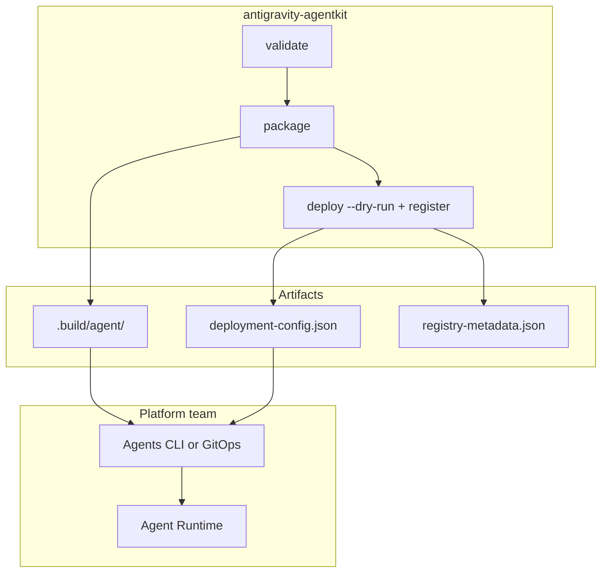
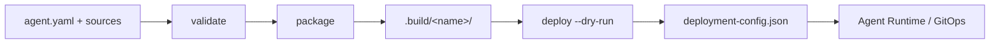

# Packaging and deployment

This guide covers the **Ship** phase: turning an agent directory into a deployable source package and configuring Google Cloud Agent Platform deployment. Implement commands (`validate`, `compile`, `run`, `eval`) do not require `deployment.yaml`. Ship commands (`package`, `deploy`, `register`) do.

For the authoring layout, see [Your first agent](02-your-first-agent.md) and [Agent manifest reference](03-agent-manifest-reference.md). For validation before you ship, see [Validation and evals](08-validation-and-evals.md). For the IR and package-layout rationale, see [RFC 0002: Spec-first core with frozen IR](../rfcs/0002-spec-first-core-frozen-ir.md).

## Optional install extras

Ship and local-run commands require optional dependencies beyond the base package. Install the extra that matches your workflow:

| Extra           | Install                                           | Enables                                                     |
| --------------- | ------------------------------------------------- | ----------------------------------------------------------- |
| _(base)_        | `pip install antigravity-agentkit`                | `validate`, `compile`, `eval` (core; no SDK or GCP)         |
| `[antigravity]` | `pip install 'antigravity-agentkit[antigravity]'` | `run`, `chat` (Antigravity SDK runtime assembly)            |
| `[gcp]`         | `pip install 'antigravity-agentkit[gcp]'`         | `package`, `deploy`, `register` (deploy targets, packaging) |
| `[all]`         | `pip install 'antigravity-agentkit[all]'`         | Full local run plus ship workflow                           |

Core-only CI installs the base package and runs load/validate/compile/eval without `google-antigravity` or Google Cloud libraries.

## Agent Platform boundary

AgentKit compiles agents and supports **native platform operations (M3)** via the `[gcp]` extra. See [ADR 0004: Native platform operations](../adr/0004-native-platform-operations.md) (amends [ADR 0003](../adr/0003-agent-platform-boundary.md)).

| Tier                   | AgentKit                                                                 | Platform team (infra only)     |
| ---------------------- | ------------------------------------------------------------------------ | ------------------------------ |
| **A — Compile**        | skills, subagents, MCP, policies → SDK                                   | —                              |
| **B — Emit contracts** | `deployment-config.json`, registry JSON, skill zip                       | Optional GitOps mirror         |
| **C — Bindings**       | _Deferred_ — memory, sessions, sandbox YAML                              | Managed services at runtime    |
| **D — Ops (M3)**       | Live `deploy`, `register --live`, `publish`, `rollback`, platform `eval` | Terraform (BQ buckets, WIF CI) |

With GCP credentials configured, `deploy` applies to Agent Runtime via `vertexai.Client().agent_engines`. Use `--dry-run` to emit artifacts only (default when ADC is absent).



## What `antigravity-agentkit package` produces

The `package` command (and `build_source_package()` in the Python API) builds a self-contained source bundle under `.build/<agent-name>/` by default. The build directory is recreated on each run. **`deployment.yaml` must exist** in the agent directory.

```bash
# From an agent directory that includes deployment.yaml (not the bundled examples/)
uv run antigravity-agentkit package path/to/my-agent
# Package built at .../path/to/my-agent/.build/<agent-name>
```

You can override the output path:

```bash
uv run antigravity-agentkit package path/to/my-agent --output-dir /tmp/my-agent-build
```

### Package contents

The agent directory is the package boundary. AgentKit copies its complete contents so evals,
local MCP server implementations, discovered skills/subagents, and other runtime assets retain
their relative paths. It then writes or replaces these generated files:

| File               | Purpose                                                             |
| ------------------ | ------------------------------------------------------------------- |
| `agent.py`         | Generated runtime entrypoint exposing `root_agent`                  |
| `requirements.txt` | Runtime dependency (`antigravity-agentkit[antigravity]` or `[all]`) |
| `metadata.json`    | Build summary (agent name, compiled vertex/MCP/tool/policy counts)  |

Development and secret-bearing artifacts are excluded: `.build`, `.git`, virtual environments,
tool caches, `__pycache__`, bytecode, `.DS_Store`, and `.env` files. Symbolic links are rejected
rather than followed, and all copied paths must remain inside the agent directory.

The generated entrypoint loads the package directory and creates an Antigravity SDK agent:

```python
"""Generated Antigravity AgentKit runtime entrypoint."""

from antigravity_agentkit.project import AgentProject

root_agent = AgentProject.load(".").create_agent()
```

Agent Runtime expects this shape: `entrypoint_module` = `agent`, `entrypoint_object` = `root_agent`, `requirements_file` = `requirements.txt`.

`metadata.json` is for operators and CI; it is not consumed by the runtime directly. Example fields:

```json
{
  "agentName": "hello_world",
  "compiled": {
    "vertex": { "enabled": false, "project": null, "location": null },
    "mcpServers": [],
    "toolCount": 1,
    "policyCount": 0
  }
}
```

Packaging runs `compile()` internally, so schema and governance checks must pass before the bundle is written. See [Python API](11-python-api.md) if you need programmatic control over the build.

## `deployment.yaml`

Production and platform settings live in **`deployment.yaml`** beside `agent.yaml`. They are merged into the Agent Platform Runtime deployment config by `build_deployment_config()`.

```yaml
apiVersion: antigravity-agentkit.dev/v1alpha1
kind: Deployment
metadata:
  name: hello-world # must match agent metadata.name
spec:
  target: agent-platform-runtime # alias: agent-platform
  displayName: Hello World
  serviceAccount: hello-world@my-project.iam.gserviceaccount.com
  minInstances: 0
  maxInstances: 5
  containerConcurrency: 5
  resourceLimits:
    cpu: "2"
    memory: 4Gi
  labels:
    owner: platform-team
  gateway:
    enabled: true
    egressPolicy: restricted
    requiredEndpoints:
      - https://bigquery.googleapis.com
```

Model and Vertex backend settings stay in `agent.yaml` under `spec.runtime`:

```yaml
spec:
  runtime:
    framework: antigravity
    model: gemini-2.5-pro
    vertex:
      enabled: true
      project: my-agent-project
      location: us-central1
```

### Field reference

| YAML field                       | Deployment config key             | Notes                                                             |
| -------------------------------- | --------------------------------- | ----------------------------------------------------------------- |
| `displayName`                    | `display_name`                    | Overrides `metadata.displayName` when set                         |
| `serviceAccount`                 | `service_account`                 | Runtime identity; required by `prod-readonly` validation          |
| `minInstances` / `maxInstances`  | `min_instances` / `max_instances` | `maxInstances` must be ≥ `minInstances`                           |
| `containerConcurrency`           | `container_concurrency`           | Minimum 1                                                         |
| `resourceLimits.cpu` / `.memory` | `resource_limits`                 | Omitted keys are not sent                                         |
| `labels`                         | Merged into top-level `labels`    | Combined with `managed-by: antigravity-agentkit` and `agent-name` |
| `gateway`                        | `gateway`                         | Only included when `gateway.enabled` is true                      |

Default deployment target is `agent-platform-runtime` (accepted alias: `agent-platform`). Labels always include `managed-by: antigravity-agentkit` and `agent-name: <metadata.name>`.

For gateway behavior on Agent Runtime, see [Google Cloud Agent Gateway documentation](https://docs.cloud.google.com/gemini-enterprise-agent-platform/scale/runtime/agent-gateway-runtime-deploy).

## Vertex configuration

Vertex settings are declared under `spec.runtime.vertex`:

```yaml
spec:
  runtime:
    vertex:
      enabled: true
      project: my-agent-project # required when enabled: true
      location: us-central1 # optional; falls back to deploy --location
```

When `vertex.enabled` is true:

- Deployment config includes a `vertex` block with `project` and `location` (manifest values override CLI defaults when set).
- Compiled runtime config passes Vertex project/location to the Antigravity SDK.

Keep Vertex project/location aligned with your Agent Runtime `--project` and `--location` unless you intentionally split them.

## Deploy targets

`deployment.yaml` `spec.target` selects which artifact `deploy` emits. Live apply is implemented for `agent-platform-runtime` and `managed-agents-api` (M3). Canonical target names follow [RFC 0002](../rfcs/0002-spec-first-core-frozen-ir.md).

| Target (canonical)                 | Alias            | Artifact                                         | Notes                                                           |
| ---------------------------------- | ---------------- | ------------------------------------------------ | --------------------------------------------------------------- |
| `agent-platform-runtime` (default) | `agent-platform` | `.build/deployment-config.json` + source package | **Agent Platform Runtime** contract; scaling, gateway, Vertex   |
| `managed-agents-api`               | `gemini-api`     | `.build/gemini-agent-config.json`                | **Managed Agents API** registration contract; no source package |
| `ai-studio`, `cloud-run`           | —                | —                                                | Not implemented; `deploy` raises `DeployError`                  |

### Managed Agents API (`target: managed-agents-api`)

For API-key–friendly Managed Agents registration, set `spec.target: managed-agents-api` in
`deployment.yaml` (alias: `gemini-api`). AgentKit emits a submit-ready `agents.create` request body in
`gemini-agent-config.json`. The deployment name becomes `id`, the base agent is pinned to
`antigravity-preview-05-2026`, system instructions are embedded, and local skills are mounted
as inline `.agents/skills/<name>/SKILL.md` sources.

Managed Agents API emission rejects MCP servers, static subagents, policies, non-default capabilities,
and enabled Vertex configuration because those settings cannot be represented by
`agents.create`. The shared deployment fields `displayName`, `labels`, scaling, service account,
resource limits, concurrency, and gateway apply only to Agent Platform Runtime and are ignored for
`managed-agents-api`. The local runtime model is also independent of the pinned Managed Agents base
harness.

```bash
uv run antigravity-agentkit deploy examples/managed_agents_api \
  --project demo \
  --location us-central1 \
  --dry-run
```

`--project` and `--location` are ignored for `managed-agents-api` config content but remain required CLI flags. Live apply uses `deploy` with explicit `--no-wait` or implicit credentials for Agent Platform Runtime; Managed Agents API live deploy requires `dry_run=False` (pass no `--dry-run` and use explicit live intent via platform credentials + API key).

```bash
curl -X POST "https://generativelanguage.googleapis.com/v1beta/agents" \
  -H "Content-Type: application/json" \
  -H "x-goog-api-key: ${GEMINI_API_KEY}" \
  -H "Api-Revision: 2026-05-20" \
  --data-binary @examples/managed_agents_api/.build/gemini-agent-config.json
```

> **Note:** The example directory is `examples/managed_agents_api/` (renamed from `gemini_api/`). The deploy target alias `gemini-api` remains accepted.

## Deploying with `antigravity-agentkit deploy`

```bash
uv run antigravity-agentkit deploy path/to/my-agent \
  --project my-gcp-project \
  --location us-central1
```

The deploy flow:

1. **Package** — builds `.build/<name>/` (or your custom output from a prior `package` run).
2. **Configure** — merges manifest deployment and Vertex settings with CLI `project` and `location`.
3. **Apply or dry-run** — live deploy when credentials are present; otherwise writes config JSON.

### Dry-run mode

Dry-run is the default when GCP application-default credentials are not detected. Force it explicitly:

```bash
uv run antigravity-agentkit deploy path/to/my-agent \
  --project my-gcp-project \
  --location us-central1 \
  --dry-run
```

Custom output path:

```bash
uv run antigravity-agentkit deploy path/to/my-agent \
  --project my-gcp-project \
  --location us-central1 \
  --dry-run \
  --output .build/deployment-config.json
```

Dry-run writes `deployment-config.json` (default: `.build/deployment-config.json` under the agent root) and returns a summary:

```json
{
  "status": "dry_run",
  "config_path": ".../.build/deployment-config.json",
  "package_dir": ".../.build/hello_world",
  "config": { "...": "..." }
}
```

The config includes `source_packages`, `platform_adapter` entrypoint metadata, `class_methods`, OTEL `env_vars`, identity fields, labels, scaling limits, gateway settings, and Vertex block when enabled.

**Live deploy (M3):** With ADC configured, `deploy` calls `vertexai.Client().agent_engines.create`. Additional flags:

```bash
uv run antigravity-agentkit deploy examples/agent_platform \
  --project "$GCP_PROJECT" \
  --location "$GCP_LOCATION" \
  --resource-name "projects/.../reasoningEngines/..."  # update existing
uv run antigravity-agentkit deploy examples/agent_platform \
  --project "$GCP_PROJECT" \
  --location "$GCP_LOCATION" \
  --status
uv run antigravity-agentkit rollback examples/agent_platform \
  --project "$GCP_PROJECT" \
  --location "$GCP_LOCATION" \
  --to sha256:abc123
```

### Identity and observability (`deployment.yaml`)

```yaml
spec:
  identity:
    mode: agent-identity # agent-identity | service-account | oauth
    serviceAccount: agent@project.iam.gserviceaccount.com
  observability:
    cloudTrace: true
    captureMessageContent: event_only # false | event_only | full
    logsBucket: gs://project-logs
    bigQueryAnalytics: false
```

Legacy `spec.serviceAccount` remains supported; prefer `spec.identity`.

### GCP credentials

Deploy detects credentials via:

1. `GOOGLE_APPLICATION_CREDENTIALS` — path to a service account key or workload identity config.
2. `CLOUDSDK_AUTH_ACCESS_TOKEN` — short-lived access token.
3. Application Default Credentials from `gcloud auth application-default login` or a GCE/GKE/Cloud Run metadata service.

For local dry-run you do not need credentials. For future live deploy, use a **deployer** service account separate from the agent **runtime** `serviceAccount` in `deployment.yaml`. See [Policies and governance](./07-policies-and-governance.md) and [Production workflows](./12-production-workflows.md).

### Operator authentication (local `run`)

`deployment.yaml` `spec.serviceAccount` is the **runtime** identity attached by Agent Platform Runtime when deployed. It is not used as caller credentials for local development.

For local `run` with Vertex, impersonate a service account at the **operator** layer:

| Task                    | How to authenticate                                                                                                                                                             |
| ----------------------- | ------------------------------------------------------------------------------------------------------------------------------------------------------------------------------- |
| Local `run` with Vertex | `--impersonate-service-account` or `AGK_IMPERSONATE_SERVICE_ACCOUNT`, or preconfigure ADC with `gcloud auth application-default login --impersonate-service-account=RUNTIME_SA` |
| CI deploy (future)      | Deployer SA via Workload Identity Federation or `google-github-actions/auth` — not the runtime SA                                                                               |
| Runtime on platform     | `deployment.serviceAccount` — no app-level impersonation                                                                                                                        |

```bash
antigravity-agentkit run examples/agent_platform \
  --prompt "Hello" \
  --production \
  --impersonate-service-account platform-assistant@demo-project.iam.gserviceaccount.com
```

Impersonation is never written into packaged output or `deployment-config.json`. The credential patch applies only for the duration of a single `run` / `run_chat` call and is not thread-safe for concurrent runs.

## Typical workflow



1. [Validate](08-validation-and-evals.md) with a production profile.
2. [Run evals](08-validation-and-evals.md) if configured.
3. `antigravity-agentkit package <path>`.
4. `antigravity-agentkit deploy <path> --project ... --location ... --dry-run`.
5. Commit or apply `deployment-config.json` through your platform pipeline.
6. [Register](10-registry-and-publishing.md) agent metadata for inventory.
7. Platform team runs [Agent Platform evaluation](13-agent-platform-evaluation.md) on the deployed runtime (offline, simulated, or online monitors).

## Related guides

- [Python API](11-python-api.md) — `build_source_package()`, `build_deployment_config()`, `deploy()`
- [Registry and publishing](10-registry-and-publishing.md) — post-deploy inventory
- [Production workflows](12-production-workflows.md) — CI/CD and dev→prod promotion
- [Agent Platform evaluation](13-agent-platform-evaluation.md) — post-deploy quality loop
