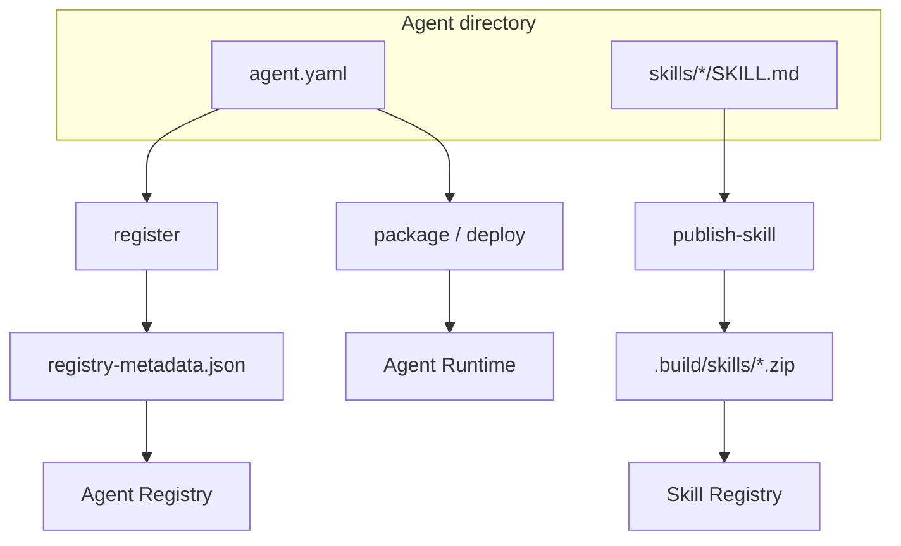

# Registry and publishing

AgentKit supports **local stubs and live apply** for registry operations with `--live` on `register` and `publish-skill`, plus `publish` for Gemini Enterprise catalog registration.

## Agent Registry: `antigravity-agentkit register`

Register builds a metadata document from a loaded agent project. It does not call Google Cloud APIs yet.

```bash
uv run antigravity-agentkit register examples/mcp \
  --project my-gcp-project \
  --location us-central1 \
  --output .build/registry-metadata.json
```

Without `--output`, metadata is printed to stdout as JSON.

### Metadata shape

`build_agent_registry_metadata()` collects:

| Field                                                                               | Source                               |
| ----------------------------------------------------------------------------------- | ------------------------------------ |
| `name`, `displayName`, `description`, `owner`, `labels`                             | `agent.yaml` metadata                |
| `runtime.framework`, `runtime.vertexEnabled`, `runtime.project`, `runtime.location` | `spec.runtime`                       |
| `deployment.target`, `deployment.serviceAccount`, `deployment.labels`               | `deployment.yaml`                    |
| `mcpServers`                                                                        | Sorted server names from `mcp.json`  |
| `tools`                                                                             | Compiled tool names                  |
| `skills`                                                                            | Local skill names                    |
| `subagents`                                                                         | Subagent names                       |
| `policyFile`                                                                        | Policies file path when declared     |
| `sourceRoot`                                                                        | Absolute path to agent directory     |
| `generatedAt`                                                                       | UTC timestamp                        |
| `gitSha`                                                                            | When `AGK_GIT_SHA` env is set (CI)   |
| `packageDigest`                                                                     | When `AGK_PACKAGE_DIGEST` env is set |

The CLI adds a `registry` block:

```json
{
  "registry": {
    "project": "my-gcp-project",
    "location": "us-central1",
    "mcpServers": [
      {
        "name": "bigquery-metadata",
        "transport": "stdio",
        "command": "...",
        "args": [],
        "envKeys": ["GOOGLE_CLOUD_PROJECT"],
        "owner": "data-platform",
        "agentName": "mcp example"
      }
    ]
  }
}
```

Stdio records include `command`, `args`, and `envKeys`. Streamable HTTP records instead
include `url` and `headerKeys`; header values are never written to registry metadata.

Use this file for governance inventory, dependency graphs, and audit trails. In CI, set `AGK_GIT_SHA` and optionally `AGK_PACKAGE_DIGEST` before `register` to stamp provenance (see [Production workflows](12-production-workflows.md)).

### Manifest registry hints (intent only until M3)

Optional `spec.registry` flags document **intent for CI and platform automation**. AgentKit does **not** call Agent Registry or Skill Registry APIs, resolve remote skill URIs at compile time, or auto-run `register` / `publish-skill` when these flags are true.

```yaml
spec:
  registry:
    agentRegistry:
      enabled: true
    skillRegistry:
      publishLocalSkills: false
    mcpServers:
      register: true
```

Your pipeline should:

1. Read these flags (or team conventions) to decide when to run `antigravity-agentkit register` or `publish-skill`.
2. Upload emitted JSON/zip artifacts via Agents CLI or internal tooling.

Similarly, `spec.skills.registry[]` and `spec.subagents[]` with `type: remote` are **schema placeholders** for M3 registry-backed resolution. Local markdown skills and subagents are fully supported today.

`register` does not read `spec.registry` flags automatically; pass `--project` and `--location` on the CLI.

## Skill Registry: `antigravity-agentkit publish-skill`

Publish validates a skill directory and creates a zip archive suitable for Skill Registry upload.

```bash
uv run antigravity-agentkit publish-skill examples/mcp/skills/bigquery-analysis \
  --project my-gcp-project \
  --location us-central1
```

Default output: `.build/skills/<skill-name>.zip` next to the skill’s parent tree (or under `--output-dir`).

### Success response

```json
{
  "status": "packaged",
  "skillName": "bigquery-analysis",
  "archivePath": ".../.build/skills/bigquery-analysis.zip",
  "sha256": "...",
  "project": "my-gcp-project",
  "location": "us-central1",
  "registryRef": "projects/my-gcp-project/locations/us-central1/skills/bigquery-analysis"
}
```

When `--project` and `--location` are omitted, `registryRef` is `null`.

### Skill package requirements

Before zipping, `publish_skill()` enforces:

| Rule                                                | Error if violated                |
| --------------------------------------------------- | -------------------------------- |
| `SKILL.md` must exist at the skill root             | `Skill package missing SKILL.md` |
| Skill name must pass `validate_skill_name()`        | Invalid name format              |
| No symlinks anywhere under the skill directory      | `Symlinks are not allowed`       |
| No file larger than 10 MiB                          | `Skill file exceeds size limit`  |
| Zip member paths must not traverse outside the root | `Path traversal detected`        |

The archive uses `ZIP_DEFLATED` compression. Files are added in sorted path order for reproducibility. A SHA-256 digest covers member paths and file bytes.

Skill authoring conventions are covered in [Skills and subagents](06-skills-and-subagents.md).

### Python API

```python
from antigravity_agentkit import publish_skill, build_agent_registry_metadata
from antigravity_agentkit import AgentProject
from antigravity_agentkit.deploy import load_deployment

project = AgentProject.load("examples/hello_world")
deployment = load_deployment(project.root)
metadata = build_agent_registry_metadata(project, deployment)

result = publish_skill(
    "examples/mcp/skills/bigquery-analysis",
    project="my-gcp-project",
    location="us-central1",
)
print(result["archivePath"], result["sha256"])
```

See [Python API](11-python-api.md) for the full surface.

## `skills.lock` (revision pinning)

Skill Registry revisions are immutable. Publish live and request a lock update to pin the returned
revision in `skills.lock` at the nearest parent agent root:

```bash
uv run antigravity-agentkit publish-skill ./skills/bigquery-analysis \
  --project my-project --location us-central1 --live --write-lock
```

`--write-lock` requires `--live`. AgentKit validates and merges an existing version 1 lock without
removing other skill entries; malformed locks are left untouched.

```yaml
version: 1
skills:
  - name: bigquery-analysis
    source: local
    registryName: projects/my-project/locations/us-central1/skills/bigquery-analysis
    revision: projects/my-project/locations/us-central1/skills/bigquery-analysis/revisions/20260620-abc123
    sha256: "a1b2c3..."
```

Recommended workflow:

1. `antigravity-agentkit publish-skill --live --write-lock` uploads the archive.
2. Review the merged immutable revision and digest in `skills.lock`.
3. Run [validation](08-validation-and-evals.md) and [evals](08-validation-and-evals.md) before [packaging](09-packaging-and-deployment.md).

Commit `skills.lock` alongside `agent.yaml` so production builds resolve the same skill revision every time.

## Register vs publish vs deploy



| Command         | Input           | Output                      | Cloud API today |
| --------------- | --------------- | --------------------------- | --------------- |
| `publish-skill` | Skill directory | Zip + SHA-256               | No (local stub) |
| `register`      | Agent directory | JSON metadata               | No (local stub) |
| `deploy`        | Agent directory | Package + deployment config | Dry-run only    |

## Related guides

- [Packaging and deployment](09-packaging-and-deployment.md) — source bundles for Agent Runtime
- [Production workflows](12-production-workflows.md) — GitOps register step
- [MCP integration](05-mcp-integration.md) — MCP metadata in register output
- [Python API](11-python-api.md) — programmatic registry helpers
