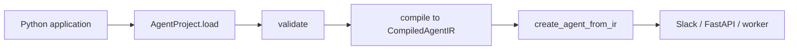

# Python API

AgentKit is a **Python library** for embedding declarative agents in applications—not only a CLI wrapper. Use it in Slack bots, FastAPI services, workers, notebooks, and CI when you need programmatic control over validation, compilation, and runtime construction.

Runnable tier examples: [`examples/python_embedding/`](../../examples/python_embedding/).

Install the package and optional extras:

```bash
uv sync
uv sync --extra antigravity   # Tier 2: create_agent_from_ir, run/chat
uv sync --extra gcp           # Tier 3: package, deploy, register helpers
```

## API tiers

| Tier            | Extra           | Entry points                                                | Network / credentials        |
| --------------- | --------------- | ----------------------------------------------------------- | ---------------------------- |
| **1 — Core**    | (base)          | `AgentProject.load`, `validate`, `compile`, `eval`          | None                         |
| **2 — Runtime** | `[antigravity]` | `antigravity_agentkit.runtime.create_agent_from_ir`         | API key for live model calls |
| **3 — Deploy**  | `[gcp]`         | `build_deployment_config`, `build_source_package`, `deploy` | Dry-run needs none           |



Prefer `from antigravity_agentkit.runtime import create_agent_from_ir` in application code. The `antigravity_agentkit.sdk` package remains an implementation detail.

## Public exports

`antigravity_agentkit` re-exports the main types and functions:

```python
from antigravity_agentkit import (
    AgentProject,
    AgentProjectData,
    CompiledAgentIR,
    EvalReport,
    RuntimeAgent,
    compile_agent_ir,
    compile_from_data,
    compile_sdk_policies,
    ir_to_dict,
    load_agent,
    load_agent_directory,
    load_deployment,
    validate_project,
    build_source_package,
    build_deployment_config,
    deploy,
    build_agent_registry_metadata,
    publish_skill,
    run_evals,
)
```

`load_agent(path)` is an alias for `AgentProject.load(path)`.

`EvalReport` is an alias for `EvalRunResult` from `project.eval()` and `run_evals()`.

Tier 2 runtime helpers (`create_agent_from_ir`, `create_agent_from_project`, …) live in `antigravity_agentkit.runtime` and require `[antigravity]`. See [Create agent (live runtime)](#create-agent-live-runtime).

## `AgentProject` lifecycle

`AgentProject` is the high-level handle for an agent directory.

### Load

```python
from pathlib import Path
from antigravity_agentkit import AgentProject

project = AgentProject.load("examples/hello_world")
# or
project = AgentProject.load(Path("examples/hello_world"))

print(project.manifest.metadata.name)
print(project.data.system_instructions[:200])
```

`load()` reads `agent.yaml`, system instructions, MCP config, skills, subagents, policies, and eval files via `load_agent_directory()`.

### Validate

```python
# Development defaults: level="schema", profile="dev-restricted"
project.validate()

# Production gate (level="security", profile="prod-readonly"; implement path, no deployment.yaml required)
project.validate(production=True)

# Explicit control
project.validate(level="security", profile="prod-locked")
```

`validate()` raises on failure (through `assert_valid_project`). For non-throwing diagnostics, use `validate_project()`:

```python
from antigravity_agentkit import validate_project

collector = validate_project(project.root, project.data, level="full", profile="prod-readonly")
if collector.has_errors():
    print(collector.format_all())
```

Profiles and levels are documented in [Validation and evals](08-validation-and-evals.md).

### Compile

```python
ir = project.compile()
ir_prod = project.compile(production=True)

print(ir.schema_version)
print(len(ir.system_instructions))
print(ir.mcp_servers)
print(ir.tools)
print(ir.policies)
print(ir.vertex)
print(ir.capabilities)
```

`compile()` validates first, then returns a frozen `CompiledAgentIR` dataclass (`schema_version = antigravity-agentkit.ir/v1alpha1`) with rendered system instructions (including skill index), MCP servers, tools, policies, Vertex settings, and capabilities. The IR is JSON-serializable via `ir_to_dict()`.

One-shot compile without holding a project:

```python
from antigravity_agentkit import compile_agent_ir, ir_to_dict

ir = compile_agent_ir("examples/mcp", production=True)
payload = ir_to_dict(ir)  # dict suitable for JSON encoding
```

To compile from already-loaded `AgentProjectData` (for example after custom preprocessing), use `compile_from_data(project.data)`.

### Eval (mock mode)

```python
report = project.eval(suite_filter="smoke")
print(f"{report.passed}/{report.total} passed")
```

Evaluations use deterministic mock assertions; they do not call the live model. See [Validation and evals](08-validation-and-evals.md).

### Create agent (live runtime)

`AgentProject.create_agent()` compiles to IR and delegates to `create_agent_from_project`. Prefer the public runtime module in application code:

```python
from antigravity_agentkit.runtime import (
    create_agent_from_ir,
    create_agent_from_project,
    create_sdk_config_from_ir,
    chat_response_text,
)

ir = project.compile(production=True)
agent = create_agent_from_ir(
    ir,
    project_root=project.root,
    interactive=False,
    loaded_skills=project.data.skills,
)

async def classify_once():
    async with agent:
        response = await agent.chat("Classify this support message...")
        return await chat_response_text(response)
```

Shorthand:

```python
agent = create_agent_from_project(project, production=True, interactive=False)
```

You can also use `antigravity_agentkit.sdk` exports; they delegate to the same implementation.

`interactive=True` wires a real `ask_user` approval handler for `askUser` / `requireApproval` policies. The CLI equivalent is `antigravity-agentkit run --interactive`.

To load a serialized IR JSON file and create an agent:

```python
from antigravity_agentkit.runtime import create_agent_from_ir_file

agent = create_agent_from_ir_file(".build/compiled-agent-ir.json", project_root=project.root)
```

Requires `google-antigravity` (`pip install 'antigravity-agentkit[antigravity]'`). Raises `SdkCompatibilityError` if the extra is missing or the installed SDK cannot accept a compiled feature.

### Package

```python
from antigravity_agentkit import AgentProject, build_source_package, load_deployment

project = AgentProject.load("src/antigravity_agentkit/tests/fixtures/ship_agent")
load_deployment(project.root)  # required before package

package_dir = build_source_package(project)
# default: <agent-root>/.build/<metadata.name>/

custom = build_source_package(project, output_dir="/tmp/my-agent-build")
```

See [Packaging and deployment](09-packaging-and-deployment.md) for output layout.

## `RuntimeAgent`

`RuntimeAgent` wraps `AgentProject` for a convenient local chat path.

```python
import asyncio
from antigravity_agentkit import RuntimeAgent

async def main():
    runtime = RuntimeAgent.from_directory("examples/hello_world")
    response = await runtime.run_chat("Hello!", production=False)
    print(response)

    # Prompt for ask_user policy approvals:
    response = await runtime.run_chat("Delete prod data", interactive=True)

    # Multi-turn REPL (stdin loop):
    await runtime.run_repl(initial_prompt="Hello!")

asyncio.run(main())
```

`from_directory(..., production=True)` calls `project.validate(production=True)` before constructing the wrapper. `run_chat()` runs a single turn; `run_repl()` keeps one SDK agent session open and reads prompts from stdin until `exit`, `quit`, or EOF. Pass `interactive=True` when `policies.yaml` contains `askUser` or `requireApproval` rules.

CLI equivalents: `antigravity-agentkit run` (one turn), `antigravity-agentkit chat` (REPL).

### Policy compilation helper

If you build SDK agents manually from compiled policy IR:

```python
from antigravity_agentkit import compile_sdk_policies
from antigravity_agentkit.sdk.capabilities import SdkCapabilities

policies = compile_sdk_policies(
    ir.policies,
    capabilities=SdkCapabilities.detect(),
)
# tuple of google.antigravity.policy objects
```

Non-interactive mode (the default) denies `ask_user` / `require_approval` tool calls via a default handler that returns `False`. Use `create_agent(interactive=True)`, `create_agent_from_ir(..., interactive=True)`, `run_chat(..., interactive=True)`, `run_repl(..., interactive=True)`, or `antigravity-agentkit run|chat --interactive` to approve interactively.

## Deploy and registry helpers

Deploy targets use canonical names in `deployment.yaml`:

| Canonical target         | Accepted alias   | Primary artifact                   |
| ------------------------ | ---------------- | ---------------------------------- |
| `agent-platform-runtime` | `agent-platform` | `deployment-config.json` + package |
| `managed-agents-api`     | `gemini-api`     | `gemini-agent-config.json`         |

```python
from antigravity_agentkit import (
    AgentProject,
    build_source_package,
    build_deployment_config,
    deploy,
    build_agent_registry_metadata,
    publish_skill,
    load_deployment,
)

project = AgentProject.load("src/antigravity_agentkit/tests/fixtures/ship_agent")
deployment = load_deployment(project.root)

package_path = build_source_package(project)
config = build_deployment_config(
    project, deployment, project_id="my-project", location="us-central1"
)

summary = deploy(
    project,
    deployment,
    "my-project",
    "us-central1",
    dry_run=True,
    output_path="/tmp/deployment-config.json",
)

metadata = build_agent_registry_metadata(project, deployment)
skill_result = publish_skill("path/to/skills/my-skill", project="my-project", location="us-central1")
```

See [Packaging and deployment](09-packaging-and-deployment.md) and [Registry and publishing](10-registry-and-publishing.md).

## Evaluations

```python
from antigravity_agentkit import run_evals

result = run_evals(project, suite_filter="smoke")
for case in result.cases:
    print(case.name, "PASS" if case.passed else "FAIL")
```

Eval YAML format: [Validation and evals](08-validation-and-evals.md).

## When to use CLI vs API

| Use CLI when                                          | Use Python API when                                      |
| ----------------------------------------------------- | -------------------------------------------------------- |
| You are exploring locally (`init`, `validate`, `run`) | CI needs programmatic pass/fail without shelling out     |
| Operators run one-off commands                        | You embed AgentKit in a service or notebook              |
| Shell scripts and Make targets suffice                | You need fine-grained access to `CompiledAgentIR`        |
| Human-readable Rich output is enough                  | You compose steps (validate → compile → custom artifact) |

The CLI is a thin Typer wrapper around the same library functions. Behavior should match; prefer the API when you need return values, exception handling, or custom orchestration.

## End-to-end example

```python
from antigravity_agentkit import AgentProject, deploy, build_agent_registry_metadata, load_deployment

AGENT = "examples/hello_world"
PROJECT_ID = "my-gcp-project"
LOCATION = "us-central1"

project = AgentProject.load(AGENT)
deployment = load_deployment(project.root)

# 1. Gate
project.validate(production=True)

# 2. Inspect compile output
ir = project.compile(production=True)
print(ir.schema_version, len(ir.system_instructions))

# 3. Package + deployment config
deploy_summary = deploy(project, deployment, PROJECT_ID, LOCATION, dry_run=True)
print(deploy_summary["package_dir"])

# 4. Registry metadata for inventory
metadata = build_agent_registry_metadata(project, deployment)
metadata["registry"] = {"project": PROJECT_ID, "location": LOCATION}
```

For production CI patterns, continue to [Production workflows](12-production-workflows.md).

## Related guides

- [Getting started](01-getting-started.md) — CLI quick start
- [Validation and evals](08-validation-and-evals.md) — `production=True` and profiles
- [Packaging and deployment](09-packaging-and-deployment.md) — deploy helpers
- [Registry and publishing](10-registry-and-publishing.md) — metadata and skills
