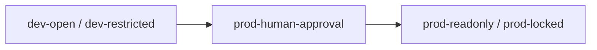
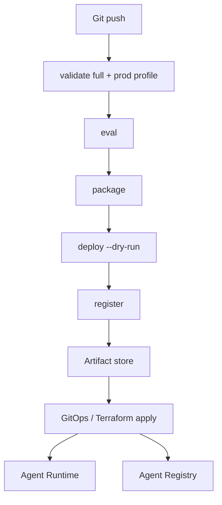

# Production workflows

This guide walks through advanced scenarios teams use when running AgentKit in CI/CD and promoting agents from development to production. It ties together [validation](08-validation-and-evals.md), [packaging](09-packaging-and-deployment.md), [registry](10-registry-and-publishing.md), and the [Python API](11-python-api.md).

## Production checklist

Before any production deploy or registry publish, confirm:

- [ ] `antigravity-agentkit validate <path> --level full --profile prod-readonly` (or stricter) passes
- [ ] `deployment.yaml` `spec.serviceAccount` is set and least-privilege
- [ ] `runtime.vertex.project` is set when `vertex.enabled: true`
- [ ] MCP [admission policy](05-mcp-integration.md) allowlists only approved servers
- [ ] [Policies](07-policies-and-governance.md) default-deny with explicit allows
- [ ] [Eval suites](08-validation-and-evals.md) pass in CI (`antigravity-agentkit eval`)
- [ ] `antigravity-agentkit package` produces a clean `.build/<name>/` artifact
- [ ] `antigravity-agentkit deploy --dry-run` emits `deployment-config.json` for review
- [ ] `antigravity-agentkit register` metadata is archived for Agent Registry
- [ ] Published skills are pinned in `skills.lock` ([Registry guide](10-registry-and-publishing.md))
- [ ] Runtime and deployer GCP identities are separated

---

## Scenario 1: Data agent with MCP, policies, and evals in CI

Use the [mcp example](../../examples/mcp/) layout as a template: MCP for tool access, policies for governance, evals as deployment gates.

### Agent ingredients

| Piece    | File                                    | Guide                                                      |
| -------- | --------------------------------------- | ---------------------------------------------------------- |
| Manifest | `agent.yaml`                            | [Agent manifest reference](03-agent-manifest-reference.md) |
| MCP      | `mcp.json` + `spec.mcp.admissionPolicy` | [MCP integration](05-mcp-integration.md)                   |
| Policies | `policies.yaml`                         | [Policies and governance](07-policies-and-governance.md)   |
| Evals    | `evals/smoke.yaml`                      | [Validation and evals](08-validation-and-evals.md)         |

Example policy posture (default deny, scoped allows, approval on risky queries):

```yaml
default: deny

allow:
  - tool: mcp.bigquery-metadata.list_datasets
  - tool: mcp.bigquery-metadata.get_table_metadata

requireApproval:
  - tool: mcp.bigquery-metadata.run_query
    when:
      estimatedBytesProcessedGt: 10000000000
```

### CI pipeline (GitHub Actions sketch)

```yaml
name: agent-ci
on:
  pull_request:
    paths: ["agents/mcp example/**"]

jobs:
  govern:
    runs-on: ubuntu-latest
    steps:
      - uses: actions/checkout@v4
      - run: make setup-python
      - name: Validate (production profile)
        run: |
          uv run antigravity-agentkit validate agents/mcp example \
            --level full \
            --profile prod-readonly
      - name: Eval gate
        run: uv run antigravity-agentkit eval agents/mcp example
      - name: Package
        run: uv run antigravity-agentkit package agents/mcp example
      - name: Deployment config (dry-run)
        run: |
          uv run antigravity-agentkit deploy agents/mcp example \
            --project ${{ vars.GCP_PROJECT }} \
            --location ${{ vars.GCP_LOCATION }} \
            --dry-run \
            --output agents/mcp example/.build/deployment-config.json
      - name: Upload artifacts
        uses: actions/upload-artifact@v4
        with:
          name: agent-build
          path: |
            agents/mcp example/.build/
```

Evals run in deterministic mock mode—fast enough for every PR. Fail the job if any case fails.

On merge to `main`, repeat with stricter gates and upload `registry-metadata.json` from `antigravity-agentkit register`.

---

## Scenario 2: Promoting dev → prod with validation profiles

AgentKit profiles encode how strict validation is. Use different profiles per environment.

| Environment     | Suggested profile                | `validate` flags   |
| --------------- | -------------------------------- | ------------------ |
| Local iteration | `dev-open`                       | `--level schema`   |
| Shared dev      | `dev-restricted`                 | `--level security` |
| Staging         | `prod-human-approval`            | `--level full`     |
| Production      | `prod-readonly` or `prod-locked` | `--level full`     |

`AgentProject.validate(production=True)` defaults to `profile=prod-readonly` and `level=full`.

### Promotion flow



1. **Develop** — authors use `dev-open` or `dev-restricted`; `antigravity-agentkit run` for local prompts.
2. **Staging** — flip `deployment.serviceAccount`, enable Vertex, run `compile --production` and `run --production` with approval policies.
3. **Production** — `validate --profile prod-readonly` enforces `serviceAccount`, cloud checks, and MCP admission; package and dry-run deploy with production GCP project/region.

Keep separate `agent.yaml` overlays or environment-specific branches only when necessary; prefer manifest fields (`deployment.labels`, Vertex `project`/`location`) that differ per environment via CI variables rather than forking agent logic.

Example production `deployment.yaml` (required for `prod-readonly` cloud checks):

```yaml
apiVersion: antigravity-agentkit.dev/v1alpha1
kind: Deployment
metadata:
  name: my-agent
spec:
  target: agent-platform
  serviceAccount: bq-agent@prod-agents.iam.gserviceaccount.com
  minInstances: 1
  maxInstances: 10
  resourceLimits:
    cpu: "2"
    memory: 4Gi
```

Details: [Validation and evals](08-validation-and-evals.md), [Packaging and deployment](09-packaging-and-deployment.md).

---

## Scenario 3: GitOps — validate → package → deploy → register

Treat the agent directory as the source of truth. CI produces immutable artifacts; GitOps applies them to Agent Runtime and registry.



### Step-by-step

| Step                | Command                                                                                                   | Artifact                                       |
| ------------------- | --------------------------------------------------------------------------------------------------------- | ---------------------------------------------- |
| 1. Validate         | `antigravity-agentkit validate ./agents/my-agent --level full --profile prod-readonly`                    | —                                              |
| 2. Eval             | `antigravity-agentkit eval ./agents/my-agent`                                                             | eval report in CI logs                         |
| 3. Package          | `antigravity-agentkit package ./agents/my-agent`                                                          | `.build/my-agent/`                             |
| 4. Deploy (dry-run) | `antigravity-agentkit deploy ./agents/my-agent -p $PROJECT -l $REGION --dry-run`                          | `deployment-config.json`                       |
| 5. Register         | `antigravity-agentkit register ./agents/my-agent -p $PROJECT -l $REGION -o .build/registry-metadata.json` | registry JSON                                  |
| 6. Skills (if any)  | `antigravity-agentkit publish-skill ./agents/my-agent/skills/foo -p $PROJECT -l $REGION`                  | `.build/skills/foo.zip` + update `skills.lock` |

### GitOps repository layout

```text
agents/
  finance-analysis-agent/
    agent.yaml
    SYSTEM.md
    ...
    skills.lock
infra/
  agent-runtime/
    finance-analysis-agent/
      deployment-config.json    # promoted from CI
      kustomization.yaml
registry/
  finance-analysis-agent-metadata.json
```

Pin `deployment-config.json` to a Git SHA and package digest in your registry metadata for auditability (extend CLI output in CI).

Live `antigravity-agentkit deploy` without `--dry-run` will apply to Agent Runtime once implemented; until then, your GitOps controller or Terraform module consumes the same JSON shape `build_deployment_config()` produces.

### Python orchestration

For a single CI script:

```python
import os

from antigravity_agentkit import AgentProject, build_agent_registry_metadata, deploy
from antigravity_agentkit.deploy import load_deployment

agent_path = "agents/finance-analysis-agent"
project_id = "prod-agents"
location = "us-central1"

project = AgentProject.load(agent_path)
deployment = load_deployment(project.root)
project.validate(production=True)

deploy_result = deploy(project, deployment, project_id, location, dry_run=True)
metadata = build_agent_registry_metadata(project, deployment)
metadata["gitSha"] = os.environ["GITHUB_SHA"]  # platform-specific
metadata["packageDir"] = deploy_result["package_dir"]
```

---

## Operating in production

### Monitoring and governance

- Register every production agent with `antigravity-agentkit register` and store JSON in your catalog.
- Register MCP servers listed in the `registry.mcpServers` array when `spec.registry.mcpServers.register` is true in your process.
- Re-run [evals](08-validation-and-evals.md) on policy or MCP changes.

### Rollback

- Keep previous `.build/<name>/` packages and `deployment-config.json` revisions in artifact storage.
- Repoint GitOps to the last known-good config; Skill Registry revisions are immutable—rollback via `skills.lock`.

### Security

- Separate deployer credentials (CI) from `deployment.serviceAccount` (runtime).
- Use [gateway egress policies](09-packaging-and-deployment.md) when agents call approved APIs only.
- Review [policies](07-policies-and-governance.md) on every tool or MCP change.

---

## Guide index (quick links)

| Topic              | Guide                                                      |
| ------------------ | ---------------------------------------------------------- |
| First steps        | [Getting started](01-getting-started.md)                   |
| First agent        | [Your first agent](02-your-first-agent.md)                 |
| `agent.yaml`       | [Agent manifest reference](03-agent-manifest-reference.md) |
| Instructions       | [System instructions](04-system-instructions.md)           |
| Skills / subagents | [Skills and subagents](06-skills-and-subagents.md)         |
| MCP                | [MCP integration](05-mcp-integration.md)                   |
| Policies           | [Policies and governance](07-policies-and-governance.md)   |
| Validation / evals | [Validation and evals](08-validation-and-evals.md)         |
| Deploy             | [Packaging and deployment](09-packaging-and-deployment.md) |
| Registry           | [Registry and publishing](10-registry-and-publishing.md)   |
| API                | [Python API](11-python-api.md)                             |

Design background: [RFC 0001](../rfcs/0001-declarative-antigravity-agentkit.md).
