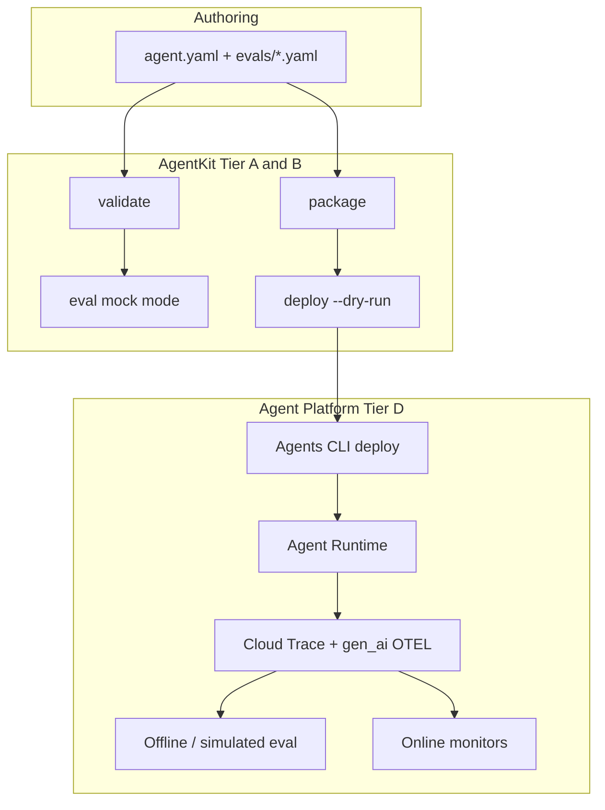
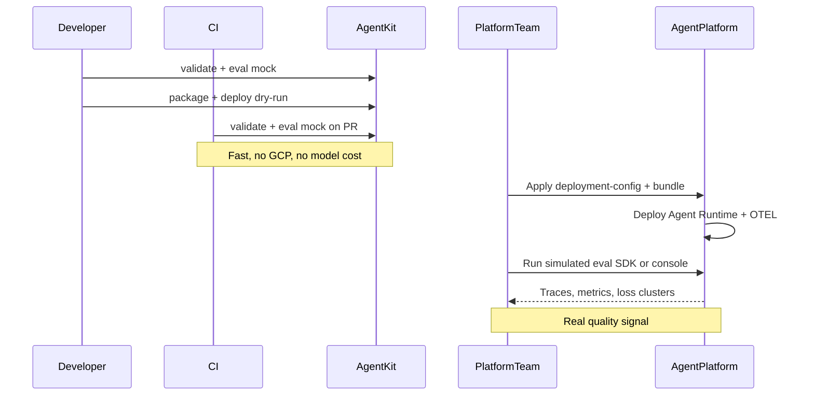
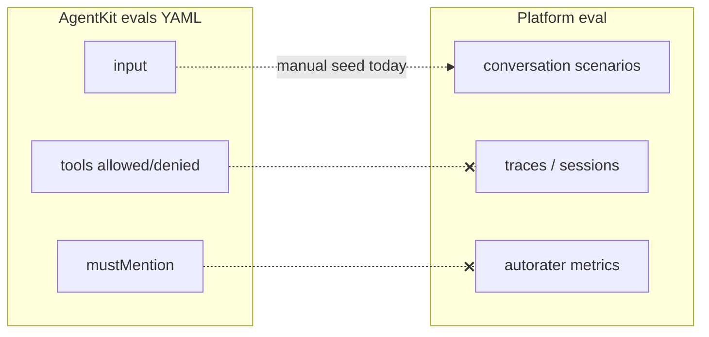

# Agent Platform evaluation

This guide explains how **antigravity-agentkit** evals relate to **Gemini Enterprise Agent Platform** evaluation. AgentKit and the Platform solve different problems; teams use both in a simple two-layer model.

**Related guides:** [Validation and evals](08-validation-and-evals.md) · [Packaging and deployment](09-packaging-and-deployment.md) · [Production workflows](12-production-workflows.md)

For the ownership boundary, see [ADR 0003: Agent Platform boundary](../adr/0003-agent-platform-boundary.md).

## Two evaluation layers

| Layer                   | Who runs it   | When         | Question it answers                                                    |
| ----------------------- | ------------- | ------------ | ---------------------------------------------------------------------- |
| **AgentKit mock eval**  | Authors / CI  | Every PR     | Did governance assertions pass? (mentions, tool allow/deny, policies)  |
| **Agent Platform eval** | Platform team | After deploy | Did the agent behave well? (task success, safety, tool quality, drift) |

`antigravity-agentkit eval` does **not** call Agent Platform APIs. It runs deterministic mock checks — see [Validation and evals](08-validation-and-evals.md). Platform evaluation uses the console or `vertexai.Client().evals` against a deployed Agent Runtime with Cloud Trace telemetry.

## Architecture



## Workflow by stage



### Stage 1 — Every PR (AgentKit only)

No GCP credentials or model API keys required:

```bash
uv run antigravity-agentkit validate examples/agent_platform \
  --level security --profile dev-restricted

uv run antigravity-agentkit eval examples/agent_platform --suite smoke
```

Example case: [`examples/agent_platform/evals/smoke.yaml`](../../examples/agent_platform/evals/smoke.yaml) (`current-time` input, tool allow/deny, `mustMention`).

### Stage 2 — Pre-ship (AgentKit artifacts)

Produce the bundle and deployment config for platform handoff:

```bash
uv run antigravity-agentkit package examples/agent_platform

uv run antigravity-agentkit deploy examples/agent_platform \
  --project "${AGK_GCP_PROJECT:-demo-project}" \
  --location "${AGK_GCP_LOCATION:-us-central1}" \
  --dry-run
```

Artifacts land under `.build/platform-assistant/` and `deployment-config.json`. The repository script [`dev/test_agent_platform.sh`](../../dev/test_agent_platform.sh) runs validate through register dry-run but stops before Platform evaluation.

### Stage 3 — Post-deploy (Platform team)

AgentKit does not implement these steps. Platform operators run them after Agent Runtime is live:

1. **Deploy** the bundle via [Agents CLI](https://docs.cloud.google.com/gemini-enterprise-agent-platform/build/runtime) using the emitted `deployment-config.json`.
2. **Enable GenAI OTEL** on the runtime ([offline eval prerequisites](https://docs.cloud.google.com/gemini-enterprise-agent-platform/optimize/evaluation/evaluate-offline)):
   - `OTEL_SEMCONV_STABILITY_OPT_IN=gen_ai_latest_experimental`
   - `OTEL_INSTRUMENTATION_GENAI_CAPTURE_MESSAGE_CONTENT=EVENT_ONLY`
3. **Regression / rapid eval:** console or SDK — `generate_conversation_scenarios` → `run_inference` → `evaluate` ([Evaluate your agents](https://docs.cloud.google.com/gemini-enterprise-agent-platform/optimize/evaluation/evaluate-agents)).
4. **Production:** online monitors on sampled traces ([Continuous evaluation](https://docs.cloud.google.com/gemini-enterprise-agent-platform/optimize/evaluation/evaluate-online)).
5. **Improve:** review results and run the optimizer loop ([Agent evaluation](https://docs.cloud.google.com/gemini-enterprise-agent-platform/optimize/evaluation/agent-evaluation)).

Seed Platform test cases manually from AgentKit `input` fields (for example, “What is the current UTC time?” from smoke evals) until an exporter exists.

## Eval schema relationship

AgentKit `evals/*.yaml` and Platform eval datasets are **separate formats** today:



AgentKit [`EvalCase`](../../src/antigravity_agentkit/schema/evals.py) supports `input`, `mustMention`, tool constraints, and regex patterns — not Platform reference answers or autorater metric names.

## What AgentKit does and does not do

| In scope (AgentKit)                         | Out of scope (Platform / Tier D)                       |
| ------------------------------------------- | ------------------------------------------------------ |
| Declare `evals/*.yaml` in `agent.yaml`      | Run `client.evals.evaluate()`                          |
| Mock-mode `antigravity-agentkit eval` in CI | Offline trace/session scoring in console               |
| Copy eval files into ship packages          | Online quality monitors                                |
| `validate` + `package` + deploy dry-run     | Prompt optimizer flywheel                              |
| Document handoff to platform team           | Live `deploy()` to Agent Runtime (not implemented yet) |

## Platform evaluation reference

| Topic           | Google Cloud documentation                                                                                                             |
| --------------- | -------------------------------------------------------------------------------------------------------------------------------------- |
| Overview        | [Agent evaluation](https://docs.cloud.google.com/gemini-enterprise-agent-platform/optimize/evaluation/agent-evaluation)                |
| SDK workflow    | [Evaluate your agents](https://docs.cloud.google.com/gemini-enterprise-agent-platform/optimize/evaluation/evaluate-agents)             |
| Offline eval    | [Run offline evaluations](https://docs.cloud.google.com/gemini-enterprise-agent-platform/optimize/evaluation/evaluate-offline)         |
| Simulated eval  | [Evaluate with simulated users](https://docs.cloud.google.com/gemini-enterprise-agent-platform/optimize/evaluation/evaluate-simulated) |
| Online monitors | [Continuous evaluation](https://docs.cloud.google.com/gemini-enterprise-agent-platform/optimize/evaluation/evaluate-online)            |
| Metrics         | [Manage metrics](https://docs.cloud.google.com/gemini-enterprise-agent-platform/optimize/evaluation/manage-metrics)                    |
| Results         | [View evaluation results](https://docs.cloud.google.com/gemini-enterprise-agent-platform/optimize/evaluation/view-results)             |
| Alerts          | [Quality alerts](https://docs.cloud.google.com/gemini-enterprise-agent-platform/optimize/evaluation/quality-alerts)                    |
| Optimization    | [Optimize your agent](https://docs.cloud.google.com/gemini-enterprise-agent-platform/optimize/evaluation/optimize-agent)               |

## Future extensions (not implemented)

If teams need tighter integration later, the smallest useful additions would be:

- Optional `eval export` emitting Platform-ready JSON from `input` fields only
- OTEL env var hints compiled into `deployment-config.json` from `deployment.yaml`
- Local live eval behind an explicit flag (still separate from Platform SDK)

None of these are required for the hybrid workflow described above.
