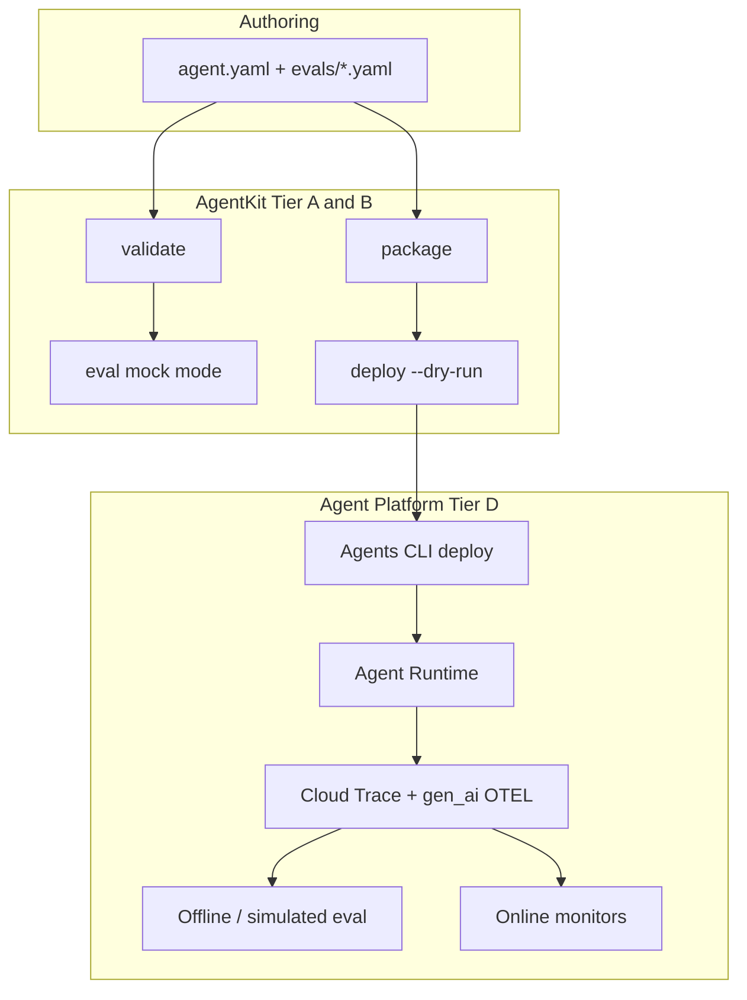
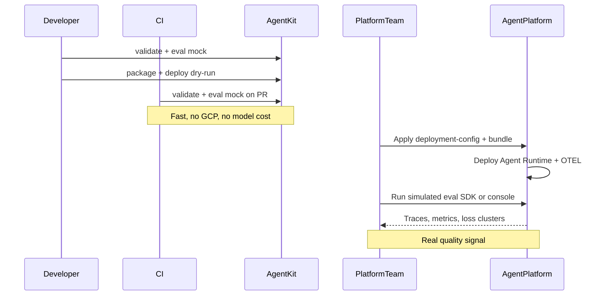
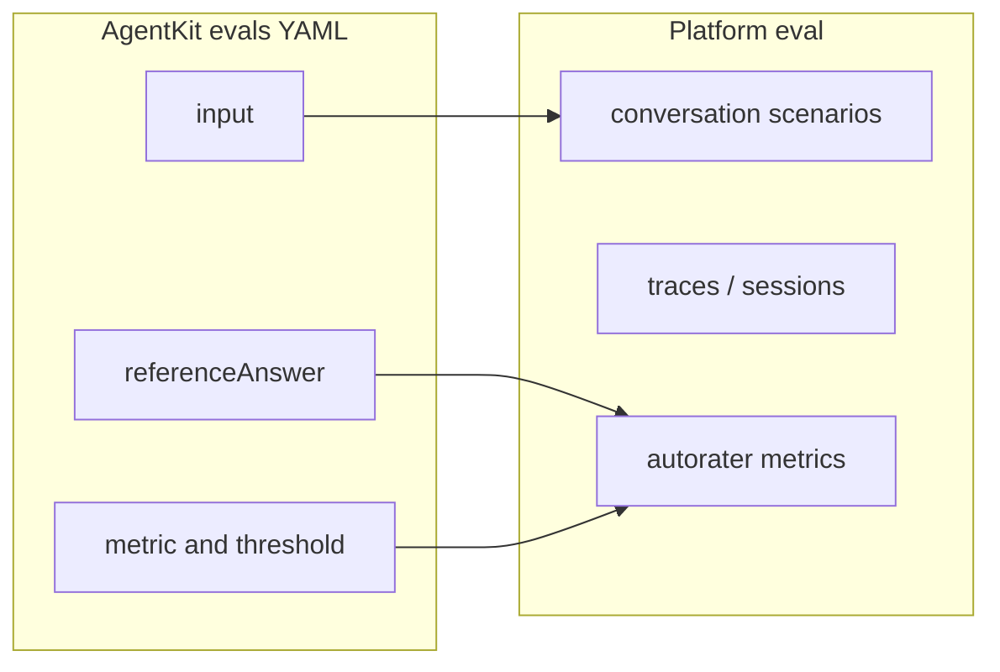

# Agent Platform evaluation

This guide explains how **antigravity-agentkit** evals relate to **Gemini Enterprise Agent Platform** evaluation. AgentKit and the Platform solve different problems; teams use both in a simple two-layer model.

**Related guides:** [Validation and evals](08-validation-and-evals.md) · [Packaging and deployment](09-packaging-and-deployment.md) · [Production workflows](12-production-workflows.md)

For the ownership boundary, see [ADR 0003](../adr/0003-agent-platform-boundary.md) and [ADR 0004](../adr/0004-native-platform-operations.md).

## Two evaluation layers

| Layer                   | Who runs it                   | When         | Question it answers                                                   |
| ----------------------- | ----------------------------- | ------------ | --------------------------------------------------------------------- |
| **AgentKit mock eval**  | Authors / CI                  | Every PR     | Did governance assertions pass? (mentions, tool allow/deny, policies) |
| **Agent Platform eval** | Platform team / CI with creds | After deploy | `eval --mode platform` or console SDK                                 |

`antigravity-agentkit eval` runs mock checks by default — see [Validation and evals](08-validation-and-evals.md). Use `eval --mode platform` (requires `[gcp]` and a deployed resource) or the console / `vertexai.Client().evals` for trace-backed quality evaluation.

## Architecture



## Workflow by stage



### Stage 1 — Every PR (AgentKit only)

No GCP credentials or model API keys required:

```bash
uv run antigravity-agentkit validate examples/agent_platform \
  --level security --profile dev-restricted

uv run antigravity-agentkit eval examples/agent_platform --suite smoke
```

Example case: [`examples/agent_platform/evals/smoke.yaml`](../../examples/agent_platform/evals/smoke.yaml) (`current-time` input, tool allow/deny, `mustMention`).

### Stage 2 — Pre-ship (AgentKit artifacts)

Produce the bundle and deployment config for platform handoff:

```bash
uv run antigravity-agentkit package examples/agent_platform

uv run antigravity-agentkit deploy examples/agent_platform \
  --project "${AGK_GCP_PROJECT:-demo-project}" \
  --location "${AGK_GCP_LOCATION:-us-central1}" \
  --dry-run
```

Artifacts land under `.build/platform-assistant/` and `deployment-config.json`. The repository script [`dev/test_agent_platform.sh`](../../dev/test_agent_platform.sh) runs validate through register dry-run but stops before Platform evaluation.

### Stage 3 — Post-deploy evaluation

After Agent Runtime is live:

1. **Enable GenAI OTEL** on the runtime ([offline eval prerequisites](https://docs.cloud.google.com/gemini-enterprise-agent-platform/optimize/evaluation/evaluate-offline)):
   - `OTEL_SEMCONV_STABILITY_OPT_IN=gen_ai_latest_experimental`
   - `OTEL_INSTRUMENTATION_GENAI_CAPTURE_MESSAGE_CONTENT=EVENT_ONLY`
2. **Regression / rapid eval:** run `antigravity-agentkit eval --mode platform --project ... --location ... --resource-name ...`. AgentKit exports selected suites, runs inference against the deployed resource, and evaluates the returned dataset.
3. **Production:** configure online monitors on sampled traces ([Continuous evaluation](https://docs.cloud.google.com/gemini-enterprise-agent-platform/optimize/evaluation/evaluate-online)).
4. **Improve:** review results and run the optimizer loop ([Agent evaluation](https://docs.cloud.google.com/gemini-enterprise-agent-platform/optimize/evaluation/agent-evaluation)).

## Eval schema relationship

AgentKit converts `evals/*.yaml` cases into the Platform inference/evaluation workflow:



Each case defaults to `general_quality_v1`. An explicit `threshold` fails the case when its score
is lower; without a threshold, a valid score passes and SDK or metric errors fail. `--suite` filters
the exported cases before any Platform request.

Execution mode is not part of eval suite YAML. Mock mode is the default, and live or Platform
execution must be selected explicitly with `--mode` or the Python `mode` argument. The optional
`judge.promptTemplate` and `judge.judgeModel` fields are preserved by `eval-export` for external
dataset consumers; the built-in Platform runner currently rejects cases containing either field.

## What AgentKit does and does not do

| In scope (AgentKit)                         | Out of scope (platform-team infra)               |
| ------------------------------------------- | ------------------------------------------------ |
| Declare `evals/*.yaml` in `agent.yaml`      | Terraform telemetry buckets / BQ datasets        |
| Mock-mode `antigravity-agentkit eval` in CI | IAM role binding apply                           |
| `eval-export`, `eval --mode platform`       | Model Armor / Gateway infrastructure beyond YAML |
| Live `deploy`, `register --live`, `publish` | Agents CLI scaffold parity                       |
| OTEL env vars via `spec.observability`      |                                                  |

## Platform evaluation reference

| Topic           | Google Cloud documentation                                                                                                             |
| --------------- | -------------------------------------------------------------------------------------------------------------------------------------- |
| Overview        | [Agent evaluation](https://docs.cloud.google.com/gemini-enterprise-agent-platform/optimize/evaluation/agent-evaluation)                |
| SDK workflow    | [Evaluate your agents](https://docs.cloud.google.com/gemini-enterprise-agent-platform/optimize/evaluation/evaluate-agents)             |
| Offline eval    | [Run offline evaluations](https://docs.cloud.google.com/gemini-enterprise-agent-platform/optimize/evaluation/evaluate-offline)         |
| Simulated eval  | [Evaluate with simulated users](https://docs.cloud.google.com/gemini-enterprise-agent-platform/optimize/evaluation/evaluate-simulated) |
| Online monitors | [Continuous evaluation](https://docs.cloud.google.com/gemini-enterprise-agent-platform/optimize/evaluation/evaluate-online)            |
| Metrics         | [Manage metrics](https://docs.cloud.google.com/gemini-enterprise-agent-platform/optimize/evaluation/manage-metrics)                    |
| Results         | [View evaluation results](https://docs.cloud.google.com/gemini-enterprise-agent-platform/optimize/evaluation/view-results)             |
| Alerts          | [Quality alerts](https://docs.cloud.google.com/gemini-enterprise-agent-platform/optimize/evaluation/quality-alerts)                    |
| Optimization    | [Optimize your agent](https://docs.cloud.google.com/gemini-enterprise-agent-platform/optimize/evaluation/optimize-agent)               |

## Implemented M3 extensions

- `antigravity-agentkit eval-export` — Platform dataset JSON from `evals/*.yaml`
- `antigravity-agentkit eval --mode platform` — `client.evals` against deployed runtime
- `antigravity-agentkit eval-compare` — diff two result files
- OTEL env vars compiled from `deployment.yaml` `spec.observability`
