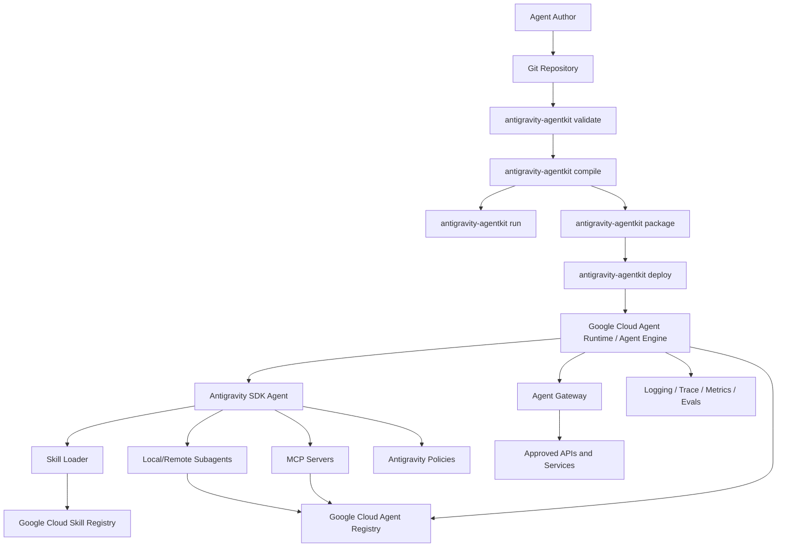
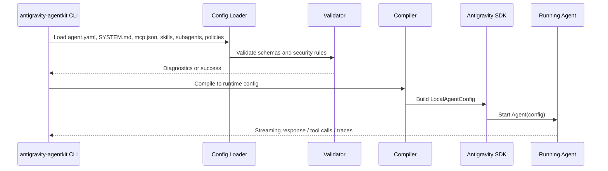
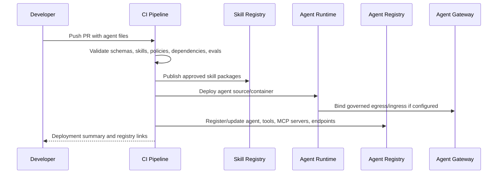

# RFC 0001: Declarative Antigravity AgentKit for Markdown-First Enterprise Agents

- **Status**: Proposed
- **Authors**: yu-iskw, ChatGPT
- **Target repository**: `yu-iskw/antigravity-agentkit`
- **Created**: 2026-06-20
- **Last updated**: 2026-06-20
- **Audience**: Agent platform engineers, Google Cloud platform engineers, security/governance reviewers, enterprise AI application developers

---

## 1. Executive Summary

This RFC proposes building **Antigravity AgentKit**, a Python framework and CLI that lets teams author, validate, run, package, deploy, and govern many different enterprise agents using **Markdown-first declarative configuration** on top of the Google Antigravity SDK.

The recommended approach is **not** to reimplement a full agent runtime. Instead, AgentKit should act as a **compiler, packager, and governance layer** that converts human-authored agent files into Antigravity SDK runtime objects and Google Cloud Agent Platform deployable artifacts.

The intended developer experience is similar to Claude Code, Cursor, and Deep Agents-style workflows:

```text
agent.yaml          # typed agent manifest
SYSTEM.md           # core system instructions
mcp.json            # MCP server declarations
skills/*/SKILL.md   # skill packages
subagents/*.md      # local subagent definitions
policies.yaml       # tool, MCP, and risk policies
evals/*.yaml        # smoke, regression, and governance evaluations
```

AgentKit should provide:

1. **Markdown-first authoring** for instructions, skills, and subagents.
2. **Typed manifests** for runtime, deployment, identity, governance, and registry metadata.
3. **MCP compatibility** by accepting a Claude/Cursor-style `mcp.json` and compiling it to Antigravity SDK `McpStdioServer` objects.
4. **Skill compatibility** with `SKILL.md` package conventions and Google Cloud Skill Registry validation constraints.
5. **Subagent support** through local markdown subagents in v1, then remote Agent Registry / A2A-discoverable agents in later versions.
6. **Enterprise governance** through default-deny tool policies, explicit service accounts, registry metadata, policy checks, evaluation gates, audit logging, and optional Agent Gateway routing.
7. **Deployment automation** to Google Cloud Agent Runtime / Agent Engine using source packages, Developer Connect, or container images.
8. **An implementation path suitable for public PyPI publication**, while keeping enterprise-specific policy packs internal.

The best implementation strategy is incremental:

- **v0.1**: local agent compiler and runner.
- **v0.2**: validation, skill loading, MCP compilation, policies, and test harness.
- **v0.3**: Google Cloud Agent Runtime deployment.
- **v0.4**: Skill Registry and Agent Registry integration.
- **v1.0**: stable schema, governance policy pack, CI templates, and production deployment patterns.

---

## 2. Background and Motivation

### 2.1 Problem Statement

Modern coding agents such as Claude Code and Cursor demonstrate a productive authoring model:

- project-local instructions,
- subagents,
- skills,
- MCP server configuration,
- permission policies,
- plugin-style reuse.

However, the target use case for this project is broader than coding agents. The goal is to quickly create and ship many kinds of enterprise agents, such as:

- data analysis agents,
- BigQuery metadata agents,
- finance analysis agents,
- sales enablement agents,
- compliance review agents,
- internal support agents,
- documentation agents,
- platform operations agents,
- agentic mesh orchestrators.

The Google Antigravity SDK provides Python runtime primitives for building AI agents, including `Agent`, `LocalAgentConfig`, tools, MCP integration, hooks/policies, triggers, streaming, conversations, and Vertex/Gemini Enterprise configuration. The public README describes the SDK as a Python SDK for building AI agents powered by Antigravity and Gemini, abstracting the agentic loop and letting developers focus on what the agent does rather than how it runs.

Relevant Antigravity SDK public capabilities include:

- install via `pip install google-antigravity`, with platform-specific wheels containing a compiled runtime binary;
- `LocalAgentConfig(vertex=True, project=..., location=...)` for Gemini Enterprise / Vertex usage;
- optional `system_instructions`;
- Python callable tools;
- MCP stdio integration using `McpStdioServer`;
- declarative hooks and policies such as `deny`, `allow`, `ask_user`, and `enforce`;
- stateful `Conversation` support;
- streaming responses, thoughts, and tool calls;
- triggers for event-driven/background behavior.

Source: <https://github.com/google-antigravity/antigravity-sdk-python>

Google Cloud Gemini Enterprise Agent Platform adds the production control plane:

- Agent Runtime / Agent Engine deployment;
- Agent Registry;
- Skill Registry;
- Agent Gateway;
- Auth Manager;
- Agent identity and IAM;
- observability, evaluation, and governance capabilities.

Google Cloud Skill Registry is especially relevant because it treats each skill as a self-contained package with structural instructions, executable code, and documentation. It validates skill payloads, requires `SKILL.md`, and creates immutable skill revisions. Google Cloud Agent Registry is also directly relevant because it is documented as a central governance and inventory hub for agents, MCP servers, tools, and endpoints.

Sources:

- Skill Registry: <https://docs.cloud.google.com/gemini-enterprise-agent-platform/build/skill-registry>
- Agent Registry: <https://docs.cloud.google.com/gemini-enterprise-agent-platform/govern/agent-registry>
- Deploy Agent Runtime / Agent Engine: <https://docs.cloud.google.com/gemini-enterprise-agent-platform/scale/runtime/deploy-an-agent>
- Agent Gateway: <https://docs.cloud.google.com/gemini-enterprise-agent-platform/scale/runtime/agent-gateway-runtime-deploy>

### 2.2 Underlying Intent

The real goal is not merely to make Antigravity agents configurable by Markdown. The real goal is:

> Build a governed, reusable, low-code, config-driven enterprise agent factory on top of Antigravity SDK and Google Cloud Agent Platform.

This requires more than prompt files. Production-grade agents need:

- typed schemas,
- deterministic validation,
- package boundaries,
- runtime policies,
- tool allowlists/denylists,
- artifact versioning,
- dependency pinning,
- IAM bindings,
- registry publishing,
- evaluation gates,
- deployment metadata,
- auditability,
- incident response hooks,
- reproducibility.

Therefore AgentKit should be **Markdown-first, not Markdown-only**.

Markdown is appropriate for:

- natural-language instructions,
- skill instructions,
- subagent role definitions,
- examples,
- operating procedures,
- review checklists,
- domain knowledge.

YAML/JSON/Python are still required for:

- validated configuration,
- policy compilation,
- deployment metadata,
- dependency resolution,
- runtime entrypoints,
- CLI behavior,
- structured evaluations.

### 2.3 XY Problem Check

A strict requirement to implement agents **only** with Markdown would be a suboptimal path. It would make early demos faster but would weaken enterprise properties such as validation, security, reproducibility, and governance.

The better approach is:

```text
Markdown + YAML + JSON authoring
        ↓
AgentKit compiler and validator
        ↓
Antigravity SDK runtime objects
        ↓
Google Cloud Agent Runtime deployment
        ↓
Agent Registry / Skill Registry / IAM / Agent Gateway governance
```

---

## 3. Goals and Non-Goals

### 3.1 Goals

AgentKit must:

1. Let users define agents declaratively with `agent.yaml`, `SYSTEM.md`, `mcp.json`, `skills`, `subagents`, `policies.yaml`, and `evals`.
2. Compile declarative definitions into Antigravity SDK objects.
3. Support local execution for development.
4. Support deterministic validation in CI.
5. Support MCP stdio servers declared in `mcp.json`.
6. Support local `SKILL.md` packages.
7. Align local skill validation with Google Cloud Skill Registry constraints.
8. Support local markdown subagents through delegation tools.
9. Provide a deployment path to Google Cloud Agent Runtime / Agent Engine.
10. Support explicit per-agent service accounts and runtime labels.
11. Produce deployment metadata suitable for Agent Registry.
12. Support safe defaults: read-only or default-deny unless explicitly allowed.
13. Provide a stable CLI suitable for automation.
14. Be installable as a Python package.
15. Be designed so an enterprise can keep its internal governance packs private while using the open framework.

### 3.2 Non-Goals

AgentKit v1 should not:

1. Replace the Antigravity SDK runtime.
2. Reimplement MCP.
3. Reimplement Google Cloud Agent Platform.
4. Provide a full remote A2A mesh implementation in the first version.
5. Dynamically install arbitrary MCP servers from untrusted sources at runtime.
6. Allow unreviewed skills to be loaded from public registries in production.
7. Provide a universal workflow engine.
8. Guarantee compatibility with every Claude Code or Cursor setting.
9. Hide IAM, networking, or deployment concerns from platform teams.
10. Treat prompts as sufficient for enterprise governance.

---

## 4. Design Principles

### 4.1 Markdown-First, Typed-Core

Human-facing behavior should be authored in Markdown. Machine-enforced behavior should be expressed in typed YAML/JSON schemas and compiled into Python runtime objects.

### 4.2 Antigravity-Native Runtime

AgentKit should use Antigravity SDK primitives directly where possible:

- `Agent`,
- `LocalAgentConfig`,
- `McpStdioServer`,
- custom Python tools,
- policy hooks,
- capabilities configuration,
- conversations,
- triggers.

### 4.3 Google Cloud-Native Governance

AgentKit should use Google Cloud primitives rather than inventing a parallel governance plane:

- Agent Runtime / Agent Engine for deployment,
- Skill Registry for reusable skills,
- Agent Registry for inventory and discovery,
- Agent Gateway for governed ingress/egress,
- IAM and service accounts for identity,
- Cloud Logging/Trace/Monitoring for observability,
- Secret Manager and Auth Manager where applicable.

### 4.4 Default Deny

The default production posture should be:

- no write tools unless explicitly allowed,
- no arbitrary shell execution unless explicitly allowed,
- no arbitrary MCP server admission,
- no unpinned dependencies,
- no unreviewed skills,
- no broad default service account.

### 4.5 Reproducibility

Every deployed agent should be reproducible from:

- Git revision,
- manifest version,
- package lock,
- skill revisions,
- dependency lock,
- runtime image or source package,
- deployment config.

### 4.6 Progressive Disclosure

Skills and subagents should not all be injected into context unconditionally. AgentKit should load compact indexes first and full instructions only when relevant.

### 4.7 Registry-First Scale

As the number of agents grows, local file discovery should give way to registry-backed discovery:

- Skill Registry for skills,
- Agent Registry for agents, MCP servers, tools, and endpoints.

---

## 5. Proposed Architecture

### 5.1 Logical Architecture



### 5.2 Runtime Compilation Flow



### 5.3 Deployment Flow



---

## 6. Repository Layout

The repository should use a source layout suitable for PyPI packaging and examples.

```text
antigravity-agentkit/
  README.md
  LICENSE
  pyproject.toml
  src/
    antigravity_agentkit/
      __init__.py
      cli.py
      schema/
        __init__.py
        agent.py
        mcp.py
        policies.py
        skills.py
        evals.py
      loader.py
      compiler.py
      runtime.py
      mcp.py
      skills.py
      subagents.py
      policies.py
      deploy.py
      registry.py
      evals.py
      diagnostics.py
      exceptions.py
  docs/
    rfcs/
      0001-declarative-antigravity-agentkit.md
    schemas/
      agent.schema.json
      policies.schema.json
      eval.schema.json
  examples/
    hello-agent/
      agent.yaml
      SYSTEM.md
      mcp.json
      policies.yaml
      evals/
        smoke.yaml
    bigquery-metadata-agent/
      agent.yaml
      SYSTEM.md
      mcp.json
      skills/
        bigquery-analysis/
          SKILL.md
      subagents/
        sql-reviewer.md
      policies.yaml
  tests/
    unit/
    integration/
    fixtures/
```

---

## 7. Authoring Model

### 7.1 Agent Directory Contract

An agent directory is the unit of authoring.

Minimum:

```text
my-agent/
  agent.yaml
  SYSTEM.md
```

Recommended production shape:

```text
my-agent/
  agent.yaml
  SYSTEM.md
  mcp.json
  policies.yaml
  skills.lock
  skills/
    some-skill/
      SKILL.md
  subagents/
    reviewer.md
  evals/
    smoke.yaml
    security.yaml
```

### 7.2 `agent.yaml`

Example:

```yaml
apiVersion: antigravity-agentkit.dev/v1alpha1
kind: Agent

metadata:
  name: finance-analysis-agent
  displayName: Finance Analysis Agent
  description: Governed finance analysis and reporting agent.
  owner: finance-platform
  labels:
    domain: finance
    criticality: high
    data-classification: confidential

spec:
  runtime:
    framework: antigravity
    model: gemini-2.5-pro
    vertex:
      enabled: true
      project: my-agent-project
      location: asia-northeast1
    capabilities:
      mode: restricted

  instructions:
    system: SYSTEM.md

  mcp:
    file: mcp.json
    admissionPolicy:
      allowedServers:
        - bigquery-metadata
        - lightdash-readonly

  skills:
    local:
      - skills/bigquery-analysis
    registry:
      - name: projects/my-agent-project/locations/us-central1/skills/gcp-skill-registry
        revision: default
        mode: pinned

  subagents:
    - name: sql-reviewer
      type: markdown
      file: subagents/sql-reviewer.md
      tools:
        - mcp.bigquery-metadata.get_table_metadata
        - mcp.bigquery-metadata.dry_run_query

  policies:
    file: policies.yaml

  deployment:
    target: agent-runtime
    displayName: Finance Analysis Agent
    serviceAccount: finance-analysis-agent@my-agent-project.iam.gserviceaccount.com
    minInstances: 0
    maxInstances: 5
    resourceLimits:
      cpu: "2"
      memory: "4Gi"
    containerConcurrency: 5
    labels:
      owner: finance-platform
      managed-by: antigravity-agentkit

  registry:
    agentRegistry:
      enabled: true
    skillRegistry:
      publishLocalSkills: false

  evals:
    files:
      - evals/smoke.yaml
      - evals/security.yaml
```

### 7.3 `SYSTEM.md`

`SYSTEM.md` contains durable behavioral instructions.

Recommended structure:

```markdown
# Role

You are a governed finance analysis agent.

# Primary Responsibilities

1. Help users inspect approved finance metadata.
2. Draft SQL only after inspecting table metadata.
3. Prefer dry-run validation before query execution.
4. Explain assumptions and limitations.

# Safety Rules

- Do not request or expose raw PII unless explicitly approved by policy.
- Do not execute write operations.
- Do not use unapproved MCP tools.

# Response Format

Use:

1. executive summary,
2. analysis,
3. assumptions,
4. risks,
5. next actions.
```

### 7.4 `mcp.json`

AgentKit should accept a common MCP config shape:

```json
{
  "mcpServers": {
    "bigquery-metadata": {
      "command": "uvx",
      "args": ["company-bigquery-mcp"],
      "env": {
        "GOOGLE_CLOUD_PROJECT": "my-data-project"
      }
    },
    "lightdash-readonly": {
      "command": "npx",
      "args": ["-y", "@company/lightdash-mcp", "--profile", "readonly"],
      "env": {
        "LIGHTDASH_URL": "<https://lightdash.example.com">
      }
    }
  }
}
```

AgentKit compiles this to Antigravity SDK MCP server objects.

Expected internal representation:

```python
from google.antigravity.types import McpStdioServer

McpStdioServer(
    name="bigquery-metadata",
    command="uvx",
    args=["company-bigquery-mcp"],
)
```

Important constraint: MCP `env` may include references to environment variables or secret names, but AgentKit should not inline secrets into generated files.

### 7.5 `SKILL.md` Packages

AgentKit local skills should follow a structure compatible with Google Cloud Skill Registry expectations.

```text
skills/bigquery-analysis/
  SKILL.md
  examples.md
  scripts/
    validate_sql.py
```

Example:

```markdown
---
name: bigquery-analysis
description: Use this skill for BigQuery metadata inspection, SQL review, dry-run validation, and privacy-aware analytics workflows.
license: Apache-2.0
---

# BigQuery Analysis Skill

## When to use

Use this skill when the user asks for BigQuery table discovery, SQL generation, SQL review, query cost estimation, or analytics troubleshooting.

## Procedure

1. Inspect metadata before writing SQL.
2. Prefer dry-run validation before execution.
3. Avoid unrestricted raw PII columns unless policy permits.
4. Explain assumptions and limitations.
```

AgentKit validation should mirror relevant Google Skill Registry constraints:

- package must contain `SKILL.md`,
- `SKILL.md` must contain YAML frontmatter and Markdown content,
- `name` must be present and follow lowercase/hyphen conventions,
- `description` must be present and bounded,
- archive must reject path traversal and symlinks,
- package should avoid excessive nesting and size.

Google Cloud Skill Registry currently documents validation constraints including required `SKILL.md`, zip archive validation, no symbolic links, no path traversal, maximum archive size, and frontmatter rules.

Source: <https://docs.cloud.google.com/gemini-enterprise-agent-platform/build/skill-registry>

### 7.6 Subagents

AgentKit should support two subagent modes.

#### 7.6.1 Local Markdown Subagents

These are lightweight prompt-scoped subagents for local decomposition.

```markdown
---
name: sql-reviewer
description: Reviews SQL for BigQuery correctness, cost, safety, and privacy.
tools:
  - mcp.bigquery-metadata.get_table_metadata
  - mcp.bigquery-metadata.dry_run_query
---

# SQL Reviewer

Review generated SQL before execution.

Return:

1. correctness issues,
2. cost risks,
3. privacy risks,
4. suggested corrected SQL if needed.
```

AgentKit should compile each local subagent into a Python tool exposed to the main agent:

```python
async def delegate_to_sql_reviewer(task: str) -> str:
    """Delegate a SQL review task to the sql-reviewer subagent."""
    ...
```

#### 7.6.2 Remote Subagents

Remote subagents should be treated as separately deployed agents discovered through Agent Registry or called through A2A-compatible endpoints.

This is the recommended production path for high-risk or independently governed capabilities.

```yaml
subagents:
  - name: pii-reviewer
    type: remote
    registryRef: projects/my-project/locations/us-central1/agents/pii-reviewer
    auth:
      mode: agent-identity
```

### 7.7 `policies.yaml`

Example:

```yaml
default: deny

allow:
  - tool: view_file
  - tool: mcp.bigquery-metadata.list_datasets
  - tool: mcp.bigquery-metadata.get_table_metadata
  - tool: mcp.bigquery-metadata.dry_run_query

askUser:
  - tool: mcp.bigquery-metadata.run_query
    when:
      risk: medium

requireApproval:
  - tool: mcp.bigquery-metadata.run_query
    when:
      estimatedBytesProcessedGt: 10000000000

 deny:
  - tool: run_command
  - tool: write_file
  - tool: mcp.lightdash.delete_user
  - tool: mcp.lightdash.delete_project
```

Note: the accidental leading space before `deny` above should be rejected by schema validation. The validator must catch malformed YAML and unknown fields.

AgentKit should compile this into Antigravity policy hooks using `deny`, `allow`, `ask_user`, and custom enforcement where needed.

### 7.8 Evaluations

Example `evals/smoke.yaml`:

```yaml
version: 1
cases:
  - name: metadata-discovery
    input: "List approved finance datasets and summarize available tables."
    expected:
      mustMention:
        - "dataset"
        - "table"
      mustNotMention:
        - "raw password"
    tools:
      allowed:
        - mcp.bigquery-metadata.list_datasets
        - mcp.bigquery-metadata.list_tables
      denied:
        - run_command
```

AgentKit should initially support simple local deterministic eval assertions:

- must mention,
- must not mention,
- allowed tools,
- denied tools,
- maximum tool calls,
- maximum latency,
- forbidden data patterns.

Later versions should integrate with Google Cloud Agent Evaluation where appropriate.

---

## 8. Package Design

### 8.1 Python Modules

```text
src/antigravity_agentkit/
  cli.py              # Typer/Click CLI
  loader.py           # Load file tree into raw model
  schema/             # Pydantic models and JSON schema export
  compiler.py         # AgentSpec -> Antigravity runtime objects
  runtime.py          # local run/chat helpers
  mcp.py              # MCP config parser/compiler
  skills.py           # local/registry skill indexing/loading/packaging
  subagents.py        # markdown subagent loader/delegation tool compiler
  policies.py         # policy YAML -> Antigravity hooks
  deploy.py           # Agent Runtime deployment adapters
  registry.py         # Agent Registry/Skill Registry adapters
  evals.py            # evaluation runner
  diagnostics.py      # rich validation diagnostics
  exceptions.py       # typed exceptions
```

### 8.2 Public Python API

Minimum v0.1 API:

```python
from antigravity_agentkit import load_agent, compile_agent_config

config = compile_agent_config("./agents/hello-agent")
agent = load_agent("./agents/hello-agent")
```

Recommended v0.2 API:

```python
from antigravity_agentkit import AgentProject

project = AgentProject.load("./agents/finance-analysis-agent")
project.validate()
config = project.compile()
agent = project.create_agent()
```

### 8.3 CLI

```bash
antigravity-agentkit init my-agent
antigravity-agentkit validate ./agents/my-agent
antigravity-agentkit compile ./agents/my-agent
antigravity-agentkit run ./agents/my-agent --prompt "Hello"
antigravity-agentkit eval ./agents/my-agent
antigravity-agentkit package ./agents/my-agent
antigravity-agentkit deploy ./agents/my-agent --project my-project --location asia-northeast1
antigravity-agentkit publish-skill ./skills/bigquery-analysis --project my-project --location us-central1
antigravity-agentkit register ./agents/my-agent --project my-project --location us-central1
```

### 8.4 CLI Command Behavior

| Command         | Purpose                             | Must be deterministic? | Cloud required? |
| --------------- | ----------------------------------- | ---------------------: | --------------: |
| `init`          | Scaffold agent directory            |                    Yes |              No |
| `validate`      | Schema/security validation          |                    Yes |              No |
| `compile`       | Emit generated runtime view         |                    Yes |              No |
| `run`           | Local Antigravity run               |                 Mostly |              No |
| `eval`          | Run tests                           |                 Mostly |        Optional |
| `package`       | Build deployable source bundle      |                    Yes |              No |
| `deploy`        | Deploy to Agent Runtime             |                     No |             Yes |
| `publish-skill` | Upload skill to Skill Registry      |                     No |             Yes |
| `register`      | Register metadata to Agent Registry |                     No |             Yes |

---

## 9. Compiler Design

### 9.1 Compiler Inputs

```text
Agent directory
  ├── agent.yaml
  ├── SYSTEM.md
  ├── mcp.json
  ├── policies.yaml
  ├── skills/
  ├── subagents/
  └── evals/
```

### 9.2 Compiler Outputs

Local execution output:

- `LocalAgentConfig`,
- initialized `Agent`,
- tool list,
- policy hooks,
- skill index,
- diagnostics.

Packaging output:

- generated `agent.py`,
- copied manifest files,
- generated `requirements.txt`,
- optional lock file,
- metadata JSON,
- optional source package archive.

Deployment output:

- Agent Runtime config dictionary,
- source package list or container spec,
- registry metadata,
- deployment summary.

### 9.3 Example Compiler Pseudocode

```python
from pathlib import Path
from google.antigravity import LocalAgentConfig, Agent
from google.antigravity.types import McpStdioServer

class AgentProject:
    def __init__(self, root: Path):
        self.root = root
        self.manifest = None

    @classmethod
    def load(cls, path: str) -> "AgentProject":
        project = cls(Path(path))
        project.manifest = load_agent_yaml(project.root / "agent.yaml")
        return project

    def validate(self) -> None:
        validate_agent_manifest(self.manifest)
        validate_system_md(self.root / self.manifest.spec.instructions.system)
        validate_mcp_json(self.root / self.manifest.spec.mcp.file)
        validate_skills(self.root, self.manifest.spec.skills)
        validate_policies(self.root / self.manifest.spec.policies.file)

    def compile(self) -> LocalAgentConfig:
        system = render_system_instructions(self.root, self.manifest)
        mcp_servers = compile_mcp_servers(self.root, self.manifest)
        tools = compile_tools(self.root, self.manifest)
        policies = compile_policies(self.root, self.manifest)

        vertex = self.manifest.spec.runtime.vertex

        return LocalAgentConfig(
            system_instructions=system,
            vertex=vertex.enabled,
            project=vertex.project,
            location=vertex.location,
            mcp_servers=mcp_servers,
            tools=tools,
            policies=policies,
        )

    def create_agent(self) -> Agent:
        return Agent(self.compile())
```

### 9.4 MCP Compilation

```python
def compile_mcp_servers(mcp_config: dict) -> list[McpStdioServer]:
    servers = []
    for name, cfg in mcp_config.get("mcpServers", {}).items():
        servers.append(
            McpStdioServer(
                name=name,
                command=cfg["command"],
                args=cfg.get("args", []),
            )
        )
    return servers
```

Security restrictions:

- reject unapproved command names in production mode,
- reject shell strings such as `sh -c` unless explicitly allowed,
- reject remote installation commands unless package is pinned,
- forbid secrets in `mcp.json`,
- require each MCP server to be declared in policy or registry metadata,
- require explicit admission policy for production.

### 9.5 Skill Loading

Recommended progressive disclosure:

1. Load skill frontmatter only.
2. Inject compact skill index into system context.
3. At runtime, expose `read_skill(name)` as an internal tool.
4. Load full `SKILL.md` only when selected.
5. Load supporting files only when explicitly requested by the skill procedure.

This avoids context bloat and mirrors the design of modern skill-based agents.

### 9.6 Subagent Compilation

Local markdown subagents should compile into delegation tools:

```python
async def delegate(task: str) -> str:
    sub_config = LocalAgentConfig(
        system_instructions=subagent_prompt,
        tools=allowed_subagent_tools,
        policies=subagent_policies,
        vertex=parent_vertex.enabled,
        project=parent_vertex.project,
        location=parent_vertex.location,
    )
    async with Agent(sub_config) as subagent:
        response = await subagent.chat(task)
        return await response.text()
```

Open design question: whether each delegation should create a fresh subagent instance or reuse a session. v0.1 should use fresh instances for isolation and simplicity. Later versions can add session reuse.

---

## 10. Deployment Design

### 10.1 Supported Deployment Modes

Google Cloud Agent Runtime / Agent Engine documentation describes multiple deployment approaches, including Python object deployment, Developer Connect Git deployment, source files, Dockerfile, and container image deployment.

AgentKit should support deployment modes in this order:

1. **Source package deployment**: best initial production path.
2. **Developer Connect deployment**: best GitOps path.
3. **Container image deployment**: best regulated enterprise path.
4. **Python object deployment**: useful for interactive development only.

Source: <https://docs.cloud.google.com/gemini-enterprise-agent-platform/scale/runtime/deploy-an-agent>

### 10.2 Source Package Deployment

AgentKit should generate a source package with an entrypoint object.

Example generated files:

```text
.build/finance-analysis-agent/
  agent.py
  requirements.txt
  agent.yaml
  SYSTEM.md
  mcp.json
  policies.yaml
  skills/
  subagents/
```

Generated `agent.py`:

```python
from antigravity_agentkit.runtime import RuntimeAgent

root_agent = RuntimeAgent.from_directory(".")
```

Deployment config:

```python
client.agent_engines.create(
    config={
        "source_packages": [".build/finance-analysis-agent"],
        "entrypoint_module": "agent",
        "entrypoint_object": "root_agent",
        "requirements_file": "requirements.txt",
        "display_name": "Finance Analysis Agent",
        "description": "Governed finance analysis and reporting agent.",
        "labels": {
            "managed-by": "antigravity-agentkit",
            "domain": "finance",
        },
        "service_account": "finance-analysis-agent@my-agent-project.iam.gserviceaccount.com",
        "min_instances": 0,
        "max_instances": 5,
        "resource_limits": {"cpu": "2", "memory": "4Gi"},
        "container_concurrency": 5,
    }
)
```

Agent Runtime documentation shows `source_packages`, `entrypoint_module`, `entrypoint_object`, `requirements_file`, labels, env vars, service accounts, resource limits, min/max instances, container concurrency, and optional framework metadata as supported config fields.

### 10.3 Container Deployment

For high-governance environments, AgentKit should support generating a container-compatible layout.

```Dockerfile
FROM python:3.12-slim
WORKDIR /app
COPY requirements.txt ./
RUN pip install --no-cache-dir -r requirements.txt
COPY . .
CMD ["python", "-m", "antigravity_agentkit.server", "--agent-dir", "."]
```

Use container image deployment when:

- dependency installation must be controlled,
- images must be vulnerability-scanned,
- SBOM and provenance are required,
- build must run in Cloud Build / GitHub Actions,
- org policy disallows dynamic build behavior.

### 10.4 Service Accounts

Every production agent should specify a service account. Do not rely on the default Reasoning Engine / Agent Runtime service identity for production.

Recommended naming:

```text
agent-{agent-name}@{project}.iam.gserviceaccount.com
```

Recommended IAM:

- grant only required Google Cloud API permissions,
- separate deployer identity from runtime identity,
- separate registry publisher from runtime identity,
- prohibit runtime identity from modifying its own deployment or policies,
- bind dataset/table permissions narrowly when BigQuery is involved.

### 10.5 Region Strategy

The manifest should allow region configuration.

Example:

```yaml
runtime:
  vertex:
    location: asia-northeast1
```

Caveat: not every Agent Platform feature is necessarily available in every region. The CLI should validate known incompatibilities where possible and produce a warning when registry/control-plane resources require a different location from runtime resources.

---

## 11. Registry Integration

### 11.1 Skill Registry

AgentKit should support:

```bash
antigravity-agentkit publish-skill ./skills/bigquery-analysis \
  --project my-project \
  --location us-central1
```

Validation before publish:

- `SKILL.md` exists,
- YAML frontmatter valid,
- name/description/license constraints,
- no symlinks,
- no path traversal,
- no oversized files,
- zip can be built reproducibly,
- optional semantic policy scan.

Skill Registry creates immutable skill revisions. AgentKit should store published revision metadata in `skills.lock`.

Example `skills.lock`:

```yaml
version: 1
skills:
  - name: bigquery-analysis
    source: local
    registryName: projects/my-project/locations/us-central1/skills/bigquery-analysis
    revision: projects/my-project/locations/us-central1/skills/bigquery-analysis/revisions/20260620-abc123
    sha256: "..."
```

### 11.2 Agent Registry

AgentKit should support:

```bash
antigravity-agentkit register ./agents/finance-analysis-agent \
  --project my-project \
  --location us-central1
```

Registry metadata should include:

- agent name,
- display name,
- description,
- owner,
- labels,
- runtime endpoint,
- deployment project,
- deployment region,
- service account,
- MCP servers used,
- tools exposed,
- skills referenced,
- upstream/downstream agent dependencies,
- data classifications,
- policy profile,
- source repository URL,
- Git SHA,
- artifact digest,
- eval summary.

Agent Registry is documented as a governance and inventory catalog for agents, MCP servers, tools, and endpoints. AgentKit should use it as the central inventory rather than maintaining a separate registry database.

Source: <https://docs.cloud.google.com/gemini-enterprise-agent-platform/govern/agent-registry>

### 11.3 MCP Server Registration

AgentKit should optionally register MCP servers used by an agent.

Example manifest:

```yaml
registry:
  mcpServers:
    register: true
```

Metadata:

- server name,
- transport type,
- command or remote URL,
- package/source reference,
- tools exposed,
- auth mode,
- owner,
- risk rating,
- allowed agents,
- version/digest.

---

## 12. Security and Governance

### 12.1 Threat Model

AgentKit introduces several risk surfaces:

| Risk                      | Example                                         | Mitigation                                                        |
| ------------------------- | ----------------------------------------------- | ----------------------------------------------------------------- |
| Prompt injection          | User asks agent to ignore policies              | Compile policies outside prompt; default deny tools               |
| Tool abuse                | Agent calls delete or write tools               | Tool allowlist, denylist, `ask_user`, external approvals          |
| MCP server compromise     | MCP server exfiltrates context                  | MCP admission policy, registry allowlist, network egress controls |
| Skill supply-chain attack | Malicious `SKILL.md` steers behavior            | Skill validation, review, registry pinning, semantic scans        |
| Dependency compromise     | Unpinned package in MCP command                 | lock files, hashes, internal package mirrors                      |
| Privilege escalation      | Runtime SA can deploy or modify IAM             | separate deployer/runtime identities                              |
| Data exfiltration         | Agent sends sensitive data to external endpoint | Agent Gateway egress allowlist, DLP checks, logging               |
| Shadow agents             | Unregistered agents deployed manually           | org policy, registry audit, CI enforcement                        |
| Overbroad subagents       | Subagent inherits all parent tools              | per-subagent tool scoping                                         |

### 12.2 MCP Security

MCP standardizes LLM access to external data and tools using JSON-RPC between hosts, clients, and servers. The MCP specification explicitly calls out security considerations including user consent, data privacy, tool safety, and the fact that tool behavior descriptions should be treated as untrusted unless obtained from trusted servers.

Source: <https://modelcontextprotocol.io/specification/2025-06-18>

AgentKit should therefore:

- treat MCP server configs as privileged code,
- require production allowlists,
- reject untrusted package installation by default,
- log tool calls,
- support explicit user approval for risky tools,
- support Agent Gateway egress controls,
- never put secrets directly into `mcp.json`.

### 12.3 Agent Gateway

Agent Gateway can route Agent Runtime traffic and enforce governed connectivity. Google documentation notes default-deny behavior for Agent Gateway traffic, requiring allowed endpoints for platform functions such as Cloud Trace and Cloud Logging.

Source: <https://docs.cloud.google.com/gemini-enterprise-agent-platform/scale/runtime/agent-gateway-runtime-deploy>

AgentKit should support manifest configuration for gateway mode:

```yaml
deployment:
  gateway:
    enabled: true
    egressPolicy: approved-agent-egress
    requiredEndpoints:
      - <https://telemetry.googleapis.com/>
      - <https://logging.googleapis.com/>
```

### 12.4 Policy Profiles

AgentKit should ship with policy profiles:

| Profile               | Use case                  | Behavior                                              |
| --------------------- | ------------------------- | ----------------------------------------------------- |
| `dev-open`            | local prototyping         | relaxed, warnings only                                |
| `dev-restricted`      | normal local development  | default deny for dangerous tools                      |
| `prod-readonly`       | metadata/read-only agents | no writes, no shell, approved MCP only                |
| `prod-human-approval` | medium-risk agents        | risky tools require approval                          |
| `prod-locked`         | regulated agents          | registry-pinned tools/skills only, no dynamic loading |

### 12.5 Secrets

AgentKit must not persist secrets in manifests.

Allowed:

```yaml
env:
  LIGHTDASH_URL: "<https://lightdash.example.com">
  GOOGLE_CLOUD_PROJECT: "my-project"
```

Not allowed:

```yaml
env:
  LIGHTDASH_API_KEY: "sk_live_..."
```

Recommended secret references:

```yaml
envFromSecretManager:
  LIGHTDASH_CLIENT_SECRET: projects/my-project/secrets/lightdash-client-secret/versions/latest
```

### 12.6 Supply Chain

Production CI should enforce:

- pinned Python dependencies,
- package hash locking where possible,
- internal package mirror for critical MCP servers,
- SBOM generation,
- vulnerability scanning,
- signed container images,
- signed skill archives,
- provenance metadata.

---

## 13. Validation and Diagnostics

### 13.1 Validation Levels

| Level    | Command                                          | Purpose                               |
| -------- | ------------------------------------------------ | ------------------------------------- |
| Syntax   | `antigravity-agentkit validate --level syntax`   | YAML/JSON/Markdown/frontmatter parse  |
| Schema   | `antigravity-agentkit validate --level schema`   | Pydantic/JSON Schema validation       |
| Security | `antigravity-agentkit validate --level security` | unsafe commands, secrets, risky tools |
| Cloud    | `antigravity-agentkit validate --level cloud`    | IAM, regions, registry resources      |
| Full     | `antigravity-agentkit validate --level full`     | all checks                            |

### 13.2 Example Diagnostics

```text
ERROR AGK-MCP-003: mcp.json contains unpinned remote package command.
  file: agents/foo/mcp.json
  path: $.mcpServers.lightdash.args
  hint: Pin package version or use an approved internal package mirror.

ERROR AGK-SKILL-001: Skill package is missing SKILL.md.
  file: skills/bigquery-analysis/

WARN AGK-POLICY-007: Production agent has no explicit deny rule for run_command.
  file: agents/foo/policies.yaml
```

### 13.3 CI Requirements

Minimum CI:

```bash
antigravity-agentkit validate ./agents --recursive --profile prod-readonly
antigravity-agentkit eval ./agents --recursive --suite smoke
```

Recommended CI:

```bash
antigravity-agentkit validate ./agents --recursive --profile prod-locked
antigravity-agentkit package ./agents --recursive --check-reproducible
antigravity-agentkit eval ./agents --recursive --suite smoke,security,regression
antigravity-agentkit sbom ./agents --recursive
```

---

## 14. Observability

AgentKit should emit structured events:

- agent loaded,
- agent compiled,
- MCP server admitted/rejected,
- skill indexed/read,
- subagent delegated,
- tool call started/completed/failed,
- policy decision,
- eval case result,
- deployment created/updated,
- registry publish/update.

Recommended log shape:

```json
{
  "event": "tool_call.policy_decision",
  "agent": "finance-analysis-agent",
  "tool": "mcp.bigquery-metadata.run_query",
  "decision": "ask_user",
  "policy": "prod-human-approval",
  "request_id": "...",
  "timestamp": "2026-06-20T00:00:00Z"
}
```

For production, integrate with:

- Cloud Logging,
- Cloud Trace,
- Cloud Monitoring,
- OpenTelemetry where appropriate.

---

## 15. Versioning and Compatibility

### 15.1 Schema Versioning

`apiVersion` controls manifest behavior.

Initial version:

```yaml
apiVersion: antigravity-agentkit.dev/v1alpha1
```

Compatibility rules:

- `v1alpha1`: breaking changes allowed with migration tool.
- `v1beta1`: breaking changes require deprecation period.
- `v1`: stable with backward-compatible additions only.

### 15.2 Lock Files

Recommended lock files:

```text
agent.lock
skills.lock
requirements.lock
```

`agent.lock` should include:

- manifest hash,
- `SYSTEM.md` hash,
- MCP config hash,
- policy hash,
- skill hashes/revisions,
- package versions,
- deployment digest.

### 15.3 Generated Metadata

AgentKit should produce:

```json
{
  "agentkitVersion": "0.1.0",
  "agentName": "finance-analysis-agent",
  "gitSha": "...",
  "manifestSha256": "...",
  "sourceDigest": "...",
  "skills": [],
  "mcpServers": [],
  "createdAt": "2026-06-20T00:00:00Z"
}
```

---

## 16. Implementation Plan

### 16.1 Milestone v0.1: Local Compiler and Runner

Deliverables:

- Python package skeleton,
- `agent.yaml` Pydantic model,
- `SYSTEM.md` loader,
- `mcp.json` loader,
- `compile_agent_config`,
- `antigravity-agentkit validate`,
- `antigravity-agentkit run`,
- one hello-world example.

Acceptance criteria:

- Can run a local agent from `agent.yaml` and `SYSTEM.md`.
- Can compile simple `mcp.json` to Antigravity MCP servers.
- Fails clearly on invalid manifests.

### 16.2 Milestone v0.2: Skills, Subagents, Policies

Deliverables:

- local `SKILL.md` parser,
- skill index injection,
- `read_skill` helper,
- local markdown subagent loader,
- delegation tool compiler,
- `policies.yaml` compiler,
- security validation profile.

Acceptance criteria:

- Agent can use a local skill.
- Agent can delegate to a local markdown subagent.
- Tool policies are enforced with default deny.
- CI can reject unsafe MCP and skill configurations.

### 16.3 Milestone v0.3: Packaging and Agent Runtime Deployment

Deliverables:

- source package generator,
- generated runtime entrypoint,
- `requirements.txt` generation,
- `antigravity-agentkit package`,
- `antigravity-agentkit deploy`,
- deployment examples.

Acceptance criteria:

- A generated source package deploys to Agent Runtime / Agent Engine.
- Runtime service account is configurable.
- Labels and resource settings are applied.

### 16.4 Milestone v0.4: Registry Integration

Deliverables:

- `antigravity-agentkit publish-skill`,
- Skill Registry zip packaging,
- `skills.lock`,
- `antigravity-agentkit register`,
- Agent Registry metadata generation,
- MCP server metadata generation.

Acceptance criteria:

- Local skill can be published and locked.
- Agent deployment can be represented in registry metadata.
- Registry publish failures are reported with actionable diagnostics.

### 16.5 Milestone v1.0: Stable Enterprise Framework

Deliverables:

- stable schema,
- CI templates,
- examples for data agent, support agent, orchestrator agent,
- container deployment pattern,
- Terraform examples,
- policy profile library,
- documentation site,
- public PyPI release.

Acceptance criteria:

- At least three production-like examples.
- End-to-end GitOps deployment path.
- Backward-compatible schema commitment.
- Governance review completed.

---

## 17. Alternatives Considered

### 17.1 Pure Markdown Agents

Rejected as the primary architecture.

Pros:

- very fast authoring,
- easy for non-engineers,
- resembles Claude/Cursor ergonomics.

Cons:

- weak validation,
- weak governance,
- hard to deploy reproducibly,
- hard to enforce IAM/policies,
- high supply-chain risk,
- insufficient for enterprise production.

### 17.2 Full Custom Agent Runtime

Rejected.

Pros:

- maximum control,
- can exactly mimic Claude/Cursor/Deep Agents.

Cons:

- duplicates Antigravity SDK,
- high engineering cost,
- higher reliability risk,
- weaker Google Cloud alignment.

### 17.3 ADK-First Framework

Viable alternative, but not the best fit for this repository if the goal is specifically to build on Antigravity SDK.

Pros:

- strong Google Cloud alignment,
- likely broad platform support,
- official ADK patterns.

Cons:

- less Antigravity-native,
- may require separate abstractions for Markdown skills/subagents,
- does not directly answer the Antigravity SDK framework goal.

### 17.4 LangChain Deep Agents-Style Runtime

Viable for advanced agents, but too large for the first version.

Pros:

- strong skill/subagent/filesystem model,
- flexible runtime patterns.

Cons:

- complex,
- likely reimplements many behaviors,
- harder to govern predictably,
- more moving parts.

### 17.5 Skills-as-Products Only

Good long-term governance pattern, insufficient alone.

Pros:

- high reuse,
- registry-friendly,
- strong review lifecycle.

Cons:

- still need agent manifests, deployment, policies, and runtime wiring.

---

## 18. Recommendation

Adopt the **Declarative Compiler Architecture**:

```text
Agent source files
  agent.yaml + SYSTEM.md + mcp.json + SKILL.md + subagents + policies
        ↓
AgentKit validation and compilation
        ↓
Antigravity SDK LocalAgentConfig / Agent
        ↓
Local run, package, eval, deploy
        ↓
Google Cloud Agent Runtime / Agent Engine
        ↓
Agent Registry + Skill Registry + IAM + Agent Gateway
```

This approach has the best balance of:

- authoring speed,
- Antigravity SDK fit,
- Google Cloud governance fit,
- security,
- portability,
- incremental implementation cost.

---

## 19. Open Questions

1. Which deployment API should AgentKit target first: current `google-cloud-aiplatform` Agent Engine client, new `google.genai` client, or both through an adapter?
2. Should local markdown subagents share parent conversation history or receive a bounded task-only context?
3. Should skill loading be implemented as prompt compilation, internal tools, or both?
4. How should AgentKit represent remote A2A agents before Agent Registry integration is stable?
5. Should `mcp.json` support only stdio in v1, or also remote HTTP MCP servers?
6. Should `antigravity-agentkit deploy` directly mutate cloud resources, or should it emit Terraform/GitOps specs by default?
7. How should human approval workflows integrate with Antigravity `ask_user` in non-interactive cloud deployments?
8. How much of the policy system should live in AgentKit versus Google Cloud Agent Gateway / policy services?
9. Should public PyPI package include Google Cloud deployment code by default or split it into extras such as `antigravity-agentkit[gcp]`?
10. What is the right compatibility target for Python versions, given Antigravity SDK wheel constraints?

---

## 20. Proposed Initial Issues

1. Create Python package skeleton with `src/antigravity_agentkit`.
2. Add Pydantic schema for `agent.yaml`.
3. Add JSON schema export for editor validation.
4. Implement `antigravity-agentkit init`.
5. Implement `antigravity-agentkit validate`.
6. Implement `SYSTEM.md` loader.
7. Implement `mcp.json` parser and compiler.
8. Implement `compile_agent_config`.
9. Implement `antigravity-agentkit run`.
10. Add hello-world example.
11. Add local skill parser.
12. Add skill validation aligned with Google Skill Registry constraints.
13. Add local subagent parser.
14. Add delegation tool generation.
15. Add policy YAML parser.
16. Add policy compiler to Antigravity hooks.
17. Add packaging command.
18. Add Agent Runtime source package deploy adapter.
19. Add Skill Registry publishing adapter.
20. Add Agent Registry metadata adapter.

---

## 21. Appendix A: Minimal Example

```text
examples/hello-agent/
  agent.yaml
  SYSTEM.md
```

`agent.yaml`:

```yaml
apiVersion: antigravity-agentkit.dev/v1alpha1
kind: Agent
metadata:
  name: hello-agent
  displayName: Hello Agent
  description: Minimal Antigravity AgentKit example.
spec:
  runtime:
    framework: antigravity
    vertex:
      enabled: false
  instructions:
    system: SYSTEM.md
```

`SYSTEM.md`:

```markdown
# Role

You are a concise helpful assistant.
```

Run:

```bash
antigravity-agentkit validate examples/hello-agent
antigravity-agentkit run examples/hello-agent --prompt "Hello"
```

---

## 22. Appendix B: Production Example Skeleton

```text
agents/finance-analysis-agent/
  agent.yaml
  SYSTEM.md
  mcp.json
  policies.yaml
  skills.lock
  skills/
    bigquery-analysis/
      SKILL.md
  subagents/
    sql-reviewer.md
  evals/
    smoke.yaml
    security.yaml
```

Run locally:

```bash
antigravity-agentkit validate agents/finance-analysis-agent --profile prod-readonly
antigravity-agentkit eval agents/finance-analysis-agent
antigravity-agentkit run agents/finance-analysis-agent --prompt "Summarize available finance tables."
```

Deploy:

```bash
antigravity-agentkit package agents/finance-analysis-agent
antigravity-agentkit deploy agents/finance-analysis-agent \
  --project my-agent-project \
  --location asia-northeast1
```

Register:

```bash
antigravity-agentkit register agents/finance-analysis-agent \
  --project my-agent-project \
  --location us-central1
```

---

## 23. Appendix C: Source References

- Google Antigravity SDK Python: <https://github.com/google-antigravity/antigravity-sdk-python>
- Google Cloud Skill Registry: <https://docs.cloud.google.com/gemini-enterprise-agent-platform/build/skill-registry>
- Google Cloud Agent Registry: <https://docs.cloud.google.com/gemini-enterprise-agent-platform/govern/agent-registry>
- Google Cloud Agent Runtime deployment: <https://docs.cloud.google.com/gemini-enterprise-agent-platform/scale/runtime/deploy-an-agent>
- Google Cloud Agent Gateway with Agent Runtime: <https://docs.cloud.google.com/gemini-enterprise-agent-platform/scale/runtime/agent-gateway-runtime-deploy>
- Model Context Protocol specification 2025-06-18: <https://modelcontextprotocol.io/specification/2025-06-18>
