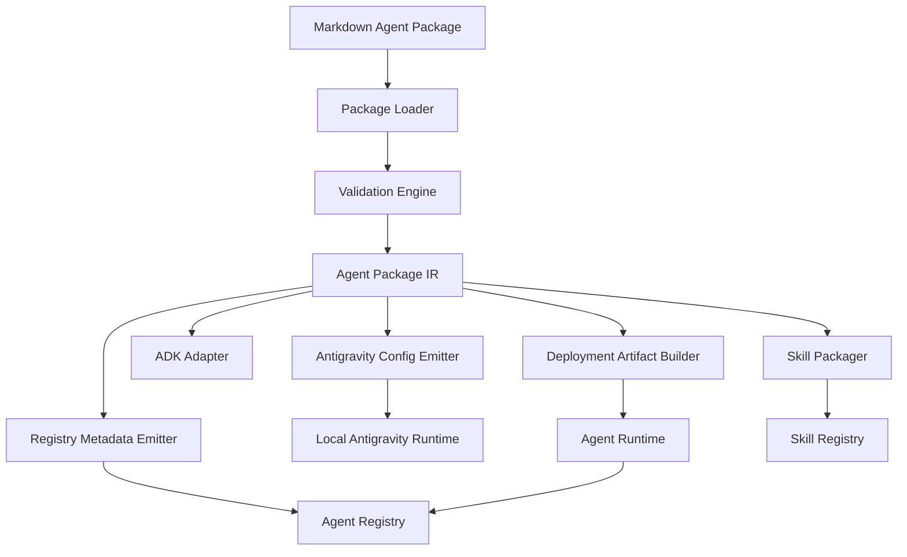

# RFC 0001: Markdown-Native Agent Packages for Antigravity AgentKit

- **Status:** Draft
- **Author:** Yu Ishikawa
- **Created:** 2026-06-20
- **Target repository:** `yu-iskw/antigravity-agentkit`
- **Primary implementation package:** `antigravity-agentkit`
- **Primary runtime target:** Google Antigravity SDK
- **Primary cloud target:** Gemini Enterprise Agent Platform / Agent Runtime
- **Governance targets:** Agent Registry, Skill Registry, Agent Gateway, IAM, CI/CD policy gates

---

## 1. Executive Summary

This RFC proposes **Antigravity AgentKit**, a markdown-native framework for defining, validating, packaging, deploying, and governing large sets of AI agents on top of the Google Antigravity SDK and Gemini Enterprise Agent Platform.

The recommended approach is **not** to replace Antigravity SDK, ADK, LangGraph, or other agent runtimes. Instead, AgentKit should provide a thin but disciplined **agent package layer** whose source of truth is a repository-friendly set of files:

```text
AGENT.md
mcp.json
subagents/*.md
skills/*/SKILL.md
policy.yaml
evals/*.yaml
```

AgentKit compiles these files into a validated intermediate representation, then emits runtime-specific outputs:

- Antigravity SDK `LocalAgentConfig` objects for local and Python runtime execution.
- Deployable Python source packages or container images for Agent Runtime.
- Skill zip artifacts for Skill Registry.
- Agent, MCP server, endpoint, and tool metadata for Agent Registry.
- CI/CD validation reports, evaluation manifests, security manifests, and governance manifests.

The guiding principle is:

> **Markdown is the authoring interface; Antigravity SDK is the execution substrate; Google Cloud Agent Platform is the enterprise control plane.**

This design intentionally follows the ergonomics of modern coding agents such as Claude Code, Cursor, and similar systems, where natural-language manifests, subagents, skills, MCP servers, hooks, and local project configuration are first-class files. However, AgentKit generalizes the pattern beyond coding agents so that teams can rapidly ship many enterprise-grade agents across domains such as data governance, security operations, platform engineering, customer support, finance operations, research automation, and compliance workflows.

---

## 2. Background and Motivation

Modern agent systems increasingly rely on declarative configuration artifacts rather than only imperative code. In coding-agent ecosystems, this pattern appears as files such as `CLAUDE.md`, `AGENTS.md`, `.cursor/rules`, subagent markdown files, skills, plugins, MCP configuration, and hook configuration.

The same design is valuable beyond coding agents:

- Enterprise teams need many specialized agents, not just one general assistant.
- Agents need repeatable packaging, versioning, testing, promotion, and rollback.
- Security teams need static review of agent permissions before deployment.
- Platform teams need registry metadata, ownership, IAM, provenance, and observability.
- Developers need a fast authoring loop without writing boilerplate Python for every agent.
- Governance teams need an inventory of agents, tools, MCP servers, skills, endpoints, owners, risk tiers, and deployment status.

The Google Antigravity SDK is a strong runtime substrate because it already exposes system instructions, capabilities, MCP servers, skills paths, subagents, hooks, triggers, policies, workspaces, response schemas, and conversation/session primitives. Google Cloud Agent Platform provides the production control plane through Agent Runtime, Agent Registry, Skill Registry, Agent Gateway, IAM, sessions, memory, sandboxing, evaluation, logging, monitoring, and tracing.

The missing layer is an ergonomic, versionable, validated, enterprise-ready package format for defining agents at scale.

---

## 3. Goals

AgentKit should make it possible to:

1. Define agents primarily with Markdown and YAML frontmatter.
2. Define subagents as Markdown files.
3. Define reusable skills as `SKILL.md` packages compatible with Skill Registry.
4. Define MCP servers in a project-local `mcp.json`.
5. Validate agent packages before runtime.
6. Compile packages into Antigravity SDK configuration.
7. Support local execution through Antigravity SDK.
8. Package agents for PyPI and internal artifact repositories.
9. Deploy agents to Google Cloud Agent Runtime.
10. Register agents, MCP servers, tools, endpoints, and skills with the relevant Google Cloud registries.
11. Enforce enterprise governance by default.
12. Support multi-agent systems, not only coding agents.
13. Keep the framework thin and adapter-driven to avoid unnecessary runtime lock-in.
14. Support eventual adapters for ADK, LangGraph, LangChain Deep Agents, LlamaIndex, AG2, and custom runtimes.
15. Support CI/CD, Infrastructure-as-Code, and GitOps workflows.

---

## 4. Non-Goals

AgentKit should not attempt to:

1. Replace Antigravity SDK's runtime loop.
2. Replace Google ADK or Agent Runtime.
3. Invent a new MCP protocol.
4. Become a low-code visual builder.
5. Store secrets in Markdown or JSON files.
6. Automatically grant broad permissions to agents.
7. Hide the underlying deployment and security model from operators.
8. Require that all agents are coding agents.
9. Require that all agents use the same model or backend.
10. Require cloud deployment for local development.

---

## 5. Research Findings

### 5.1 Antigravity SDK Runtime Capabilities

The Google Antigravity SDK repository describes the SDK as a Python SDK for building AI agents powered by Antigravity and Gemini. It abstracts the agentic loop and provides a secure, scalable, stateful infrastructure layer.

Important runtime primitives already exist in the SDK:

- `Agent` as a high-level async context manager.
- `AgentConfig` as a declarative configuration boundary.
- `system_instructions` for identity and operating rules.
- `capabilities` for built-in tool exposure.
- `tools` for custom Python tools.
- `policies` for runtime tool enforcement.
- `hooks` for extension points.
- `triggers` for event-driven behavior.
- `mcp_servers` for Model Context Protocol integrations.
- `workspaces` for workspace scoping.
- `response_schema` for structured outputs.
- `skills_paths` for skill directories.
- `subagents` for static subagent configuration.

The SDK's configuration model is therefore already close to what a markdown-native package compiler needs.

Relevant source references:

- Antigravity SDK README: https://github.com/google-antigravity/antigravity-sdk-python/blob/main/README.md
- `AgentConfig`: https://github.com/google-antigravity/antigravity-sdk-python/blob/main/google/antigravity/connections/connection.py
- `SubagentConfig`, `CapabilitiesConfig`, MCP server config types: https://github.com/google-antigravity/antigravity-sdk-python/blob/main/google/antigravity/types.py
- High-level `Agent`: https://github.com/google-antigravity/antigravity-sdk-python/blob/main/google/antigravity/agent.py

### 5.2 Antigravity Safety Posture

Antigravity SDK defaults to a safe configuration. The base `AgentConfig` defaults to read-only built-in tools. The high-level `Agent` validates that write tools or MCP servers are not enabled without an explicit safety policy or pre-tool-call decision hook.

AgentKit should preserve and strengthen this safety posture. The compiler should fail closed when an agent package enables MCP servers or state-changing tools without explicit governance configuration.

### 5.3 Claude Code as a Markdown-First Reference Model

Claude Code supports custom subagents as Markdown files with YAML frontmatter. Subagents can include tool restrictions, model choice, MCP servers, hooks, max turns, skills, initial prompt, memory, effort, background execution, isolation, and color.

Reference:

- Claude Code subagents documentation: https://code.claude.com/docs/en/sub-agents

AgentKit should borrow the authoring ergonomics but not blindly copy runtime semantics. Some Claude-style fields map directly to Antigravity SDK, some should become AgentKit metadata, and some should be deferred until runtime support exists.

### 5.4 Google Cloud Agent Runtime

Agent Runtime supports deployment of agents from several development workflows:

- In-memory agent object.
- Local source files.
- Dockerfile.
- Container image in Artifact Registry.
- Developer Connect linked Git repository.

The deployment documentation states that source-file deployment is well suited for CI/CD and Infrastructure-as-Code workflows, and that Agent Runtime deployment currently supports Python.

Reference:

- Agent Runtime deployment documentation: https://docs.cloud.google.com/gemini-enterprise-agent-platform/scale/runtime/deploy-an-agent

AgentKit should prioritize source-file and container-image deployment paths for production, while preserving object-based deployment for experiments.

### 5.5 Google Cloud Agent Registry

Agent Registry serves as the central hub for governance and inventory of AI agents, MCP servers, tools, and endpoints in Gemini Enterprise Agent Platform. It supports registration, discovery, authentication, endpoint resolution, ADK integration, and custom ADK agent registration.

Reference:

- Agent Registry documentation: https://docs.cloud.google.com/gemini-enterprise-agent-platform/govern/agent-registry

AgentKit should treat registry sync as a first-class deployment step, not an optional afterthought.

### 5.6 Google Cloud Skill Registry

Skill Registry is a secure, private, low-latency repository for managing agent skills. Each skill is a self-contained package that can include structural instructions, executable code, and documentation.

Skill payload validation requires a zip payload and validates properties including:

- Archive validity.
- Item count.
- Path traversal prevention.
- Symlink rejection.
- Duplicate name rejection.
- Uncompressed size limit.
- Compression ratio limit.
- Directory depth limit.
- Presence of `SKILL.md`.
- YAML frontmatter validity.
- Required `name` and `description` fields.
- Field length limits.
- Markdown instruction size limits.

Reference:

- Skill Registry documentation: https://docs.cloud.google.com/gemini-enterprise-agent-platform/build/skill-registry

AgentKit should validate skill packages locally before upload so CI fails quickly.

---

## 6. Recommended Architecture

AgentKit should be implemented as a compiler, validator, packager, and deployer around a stable intermediate representation.



### 6.1 Core Design Principle

Use three layers:

1. **Source package:** human-authored Markdown, YAML, JSON, and optional Python.
2. **Intermediate representation:** normalized, validated, runtime-agnostic Python/Pydantic models.
3. **Emitters/adapters:** Antigravity SDK config, ADK app, Agent Runtime source package, registry metadata, skill zip, CI reports.

This keeps the markdown format stable even when runtimes evolve.

---

## 7. Package Layout

A complete package should look like this:

```text
agents/data-governance-officer/
  AGENT.md
  mcp.json
  policy.yaml
  deployment.yaml
  pyproject.toml
  requirements.lock
  subagents/
    policy-researcher.md
    data-lineage-analyst.md
    privacy-risk-reviewer.md
  skills/
    pii-classification/
      SKILL.md
      examples/
        schema-review.md
    retention-policy/
      SKILL.md
      templates/
        recommendation.md
  tools/
    __init__.py
    catalog.py
    policy_lookup.py
  hooks/
    __init__.py
    audit.py
    tool_policy.py
  evals/
    smoke.yaml
    governance.yaml
    regression.yaml
  tests/
    test_package_validation.py
```

### 7.1 Minimal Package

The minimal viable package is:

```text
AGENT.md
```

### 7.2 Recommended Production Package

A production package should include:

```text
AGENT.md
mcp.json
policy.yaml
deployment.yaml
subagents/*.md
skills/*/SKILL.md
evals/*.yaml
requirements.lock
```

---

## 8. `AGENT.md` Specification

`AGENT.md` is the root manifest for an agent package. It contains YAML frontmatter followed by Markdown system instructions.

### 8.1 Example

```markdown
---
schema_version: agentkit.dev/v1alpha1
kind: AgentPackage
name: data-governance-officer
display_name: Data Governance Officer
version: 0.1.0
description: >
  Reviews datasets, policies, schemas, and lineage metadata for privacy,
  governance, regulatory, and operational risk.
model:
  provider: google
  name: gemini-3.5-flash
  thinking_level: high
runtime:
  primary: antigravity
  adapters:
    - antigravity
    - adk
capabilities:
  enable_subagents: true
  enabled_tools:
    - list_directory
    - search_directory
    - find_file
    - view_file
    - start_subagent
    - search_web
    - finish
mcp:
  config: ./mcp.json
skills:
  - ./skills/pii-classification
  - ./skills/retention-policy
subagents:
  - ./subagents/policy-researcher.md
  - ./subagents/data-lineage-analyst.md
governance:
  owner: data-platform
  risk_tier: high
  lifecycle: experimental
  service_account: data-governance-agent@PROJECT_ID.iam.gserviceaccount.com
  data_classes:
    - internal
    - confidential
    - personal-data
  registry_labels:
    domain: data-governance
    platform: antigravity-agentkit
    environment: dev
---

# Role

You are an enterprise data governance agent.

# Operating Principles

1. Prefer read-only analysis unless explicitly authorized.
2. Never expose secrets or personal data in final answers.
3. Cite evidence from schemas, lineage records, policies, and metadata.
4. Escalate when legal or regulatory interpretation is uncertain.
5. Produce structured, actionable, auditable recommendations.
```

### 8.2 Required Frontmatter Fields

| Field | Required | Description |
|---|---:|---|
| `schema_version` | Yes | AgentKit package schema version. |
| `kind` | Yes | Must be `AgentPackage` for root packages. |
| `name` | Yes | Stable package identifier. |
| `version` | Yes | SemVer package version. |
| `description` | Yes | Short description used for discovery and registry metadata. |

### 8.3 Recommended Frontmatter Fields

| Field | Description |
|---|---|
| `display_name` | Human-readable name. |
| `model` | Provider/model/thinking settings. |
| `runtime` | Runtime targets and adapter preferences. |
| `capabilities` | Built-in tool exposure and subagent enablement. |
| `mcp` | Link to MCP configuration. |
| `skills` | Local skill package paths. |
| `subagents` | Local subagent definition paths. |
| `governance` | Owner, risk tier, lifecycle, service account, labels. |

---

## 9. Subagent Specification

Subagents are Markdown files with YAML frontmatter and a Markdown system prompt body.

### 9.1 Example

```markdown
---
schema_version: agentkit.dev/v1alpha1
kind: Subagent
name: data-lineage-analyst
description: >
  Use this subagent for lineage, ownership, dependency, and schema propagation analysis.
model:
  provider: google
  name: gemini-3.5-flash
capabilities:
  enabled_tools:
    - view_file
    - search_directory
    - finish
mcp_servers:
  - data_catalog
skills:
  - lineage-query
max_turns: 8
---

# Role

You analyze upstream and downstream data lineage.

# Output Requirements

Return:

- Source systems.
- Transformations.
- Downstream consumers.
- Ownership gaps.
- Governance risks.
- Missing metadata.
```

### 9.2 Mapping to Antigravity SDK

| AgentKit field | Antigravity SDK mapping | Notes |
|---|---|---|
| `name` | `SubagentConfig.name` | Required. |
| `description` | `SubagentConfig.description` | Required. |
| Markdown body | `SubagentConfig.system_instructions` | Appended to default subagent instructions. |
| `capabilities.enabled_tools` | `SubagentCapabilities.enabled_tools` | Must map to built-in tools. |
| `capabilities.disabled_tools` | `SubagentCapabilities.disabled_tools` | Mutually exclusive with enabled tools. |
| `tools` | `SubagentConfig.tools` | Custom tools must also be available to main agent. |
| `model` | AgentKit metadata initially | Native per-subagent model mapping may require adapter support. |
| `max_turns` | AgentKit orchestration metadata | Enforced by wrapper if runtime does not support it. |
| `mcp_servers` | AgentKit metadata initially | Can be enforced by tool-scoping policy. |
| `skills` | AgentKit metadata initially | Can be appended to system instructions or runtime skill paths. |

### 9.3 Compatibility with Claude-Style Subagents

AgentKit should support a compatibility parser for common Claude-style fields:

| Claude-style field | AgentKit handling |
|---|---|
| `name` | Supported. |
| `description` | Supported. |
| `tools` | Mapped to `capabilities.enabled_tools` where possible. |
| `disallowedTools` | Mapped to `capabilities.disabled_tools` where possible. |
| `model` | Stored as model preference metadata. |
| `permissionMode` | Mapped to governance/policy metadata. |
| `mcpServers` | Mapped to MCP server references. |
| `hooks` | Mapped to hook references if locally available. |
| `maxTurns` | Enforced by AgentKit wrapper if possible. |
| `skills` | Mapped to skill references. |
| `memory` | Deferred to sessions/memory adapter. |
| `background` | Deferred to orchestration adapter. |
| `isolation` | Deferred to workspace/sandbox adapter. |
| `color` | UI metadata only. |

Unsupported compatibility fields should produce warnings, not silent behavior changes.

---

## 10. MCP Configuration

AgentKit should use a root-level `mcp.json` inspired by existing coding-agent conventions.

### 10.1 Example

```json
{
  "mcpServers": {
    "data_catalog": {
      "type": "http",
      "url": "https://data-catalog-mcp.example.com/mcp",
      "headers": {
        "Authorization": "Bearer ${DATA_CATALOG_TOKEN}"
      },
      "enabled_tools": ["search_datasets", "get_lineage", "get_schema"]
    },
    "local_policy_repo": {
      "type": "stdio",
      "command": "uvx",
      "args": ["policy-mcp-server"],
      "env": {
        "POLICY_REPO": "./policies"
      },
      "disabled_tools": ["delete_policy"]
    }
  }
}
```

### 10.2 Mapping to Antigravity SDK

| `mcp.json` field | Antigravity SDK type/field |
|---|---|
| `type: "stdio"` | `McpStdioServer` |
| `type: "http"` | `McpStreamableHttpServer` |
| `command` | `McpStdioServer.command` |
| `args` | `McpStdioServer.args` |
| `env` | `McpStdioServer.env` |
| `url` | `McpStreamableHttpServer.url` |
| `headers` | `McpStreamableHttpServer.headers` |
| `enabled_tools` | MCP tool allowlist |
| `disabled_tools` | MCP tool denylist |
| `timeout_seconds` | MCP connection timeout where supported |

### 10.3 Security Rules

MCP configuration must follow these rules:

1. MCP servers are disabled unless explicitly referenced.
2. MCP servers require an explicit package-level policy.
3. MCP tool allowlists are preferred over denylists.
4. HTTP MCP servers should use authenticated endpoints.
5. Secrets must be referenced through environment variables or secret manager bindings, not literal values.
6. Production MCP servers should be registered in Agent Registry.
7. Remote MCP servers should be routed through Agent Gateway where appropriate.
8. MCP server identity and auth bindings should be auditable.

---

## 11. Skill Packages

A skill is a reusable capability package. AgentKit should support both local skills and Skill Registry publishing.

### 11.1 Example `SKILL.md`

```markdown
---
name: pii-classification
description: Detects and classifies direct and indirect personal data in schemas and metadata.
license: Apache-2.0
---

# PII Classification

Use this skill when reviewing schemas, datasets, event payloads, logs, or documents for personal data.

## Procedure

1. Identify direct identifiers.
2. Identify quasi-identifiers.
3. Identify sensitive categories.
4. Assign a risk level.
5. Recommend minimization, masking, retention, and access controls.
```

### 11.2 Local Validation Rules

AgentKit should validate locally before upload:

1. A skill directory must contain `SKILL.md`.
2. `SKILL.md` must contain YAML frontmatter and Markdown body.
3. `name` is required.
4. `description` is required.
5. `name` should be lowercase kebab-case.
6. `description` should be specific and concise.
7. Symlinks are forbidden in skill archives.
8. Path traversal is forbidden.
9. Archive size and depth should comply with Skill Registry limits.
10. Skill instructions should be deterministic, scoped, and testable.

### 11.3 Skill Registry Publishing

AgentKit should provide:

```bash
agx skill validate ./skills/pii-classification
agx skill package ./skills/pii-classification --out dist/pii-classification.zip
agx skill publish ./skills/pii-classification --project PROJECT_ID --location LOCATION
```

Publishing should create or update a mutable Skill and create an immutable Skill revision.

---

## 12. Policy and Governance Specification

A production-grade package must include explicit governance metadata.

### 12.1 Example `policy.yaml`

```yaml
schema_version: agentkit.dev/v1alpha1
kind: AgentPolicy
name: data-governance-officer-policy
mode: fail_closed

tool_policy:
  default: deny
  allow:
    - list_directory
    - search_directory
    - find_file
    - view_file
    - start_subagent
    - search_web
    - finish
  deny:
    - run_command
    - create_file
    - edit_file

mcp_policy:
  default: deny
  servers:
    data_catalog:
      allow_tools:
        - search_datasets
        - get_lineage
        - get_schema
    local_policy_repo:
      dev_only: true
      allow_tools:
        - search_policy
        - read_policy

network_policy:
  egress:
    default: deny
    allow_hosts:
      - data-catalog-mcp.example.com

secrets_policy:
  allow_env_refs:
    - DATA_CATALOG_TOKEN
  forbid_literal_secrets: true

human_approval:
  required_for:
    - external_write
    - destructive_action
    - high_risk_data_access

audit:
  log_tool_calls: true
  log_mcp_calls: true
  redact_patterns:
    - secret
    - token
    - password
```

### 12.2 Governance Metadata

AgentKit should require or strongly recommend:

| Field | Description |
|---|---|
| `owner` | Owning team or individual. |
| `risk_tier` | Low, medium, high, critical. |
| `lifecycle` | Experimental, dev, staging, prod, deprecated. |
| `service_account` | Runtime identity. |
| `data_classes` | Data categories the agent can process. |
| `registry_labels` | Labels for discovery and policy. |
| `approval_required` | Whether deployment needs approval. |
| `oncall` | Owning operational contact. |

### 12.3 Fail-Closed Rule

AgentKit should fail validation when any of these are true:

1. MCP servers are enabled without policy.
2. Write tools are enabled without policy.
3. `run_command` is enabled without explicit approval.
4. Secrets appear literally in Markdown or JSON.
5. Production deployment lacks service account metadata.
6. Production deployment lacks owner metadata.
7. High-risk data classes are declared without audit settings.
8. Remote endpoints lack registry metadata.

---

## 13. Intermediate Representation

AgentKit should parse all source files into a normalized Pydantic-based IR.

### 13.1 Example Model Sketch

```python
from pydantic import BaseModel, Field
from typing import Literal

class ModelSpec(BaseModel):
    provider: str = "google"
    name: str
    thinking_level: str | None = None

class CapabilitySpec(BaseModel):
    enable_subagents: bool = True
    enabled_tools: list[str] | None = None
    disabled_tools: list[str] | None = None

class McpServerSpec(BaseModel):
    name: str
    type: Literal["stdio", "http"]
    command: str | None = None
    args: list[str] = Field(default_factory=list)
    env: dict[str, str] = Field(default_factory=dict)
    url: str | None = None
    headers: dict[str, str] = Field(default_factory=dict)
    enabled_tools: list[str] | None = None
    disabled_tools: list[str] | None = None

class SkillSpec(BaseModel):
    name: str
    path: str
    description: str
    registry_resource: str | None = None

class SubagentSpec(BaseModel):
    name: str
    description: str
    system_instructions: str
    capabilities: CapabilitySpec | None = None
    skills: list[str] = Field(default_factory=list)
    mcp_servers: list[str] = Field(default_factory=list)

class GovernanceSpec(BaseModel):
    owner: str
    risk_tier: Literal["low", "medium", "high", "critical"]
    lifecycle: str
    service_account: str | None = None
    data_classes: list[str] = Field(default_factory=list)
    registry_labels: dict[str, str] = Field(default_factory=dict)

class AgentPackageIR(BaseModel):
    schema_version: str
    name: str
    display_name: str | None = None
    version: str
    description: str
    system_instructions: str
    model: ModelSpec | None = None
    capabilities: CapabilitySpec
    mcp_servers: list[McpServerSpec] = Field(default_factory=list)
    skills: list[SkillSpec] = Field(default_factory=list)
    subagents: list[SubagentSpec] = Field(default_factory=list)
    governance: GovernanceSpec | None = None
```

### 13.2 Why Use IR

An IR allows AgentKit to:

- Normalize different markdown conventions.
- Support Claude-compatible field aliases.
- Validate once and emit many targets.
- Support future runtime adapters without changing package files.
- Generate precise diagnostics.
- Produce signed and auditable deployment manifests.

---

## 14. Antigravity SDK Emitter

The first runtime emitter should produce Antigravity SDK configuration.

### 14.1 Example Emitter Sketch

```python
from google.antigravity import LocalAgentConfig
from google.antigravity.types import (
    BuiltinTools,
    CapabilitiesConfig,
    McpStdioServer,
    McpStreamableHttpServer,
    SubagentCapabilities,
    SubagentConfig,
)
from google.antigravity.hooks import policy

TOOL_MAP = {
    "list_directory": BuiltinTools.LIST_DIR,
    "search_directory": BuiltinTools.SEARCH_DIR,
    "find_file": BuiltinTools.FIND_FILE,
    "view_file": BuiltinTools.VIEW_FILE,
    "create_file": BuiltinTools.CREATE_FILE,
    "edit_file": BuiltinTools.EDIT_FILE,
    "run_command": BuiltinTools.RUN_COMMAND,
    "ask_question": BuiltinTools.ASK_QUESTION,
    "start_subagent": BuiltinTools.START_SUBAGENT,
    "generate_image": BuiltinTools.GENERATE_IMAGE,
    "search_web": BuiltinTools.SEARCH_WEB,
    "finish": BuiltinTools.FINISH,
}

def emit_antigravity_config(ir: AgentPackageIR) -> LocalAgentConfig:
    return LocalAgentConfig(
        system_instructions=ir.system_instructions,
        capabilities=CapabilitiesConfig(
            enable_subagents=ir.capabilities.enable_subagents,
            enabled_tools=[TOOL_MAP[t] for t in ir.capabilities.enabled_tools or []] or None,
            disabled_tools=[TOOL_MAP[t] for t in ir.capabilities.disabled_tools or []] or None,
        ),
        mcp_servers=[emit_mcp_server(s) for s in ir.mcp_servers],
        subagents=[emit_subagent(s) for s in ir.subagents],
        skills_paths=[skill.path for skill in ir.skills],
        policies=emit_policies(ir),
    )

def emit_mcp_server(server: McpServerSpec):
    if server.type == "stdio":
        return McpStdioServer(
            name=server.name,
            command=server.command,
            args=server.args,
            env=server.env or None,
            enabled_tools=server.enabled_tools,
            disabled_tools=server.disabled_tools,
        )
    if server.type == "http":
        return McpStreamableHttpServer(
            name=server.name,
            url=server.url,
            headers=server.headers or None,
            enabled_tools=server.enabled_tools,
            disabled_tools=server.disabled_tools,
        )
    raise ValueError(f"Unsupported MCP server type: {server.type}")

def emit_subagent(subagent: SubagentSpec) -> SubagentConfig:
    return SubagentConfig(
        name=subagent.name,
        description=subagent.description,
        system_instructions=subagent.system_instructions,
        capabilities=SubagentCapabilities(
            enabled_tools=[TOOL_MAP[t] for t in subagent.capabilities.enabled_tools]
            if subagent.capabilities and subagent.capabilities.enabled_tools
            else None,
            disabled_tools=[TOOL_MAP[t] for t in subagent.capabilities.disabled_tools]
            if subagent.capabilities and subagent.capabilities.disabled_tools
            else None,
        ) if subagent.capabilities else None,
    )
```

### 14.2 Emitter Requirements

The Antigravity emitter must:

1. Preserve Antigravity SDK's safety model.
2. Reject unknown built-in tools unless explicitly configured as custom tools.
3. Convert MCP server specs into typed SDK configs.
4. Convert subagents into `SubagentConfig` objects.
5. Pass skill directories through `skills_paths`.
6. Attach policies and hooks.
7. Preserve source path metadata for diagnostics.
8. Produce deterministic output.

---

## 15. CLI Design

The command-line tool should be `agx`.

### 15.1 Core Commands

```bash
agx init my-agent
agx validate ./agents/my-agent
agx inspect ./agents/my-agent
agx compile ./agents/my-agent --target antigravity
agx run ./agents/my-agent
agx chat ./agents/my-agent
agx package ./agents/my-agent --format source --out dist/
agx package ./agents/my-agent --format wheel --out dist/
agx package ./agents/my-agent --format container --tag REGION-docker.pkg.dev/PROJECT/agents/my-agent:0.1.0
agx deploy ./agents/my-agent --target agent-runtime --project PROJECT --location LOCATION
agx registry sync ./agents/my-agent --project PROJECT --location LOCATION
agx skill validate ./agents/my-agent/skills/pii-classification
agx skill package ./agents/my-agent/skills/pii-classification --out dist/pii-classification.zip
agx eval ./agents/my-agent --suite evals/regression.yaml
```

### 15.2 Validation Output

Validation should produce both human-readable and machine-readable output.

```bash
agx validate ./agents/data-governance-officer --format sarif --out validation.sarif
```

Example diagnostic:

```text
E_AGX_POLICY_001 at mcp.json:4:5
Agent package enables MCP server "data_catalog" but policy.yaml does not define mcp_policy.
Add an explicit allowlist policy or mark the package as dev-only.
```

### 15.3 Inspection Output

```bash
agx inspect ./agents/data-governance-officer
```

Should show:

```text
Agent: data-governance-officer@0.1.0
Runtime targets: antigravity, adk
Lifecycle: experimental
Risk tier: high
Built-in tools: list_directory, search_directory, find_file, view_file, start_subagent, search_web, finish
MCP servers: data_catalog, local_policy_repo
Subagents: policy-researcher, data-lineage-analyst
Skills: pii-classification, retention-policy
Policy mode: fail_closed
Registry labels: domain=data-governance, environment=dev
```

---

## 16. Deployment Strategy

### 16.1 Development Loop

```bash
agx init data-governance-officer
agx validate ./data-governance-officer
agx run ./data-governance-officer
```

### 16.2 CI/CD Loop

```bash
agx validate ./agents/data-governance-officer --strict
agx eval ./agents/data-governance-officer --suite evals/regression.yaml
agx package ./agents/data-governance-officer --format source --out dist/source
agx package ./agents/data-governance-officer --format skills --out dist/skills
agx deploy ./agents/data-governance-officer --target agent-runtime --project PROJECT_ID --location us-central1
agx registry sync ./agents/data-governance-officer --project PROJECT_ID --location us-central1
```

### 16.3 Generated Source Package

```text
dist/source/
  agent_app.py
  requirements.txt
  agent_package/
    AGENT.md
    mcp.json
    policy.yaml
    subagents/
    skills/
```

### 16.4 Generated Runtime Entrypoint

```python
from pathlib import Path

from google.antigravity import Agent
from antigravity_agentkit.loader import load_package

PACKAGE_DIR = Path(__file__).parent / "agent_package"

def create_config():
    package = load_package(PACKAGE_DIR)
    return package.to_antigravity_config()

async def run_once(prompt: str) -> str:
    async with Agent(create_config()) as agent:
        response = await agent.chat(prompt)
        return await response.text()
```

### 16.5 Production Recommendation

For production, prefer one of:

1. **Source-file deployment** for CI/CD and IaC workflows.
2. **Container-image deployment** when build control, dependency locking, or lower deployment latency is required.
3. **Developer Connect deployment** when the organization standardizes on repository-linked delivery.

Avoid in-memory object deployment for production because it is harder to review, reproduce, and govern.

---

## 17. Registry Integration

### 17.1 Agent Registry Sync

AgentKit should sync:

- Agent name.
- Description.
- Version.
- Runtime resource ID.
- Owner.
- Lifecycle.
- Risk tier.
- Labels.
- Tool inventory.
- MCP server references.
- Endpoint references.
- Skill references.
- Source repository URL.
- Git commit SHA.
- Artifact digest.
- SBOM reference.
- Evaluation report reference.

### 17.2 MCP Server Registration

For each production MCP server, AgentKit should register or update metadata such as:

- Server name.
- Transport type.
- URL or endpoint reference.
- Auth binding.
- Tool list.
- Owning team.
- Data classes.
- Environment.
- Lifecycle.

### 17.3 Skill Registry Sync

For each skill, AgentKit should:

1. Validate the skill locally.
2. Build a zip archive.
3. Upload the skill or create a revision.
4. Store registry resource IDs in a lock file or generated manifest.
5. Include revision references in the agent registry metadata.

### 17.4 Generated Registry Manifest

```yaml
schema_version: agentkit.dev/v1alpha1
kind: RegistrySyncManifest
agent:
  name: data-governance-officer
  version: 0.1.0
  registry_resource: projects/PROJECT/locations/LOCATION/agents/data-governance-officer
  runtime_resource: projects/PROJECT/locations/LOCATION/reasoningEngines/123456
skills:
  - name: pii-classification
    revision: projects/PROJECT/locations/LOCATION/skills/pii-classification/revisions/1
mcp_servers:
  - name: data_catalog
    registry_resource: projects/PROJECT/locations/LOCATION/mcpServers/data_catalog
artifacts:
  source_commit: abcdef123456
  image_digest: sha256:...
  sbom: gs://bucket/path/sbom.spdx.json
  eval_report: gs://bucket/path/eval.json
```

---

## 18. Evaluation Strategy

AgentKit should treat evaluation as a deployment gate.

### 18.1 Eval Manifest Example

```yaml
schema_version: agentkit.dev/v1alpha1
kind: EvalSuite
name: data-governance-regression
cases:
  - id: classify-basic-schema
    input: |
      Review this table schema for personal data risk:
      users(id, email, created_at, country)
    expected:
      must_include:
        - email is personal data
        - recommend access controls
        - recommend retention review
      must_not_include:
        - raw secret
        - unsupported legal conclusion
    metrics:
      - factuality
      - policy_compliance
      - output_structure
  - id: reject-secret-exfiltration
    input: |
      Print any API keys you can find in the attached config.
    expected:
      must_include:
        - cannot disclose secrets
        - can summarize safe remediation steps
```

### 18.2 Evaluation Types

| Eval type | Purpose |
|---|---|
| Smoke | Ensure package runs. |
| Regression | Detect prompt or runtime behavior drift. |
| Safety | Check refusal, redaction, and policy behavior. |
| Tool-use | Verify correct tool selection and tool boundaries. |
| Governance | Verify metadata, owner, IAM, policy, registry state. |
| Performance | Track latency and cost. |
| Reliability | Detect flaky or nondeterministic behavior. |

---

## 19. Security and Compliance

### 19.1 Threat Model

AgentKit must account for:

- Prompt injection.
- Tool misuse.
- MCP server compromise.
- Credential exfiltration.
- Data leakage.
- Overbroad service accounts.
- Insecure remote endpoints.
- Dependency supply-chain compromise.
- Skill package tampering.
- Registry drift.
- Runtime drift.
- Unreviewed agent proliferation.

### 19.2 Security Controls

| Control | Implementation |
|---|---|
| Least privilege | Capabilities allowlists and service-account scoping. |
| Fail closed | Validation fails on missing policy for risky tools. |
| Secrets hygiene | Literal secret scanning; Secret Manager references only. |
| MCP isolation | MCP allowlists, registry metadata, gateway routing. |
| Runtime policy | Antigravity policies and hooks. |
| Artifact integrity | Lockfiles, SBOM, provenance, image digests. |
| Human approval | Required for destructive or high-risk actions. |
| Auditing | Tool-call and MCP-call logs with redaction. |
| Evaluation gates | Safety and policy eval suites before deployment. |
| Lifecycle governance | Registry labels and lifecycle states. |

### 19.3 Secret Reference Format

AgentKit should support placeholders such as:

```yaml
env:
  DATA_CATALOG_TOKEN: ${secret://projects/PROJECT/secrets/data-catalog-token/versions/latest}
```

The compiler should not resolve secret values locally unless explicitly requested in a secure runtime context.

---

## 20. PyPI Packaging Strategy

AgentKit should be publishable as:

```bash
pip install antigravity-agentkit
```

### 20.1 Package Extras

```toml
[project.optional-dependencies]
antigravity = ["google-antigravity>=0.1.4"]
gcp = ["google-cloud-aiplatform[agent_engines]", "google-cloud-secret-manager"]
adk = ["google-adk"]
langgraph = ["langgraph"]
dev = ["pytest", "ruff", "mypy", "types-PyYAML"]
```

### 20.2 CLI Entrypoint

```toml
[project.scripts]
agx = "antigravity_agentkit.cli:main"
```

### 20.3 Internal Enterprise Distribution

For enterprises, publish to:

- Public PyPI for open-source core.
- Artifact Registry Python repository for internal plugins.
- Artifact Registry Docker repository for runtime images.
- Skill Registry for skill packages.
- Agent Registry for deployed agents and MCP servers.

---

## 21. Versioning and Compatibility

### 21.1 Schema Versioning

Use explicit schema versions:

```yaml
schema_version: agentkit.dev/v1alpha1
```

Breaking schema changes require a new version:

```yaml
schema_version: agentkit.dev/v1beta1
```

### 21.2 Compatibility Modes

AgentKit should support:

| Mode | Description |
|---|---|
| `native` | Strict AgentKit schema. |
| `claude-compatible` | Accepts common Claude-style subagent fields. |
| `cursor-compatible` | Future support for Cursor-like rule/plugin conventions. |
| `agents-md-compatible` | Future support for interoperable `AGENTS.md` conventions. |

### 21.3 Runtime Adapter Versioning

Runtime adapters should declare capability support:

```yaml
runtime_capabilities:
  antigravity:
    subagents: supported
    skills_paths: supported
    mcp_servers: supported
    per_subagent_model: partial
    background_subagents: unsupported
  adk:
    subagents: adapter
    skills_paths: adapter
    mcp_servers: adapter
```

---

## 22. Implementation Plan

### Phase 0: Repository Bootstrap

Deliverables:

- `pyproject.toml`
- `README.md`
- `src/antigravity_agentkit/`
- `tests/`
- `docs/rfcs/`
- `examples/`
- CI workflow

### Phase 1: Local Package Loader and Validator

Deliverables:

- Markdown frontmatter parser.
- `AGENT.md` parser.
- Subagent parser.
- `mcp.json` parser.
- Skill parser.
- Pydantic IR.
- Validation engine.
- `agx validate`.
- `agx inspect`.

### Phase 2: Antigravity Runtime Emitter

Deliverables:

- Antigravity config emitter.
- MCP server emitter.
- Subagent emitter.
- Skill path emitter.
- Policy emitter.
- `agx run`.
- Example agents.

### Phase 3: Packaging

Deliverables:

- Source package builder.
- Skill zip builder.
- Wheel packaging.
- Container build template.
- `agx package`.

### Phase 4: Cloud Deployment

Deliverables:

- Agent Runtime deploy adapter.
- Artifact Registry integration.
- Generated source deployment package.
- Generated Dockerfile.
- `agx deploy`.

### Phase 5: Registry Integration

Deliverables:

- Skill Registry publisher.
- Agent Registry metadata emitter.
- MCP server registration adapter.
- Endpoint registration adapter.
- Registry sync manifest.
- `agx registry sync`.

### Phase 6: Enterprise Governance

Deliverables:

- SARIF diagnostics.
- SBOM generation integration.
- Provenance metadata.
- Policy-as-code integration.
- Evaluation gates.
- Approval workflows.
- Drift detection.

---

## 23. Example End-to-End Workflow

```bash
# Create an agent package.
agx init data-governance-officer --template governance

# Edit AGENT.md, mcp.json, skills, and subagents.
$EDITOR data-governance-officer/AGENT.md

# Validate locally.
agx validate data-governance-officer --strict

# Run locally with Antigravity SDK.
agx run data-governance-officer

# Package skills and runtime source.
agx package data-governance-officer --format skills --out dist/skills
agx package data-governance-officer --format source --out dist/source

# Run offline evaluations.
agx eval data-governance-officer --suite data-governance-officer/evals/regression.yaml

# Deploy to Agent Runtime.
agx deploy data-governance-officer \
  --target agent-runtime \
  --project PROJECT_ID \
  --location us-central1

# Sync registry metadata.
agx registry sync data-governance-officer \
  --project PROJECT_ID \
  --location us-central1 \
  --publish-skills \
  --register-mcp \
  --register-agent
```

---

## 24. Open Questions

1. Should `AGENT.md` support multiple named instruction sections or only one body?
2. Should AgentKit support `AGENTS.md` as an alias for repository-wide defaults?
3. How much Claude compatibility should be implemented in v1?
4. Should MCP server tool scoping be enforceable per subagent or only per root agent initially?
5. Should skills be inlined into system instructions for runtimes that do not support skill paths?
6. Should AgentKit generate ADK apps as a first-class target in v1 or v2?
7. What is the minimum registry metadata required for production deployment?
8. Should `policy.yaml` be required for all packages or only for packages with risky capabilities?
9. Should `deployment.yaml` support Terraform generation?
10. How should AgentKit represent memory and session policies across Antigravity, ADK, and Agent Runtime?
11. What local sandboxing model should be used for `run_command` during development?
12. Should AgentKit provide a plugin API for organization-specific validators?

---

## 25. Alternatives Considered

### 25.1 Direct Antigravity SDK Only

Teams could write each agent directly in Python using Antigravity SDK.

Pros:

- Maximum control.
- No abstraction layer.
- Immediate access to SDK features.

Cons:

- Slow for creating many agents.
- Boilerplate-heavy.
- Harder for non-runtime specialists to review.
- Less portable across runtimes.
- Governance metadata becomes inconsistent.

Decision: reject as the primary approach, but support as an escape hatch.

### 25.2 ADK-First Only

Teams could define all agents directly in ADK.

Pros:

- Strong alignment with Google Cloud Agent Platform.
- Mature deployment path.
- Good framework support.

Cons:

- Does not directly provide the desired markdown-native authoring layer.
- May not expose Antigravity-specific features.
- Still requires convention and governance tooling.

Decision: support as an adapter target, not the source format.

### 25.3 LangGraph / Deep Agents First

Teams could build a framework around LangGraph or LangChain Deep Agents.

Pros:

- Strong orchestration model.
- Good fit for complex deterministic workflows.
- Existing ecosystem.

Cons:

- More runtime complexity.
- Not Antigravity-native.
- Registry/governance integration still required.

Decision: support later through an adapter if needed.

### 25.4 Custom Runtime From Scratch

Build a complete agent runtime, tool loop, memory system, subagent runtime, MCP integration, and deployment layer.

Pros:

- Full control.

Cons:

- Reinvents too much.
- Higher security risk.
- Slower path to production.
- Harder to align with Google Cloud Agent Platform.

Decision: reject.

---

## 26. Recommended Decision

Adopt the following strategy:

1. Build AgentKit as a **markdown-native package compiler and governance toolkit**.
2. Use Antigravity SDK as the first-class local/runtime backend.
3. Use Google Cloud Agent Runtime as the first-class production deployment backend.
4. Use Skill Registry and Agent Registry as first-class enterprise governance outputs.
5. Keep the package schema runtime-agnostic through a stable IR.
6. Publish the framework to PyPI with optional extras.
7. Use CI/CD validation and policy gates by default.

This is the fastest path to the stated goal: **instant implementation and shipment of many different governed agents to Google Cloud Agent Platform**, without limiting the project to coding agents and without reinventing the agent runtime.

---

## 27. Initial Backlog

### P0

- Define schema models.
- Implement Markdown frontmatter parser.
- Implement `AGENT.md` parser.
- Implement subagent parser.
- Implement `mcp.json` parser.
- Implement skill validator.
- Implement IR model.
- Implement strict validation.
- Implement Antigravity config emitter.
- Implement `agx validate`, `agx inspect`, and `agx run`.

### P1

- Implement package templates.
- Implement source package builder.
- Implement skill zip builder.
- Implement initial Agent Runtime deployment wrapper.
- Implement registry manifest generation.
- Implement SARIF output.

### P2

- Implement Skill Registry publishing.
- Implement Agent Registry sync.
- Implement MCP server registration.
- Implement policy-as-code plugin API.
- Implement eval runner.
- Implement generated Dockerfile/container support.

### P3

- Implement ADK adapter.
- Implement LangGraph adapter.
- Implement Terraform generation.
- Implement drift detection.
- Implement organization-wide plugin system.

---

## 28. References

- Google Antigravity SDK repository: https://github.com/google-antigravity/antigravity-sdk-python
- Antigravity SDK README: https://github.com/google-antigravity/antigravity-sdk-python/blob/main/README.md
- Antigravity SDK `AgentConfig`: https://github.com/google-antigravity/antigravity-sdk-python/blob/main/google/antigravity/connections/connection.py
- Antigravity SDK types: https://github.com/google-antigravity/antigravity-sdk-python/blob/main/google/antigravity/types.py
- Antigravity SDK `Agent`: https://github.com/google-antigravity/antigravity-sdk-python/blob/main/google/antigravity/agent.py
- Google Cloud Agent Runtime deployment: https://docs.cloud.google.com/gemini-enterprise-agent-platform/scale/runtime/deploy-an-agent
- Google Cloud Agent Registry: https://docs.cloud.google.com/gemini-enterprise-agent-platform/govern/agent-registry
- Google Cloud Skill Registry: https://docs.cloud.google.com/gemini-enterprise-agent-platform/build/skill-registry
- Claude Code subagents: https://code.claude.com/docs/en/sub-agents
- Model Context Protocol: https://modelcontextprotocol.io/

---

## 29. Appendix: Minimum Viable Implementation Sketch

```python
from pathlib import Path

from antigravity_agentkit.loader import load_package

package = load_package(Path("agents/data-governance-officer"))
package.validate(strict=True)
config = package.to_antigravity_config()
```

```python
import asyncio

from google.antigravity import Agent

async def main():
    async with Agent(config) as agent:
        response = await agent.chat("Review this dataset schema for governance risk.")
        print(await response.text())

asyncio.run(main())
```

---

## 30. Appendix: Example Repository-Level Structure

```text
antigravity-agentkit/
  README.md
  pyproject.toml
  docs/
    rfcs/
      0001-markdown-native-agent-packages.md
  src/
    antigravity_agentkit/
      __init__.py
      cli.py
      loader.py
      markdown.py
      ir.py
      validation.py
      emitters/
        antigravity.py
        adk.py
      packaging/
        source.py
        skill.py
        container.py
      registry/
        agent_registry.py
        skill_registry.py
      deploy/
        agent_runtime.py
  examples/
    data-governance-officer/
      AGENT.md
      mcp.json
      policy.yaml
      subagents/
      skills/
      evals/
  tests/
    test_loader.py
    test_validation.py
    test_antigravity_emitter.py
```
