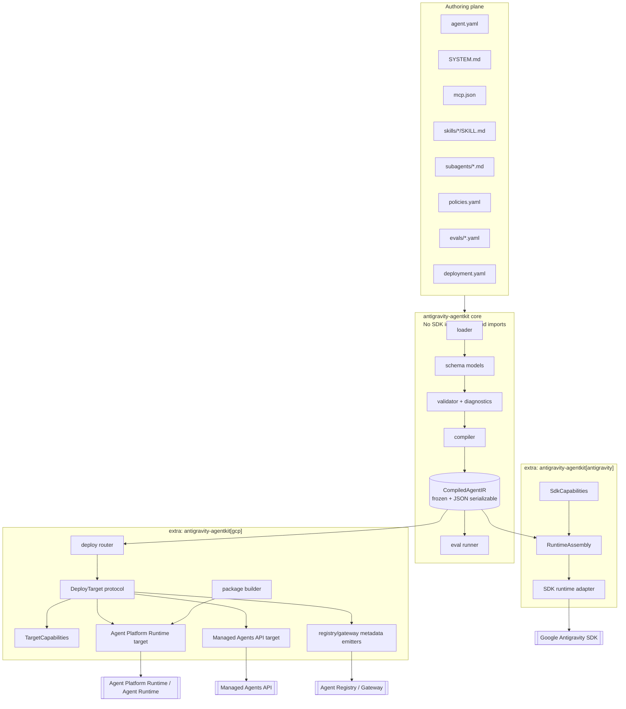
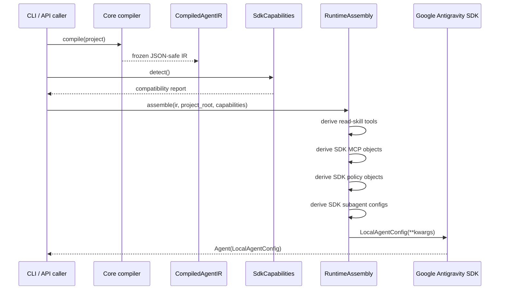

# RFC 0002: Spec-First Core with Frozen IR, Runtime Assembly, and Deploy Target Capabilities

- **Status**: Proposed
- **Authors**: yu-iskw, ChatGPT
- **Supersedes / refines**: [RFC 0001 — Declarative Antigravity AgentKit](../rfcs/0001-declarative-antigravity-agentkit.md)
- **Target repository**: `yu-iskw/antigravity-agentkit`
- **Created**: 2026-06-20
- **Revised**: 2026-06-20
- **Audience**: Agent platform engineers, Google Cloud platform engineers, security/governance reviewers, maintainers of this package

---

## 1. Executive Summary

RFC 0001 established the correct product and architectural direction: AgentKit is a
**declarative compiler and governance layer** over the Google Antigravity SDK and Google Cloud
agent control-plane surfaces, not a custom agent runtime. The current implementation is already
close to this model: authors define agents with `agent.yaml`, `SYSTEM.md`, `mcp.json`, local
skills, subagents, policies, and evals; AgentKit loads and validates those files, compiles them,
and can either run locally through the Antigravity SDK or emit deployment artifacts for cloud
targets.

This RFC revises the original RFC 0002 proposal based on implementation review. The core direction
is retained, but the contract is tightened in four important ways:

1. **Introduce a truly frozen, JSON-serializable IR.**
   The existing `CompiledAgentConfig` is not yet a stable intermediate representation because it
   contains runtime-only objects such as callables and `Any`-typed values. This RFC introduces
   `CompiledAgentIR` as the authoritative backend-neutral contract. Runtime callables, SDK policy
   objects, SDK MCP objects, and SDK subagent objects are derived later by runtime adapters.

2. **Separate compiler IR from runtime assembly.**
   The pure core compiles source manifests into `CompiledAgentIR`. The Antigravity runtime extra
   converts that IR into SDK-ready runtime objects via a `RuntimeAssembly` layer. This prevents
   the core compiler from importing the Antigravity SDK and preserves the ability to run
   load/validate/compile/eval in CI without the SDK wheel.

3. **Centralize SDK compatibility behind one negotiator.**
   All SDK drift handling is moved into `SdkCapabilities`, which detects constructor parameters,
   SDK object availability, policy module paths, and installed SDK version. No other module may
   perform ad hoc `inspect.signature(...)` checks or import `google.antigravity` for compatibility
   decisions.

4. **Make deploy target capabilities explicit.**
   Deploy targets implement a documented `DeployTarget` protocol and expose a
   `TargetCapabilities` manifest. The router can remain static while only two targets exist, but
   each target must declare which IR features it supports and reject unsupported features before
   emitting or deploying.

The recommended design is:

- a **pure core** package containing schema, loader, validator, compiler, IR, diagnostics, and evals;
- an optional **`[antigravity]` runtime extra** containing SDK capability negotiation and runtime
  assembly;
- an optional **`[gcp]` deploy/governance extra** containing deployment targets, packaging, registry
  metadata, and future live cloud clients;
- a **serialized `compiled-agent-ir.json` artifact** included in source packages for reproducible
  deploys;
- a documented, test-enforced import boundary preventing SDK/GCP dependencies from leaking into
  core.

The result is an incremental refactor, not a rewrite. It preserves the Markdown-first authoring
model and current CLI behavior while turning already-visible implementation seams into explicit,
testable contracts.

---

## 2. Background and Motivation

### 2.1 What RFC 0001 got right

RFC 0001 made several choices that remain correct and should not be reopened in this RFC:

- AgentKit is **declarative**: users author agents with Markdown/YAML/JSON rather than imperative
  SDK code.
- AgentKit is a **compiler and governance layer**, not a replacement runtime.
- The Antigravity SDK remains the local execution engine.
- Google Cloud agent platform components remain the intended enterprise control plane.
- Markdown-based skills, subagents, MCP configuration, policies, evals, and registry metadata are
  first-class authoring concerns.
- Default-deny or restricted governance is preferred over open-ended runtime authority.
- The package should support both local developer iteration and production deployment workflows.

### 2.2 What has changed since RFC 0001

The implementation has evolved in ways that reveal architectural seams:

1. **SDK coupling is real but informal.**
   The current SDK adapter performs repeated reflection against `LocalAgentConfig` to decide whether
   the installed SDK accepts fields such as `skills_paths` and `subagents`. This is a valid response
   to a fast-moving SDK, but compatibility logic should not be scattered through the runtime hot path.

2. **The implement/ship boundary had to be corrected.**
   Deployment concerns were originally allowed to live under `agent.yaml` and were later moved to
   `deployment.yaml`. This separation is correct: implementation artifacts and shipping artifacts
   are different lifecycle planes. The RFC turns that separation from convention into package and
   API structure.

3. **The first deployment targets grew organically.**
   The repository now has a router and two deployment targets: a higher-fidelity platform runtime
   package target and a reduced Managed Agents API-style target. The second target already has an
   unsupported-feature gate. That is the right pattern, but it should become a general deploy-target
   contract.

4. **The current compiled object is not a stable IR.**
   `CompiledAgentConfig` mixes backend-neutral metadata with runtime-only objects, including Python
   callables and `Any` fields. That makes it impossible to use as a reproducible serialized contract.

5. **Current Google Cloud agent platform terminology is broader than early implementation naming.**
   Current docs describe a Gemini Enterprise Agent Platform umbrella that includes ADK, Managed
   Agents API, Agent Runtime, Agent Registry, Agent Identity, Agent Gateway, evaluation,
   observability, and governance policies. Target names and documentation should align with those
   product surfaces while keeping backward-compatible aliases.

### 2.3 Underlying intent

The true goal is not just to clean up code style. The goal is to make AgentKit a stable enterprise
agent supply-chain layer:

> Authors define agents once. AgentKit validates and compiles them into a stable, inspectable IR.
> Runtime adapters and deploy targets consume that IR through explicit capability contracts. Cloud
> packaging and registry metadata preserve governance intent without silently dropping unsupported
> features.

---

## 3. Goals and Non-Goals

### 3.1 Goals

1. **Pure core package**
   Keep schema, loader, validator, compiler, diagnostics, IR, and evals independent of the
   Antigravity SDK and Google Cloud clients.

2. **Frozen serializable IR**
   Introduce `CompiledAgentIR` as the single backend-neutral contract. It must be frozen,
   versioned, JSON-serializable, and free of SDK types, callables, and filesystem-dependent runtime
   objects.

3. **Runtime assembly layer**
   Move SDK-specific runtime object creation into `antigravity_agentkit.sdk.runtime`, deriving
   runtime callables, SDK MCP objects, SDK policy objects, SDK capabilities, and SDK subagents from
   the IR and project/package context.

4. **Single SDK compatibility door**
   Introduce `SdkCapabilities` as the only SDK feature detection layer. It detects constructor
   parameter support, SDK type support, policy module path, installed version, and compatibility
   diagnostics.

5. **Deploy target capability contract**
   Add a documented `DeployTarget` protocol and `TargetCapabilities` metadata. Targets must validate
   unsupported IR features explicitly before emitting artifacts or attempting deployment.

6. **Two-lifecycle structural separation**
   Keep `agent.yaml` for implementation and `deployment.yaml` for shipping. Enforce this through
   schema, package layout, and deploy APIs.

7. **Reproducible source packages**
   Include `compiled-agent-ir.json` and `agentkit.lock.json` in generated packages. The generated
   runtime entrypoint should prefer the serialized IR rather than recompiling mutable source files.

8. **Core-only CI**
   Add a CI job that installs only the base package and runs load/validate/compile/eval tests
   without `google-antigravity` or Google Cloud libraries.

9. **Backward-compatible CLI behavior**
   Existing user-facing target names and CLI flows should continue to work, with documented aliases
   if internal target names are normalized.

10. **First-class Python embedding API**
    Preserve and formalize AgentKit as a library for embedded application use cases (Slack bots,
    services, CI), with a stable spec/IR boundary and SDK-specific behavior behind `[antigravity]`.

### 3.2 Non-Goals

1. **No custom runtime.**
   AgentKit does not implement its own agent loop or SDK replacement.

2. **No immediate entry-point plugin framework.**
   Static routing is sufficient while there are only two in-tree deploy targets. Entry-point
   discovery is deferred until a third real target or a private out-of-tree target appears.

3. **No semantic redesign of Markdown authoring.**
   `agent.yaml`, `SYSTEM.md`, `mcp.json`, `skills/`, `subagents/`, `policies.yaml`, and `evals/`
   remain the authoring model.

4. **No requirement to implement live cloud deploy in this RFC.**
   Dry-run emitters remain valid. This RFC defines contracts that live deploy can later use safely.

5. **No re-litigation of Antigravity vs ADK as the runtime base.**
   ADK and Managed Agents API are relevant platform surfaces, but this package remains focused on
   Antigravity SDK-backed authoring and packaging unless a later RFC expands scope.

6. **No public plugin API guarantee yet.**
   `DeployTarget` is an internal/public-in-repo protocol first. Stable third-party extension points
   can be added after target count and use cases justify them.

7. **Not an application framework.**
   AgentKit does not implement Slack, FastAPI, or webhook lifecycle. It provides load, validate,
   compile, and runtime construction APIs for those applications to embed.

---

## 4. Design Principles

### 4.1 Spec-first, runtime-pluggable

The core describes what an agent is. Runtime and deploy adapters describe how that agent is run or
shipped. The core must not import SDK or cloud clients.

### 4.2 The IR is the contract

All downstream consumers read `CompiledAgentIR`. They must not reach back into pydantic schema
objects, raw manifests, or loader internals for semantic decisions. Filesystem access may still be
needed for packaging, but feature compatibility and deployment validation must be IR-driven.

### 4.3 Runtime objects are derived, not stored

Python callables, SDK policy objects, SDK MCP objects, and SDK subagent configs are not part of the
IR. They are derived by the `[antigravity]` runtime adapter from serialized IR plus project/package
context.

### 4.4 One door to the SDK

All SDK compatibility decisions go through `SdkCapabilities`. If the SDK changes constructor
signatures, module paths, or type availability, only the negotiator and its tests should need to
change.

### 4.5 Explicit degradation, never silent loss

If a deploy target cannot represent an IR feature, it must fail loudly with actionable diagnostics.
For example, a Managed Agents API target that cannot represent MCP, policies, static subagents, or
Vertex runtime configuration must reject those features before emitting an artifact.

### 4.6 Defer extensibility ceremony until needed

A static router plus a protocol is simpler than entry-point plugin discovery while there are only
two supported targets. The protocol is designed so entry points can be added later without changing
callers.

### 4.7 Governance metadata is part of deployment, not an afterthought

Registry placement, gateway metadata, identity mode, labels, allowed capabilities, and policy
summaries are part of the deployment contract. They should be emitted with packages/configs even
before live deploy is implemented.

---

## 5. Proposed Architecture

### 5.1 High-level architecture



### 5.2 Package layout

```text
src/antigravity_agentkit/
  __init__.py

  # Pure core
  schema/
    agent.py
    deployment.py
    evals.py
    mcp.py
    policies.py
    skills.py
  ir.py
  json_types.py
  loader.py
  validator.py
  diagnostics.py
  compiler.py
  evals.py
  exceptions.py
  project.py
  paths.py

  # Runtime extra: imports google.antigravity are allowed only here
  sdk/
    __init__.py
    capabilities.py
    runtime.py
    policies.py
    mcp.py
    subagents.py
    errors.py

  # Cloud/deploy extra: cloud clients only here
  deploy/
    __init__.py
    target.py
    capabilities.py
    router.py
    context.py
    _common.py
    package.py
    agent_platform_runtime.py
    managed_agents_api.py
    aliases.py

  registry/
    __init__.py
    metadata.py
    gateway.py
```

### 5.3 Optional dependencies

```toml
[project.optional-dependencies]
antigravity = [
  "google-antigravity>=0.1.4",
]
gcp = [
  "google-auth>=2",
  "google-cloud-aiplatform>=1",
]
all = [
  "antigravity-agentkit[antigravity,gcp]",
]
```

Notes:

- The exact `google-antigravity` minimum version should be determined by compatibility tests.
- `[gcp]` may be split later into `[agent-platform]`, `[managed-agents-api]`, or `[registry]` if
  dependency footprints diverge.
- CLI commands that require extras must fail with actionable install hints.

---

## 6. Core Data Model

### 6.1 JSON value type

The IR must be strictly JSON-compatible.

```python
JsonScalar = str | int | float | bool | None
JsonValue = JsonScalar | Mapping[str, "JsonValue"] | Sequence["JsonValue"]
```

Implementation may define this as a typing alias or use pydantic validation.

### 6.2 CompiledAgentIR

`CompiledAgentIR` replaces `CompiledAgentConfig` as the backend-neutral contract.

```python
from __future__ import annotations

from dataclasses import dataclass, field
from typing import Literal, Mapping, Sequence

JsonScalar = str | int | float | bool | None
JsonValue = JsonScalar | Mapping[str, "JsonValue"] | Sequence["JsonValue"]

@dataclass(frozen=True)
class VertexIR:
    enabled: bool = False
    project: str | None = None
    location: str | None = None

@dataclass(frozen=True)
class McpServerIR:
    name: str
    transport: Literal["stdio", "sse", "streamable-http"]
    command: str | None = None
    args: tuple[str, ...] = ()
    url: str | None = None
    env: Mapping[str, str] = field(default_factory=dict)

@dataclass(frozen=True)
class SkillIR:
    name: str
    path: str
    content_hash: str
    description: str | None = None
    source: Literal["local", "registry"] = "local"
    registry_ref: str | None = None
    revision: str | None = None

@dataclass(frozen=True)
class SubagentIR:
    name: str
    type: Literal["markdown", "remote"]
    path: str | None = None
    content_hash: str | None = None
    registry_ref: str | None = None
    auth_mode: Literal["agent-identity", "service-account", "oauth"] = "agent-identity"
    tools: tuple[str, ...] = ()

@dataclass(frozen=True)
class ToolIR:
    name: str
    kind: Literal["skill-reader", "delegation", "mcp", "runtime"]
    description: str | None = None
    metadata: Mapping[str, JsonValue] = field(default_factory=dict)

@dataclass(frozen=True)
class PolicyRuleIR:
    decision: Literal["allow", "deny", "ask_user", "require_approval"]
    tool: str | None = None
    default: bool = False
    when: Mapping[str, JsonValue] = field(default_factory=dict)

@dataclass(frozen=True)
class CapabilitiesIR:
    mode: Literal["open", "restricted", "locked"] = "restricted"
    enabled_tools: tuple[str, ...] = ()
    disabled_tools: tuple[str, ...] = ()
    enable_subagents: bool = False

@dataclass(frozen=True)
class CompiledAgentIR:
    schema_version: str
    agentkit_version: str | None
    metadata: Mapping[str, JsonValue]
    system_instructions: str
    model: str | None
    vertex: VertexIR
    mcp_servers: tuple[McpServerIR, ...]
    skills: tuple[SkillIR, ...]
    skills_paths: tuple[str, ...]
    subagents: tuple[SubagentIR, ...]
    tools: tuple[ToolIR, ...]
    policies: tuple[PolicyRuleIR, ...]
    capabilities: CapabilitiesIR
```

### 6.3 IR invariants

The compiler must enforce these invariants:

1. `CompiledAgentIR` is frozen.
2. `CompiledAgentIR` can round-trip through JSON without losing semantics.
3. No field may contain a callable.
4. No field may contain SDK objects.
5. No field may contain `Path` objects; paths are stored as normalized POSIX strings.
6. No field may contain pydantic model instances.
7. Any map values must be JSON-compatible.
8. `schema_version` is required.
9. If subagents exist and capability config does not explicitly disable them, the compiled
   `capabilities.enable_subagents` value must reflect the effective policy.
10. A backend may reject fields, but it must never silently drop them.

### 6.4 Compatibility alias

For one release cycle, `CompiledAgentConfig` may remain as a compatibility alias or adapter:

```python
CompiledAgentConfig = CompiledAgentIR
```

If this is too breaking for internal tests, add:

```python
def compile_legacy_config(ir: CompiledAgentIR) -> LegacyCompiledAgentConfig:
    ...
```

But new runtime and deploy code must consume `CompiledAgentIR`.

---

## 7. Core Compiler Boundary

### 7.1 Current problem

The current compiler performs two incompatible jobs:

1. It compiles backend-neutral agent metadata.
2. It prepares runtime objects and delegates SDK conversion.

That prevents the compiler from being pure.

### 7.2 New compiler contract

The core compiler exposes only:

```python
def compile_from_data(data: AgentProjectData) -> CompiledAgentIR:
    ...

def compile_agent_ir(path: str | Path, *, production: bool = False) -> CompiledAgentIR:
    ...
```

It must not expose:

```python
def compile_to_sdk_config(...): ...
```

SDK conversion moves to:

```python
from antigravity_agentkit.sdk.runtime import create_sdk_config_from_ir
from antigravity_agentkit.sdk.runtime import create_agent_from_ir
from antigravity_agentkit.sdk.runtime import create_agent_from_ir_file
```

### 7.3 Project API

`AgentProject` remains the ergonomic façade, but imports must be lazy or split:

```python
class AgentProject:
    def compile(self, *, production: bool = False) -> CompiledAgentIR:
        ...

    def create_agent(self, *, production: bool = False, interactive: bool = False) -> Any:
        from antigravity_agentkit.sdk.runtime import create_agent_from_ir
        ir = self.compile(production=production)
        return create_agent_from_ir(ir, project_root=self.root, interactive=interactive)
```

`project.py` must not import `google.antigravity` or import modules that import it at module load
time.

---

## 8. Runtime Assembly and SDK Capability Negotiation

### 8.1 RuntimeAssembly

`RuntimeAssembly` is the non-serializable SDK-preparation layer.

```python
@dataclass(frozen=True)
class RuntimeAssembly:
    sdk_config_kwargs: Mapping[str, Any]
    runtime_tools: tuple[Any, ...]
    sdk_mcp_servers: tuple[Any, ...]
    sdk_policies: tuple[Any, ...]
    sdk_subagents: tuple[Any, ...]
```

This object may contain SDK types and Python callables. It lives only under
`antigravity_agentkit.sdk`.

### 8.2 SdkCapabilities

`SdkCapabilities` is the single SDK compatibility report.

```python
@dataclass(frozen=True)
class SdkCapabilities:
    sdk_version: str | None

    local_agent_config_params: frozenset[str]
    local_agent_config_accepts_kwargs: bool

    accepts_model: bool
    accepts_vertex: bool
    accepts_project: bool
    accepts_location: bool
    accepts_mcp_servers: bool
    accepts_tools: bool
    accepts_policies: bool
    accepts_capabilities: bool
    accepts_skills_paths: bool
    accepts_subagents: bool

    has_capabilities_config: bool
    has_mcp_stdio_server: bool
    has_mcp_sse_server: bool
    has_mcp_streamable_http_server: bool
    has_subagent_config: bool

    policy_module_path: str | None

    @classmethod
    def detect(cls) -> "SdkCapabilities":
        ...
```

### 8.3 Detection rules

The negotiator should detect:

1. Installed `google-antigravity` distribution version, where available.
2. `LocalAgentConfig` constructor parameters.
3. Whether `LocalAgentConfig` accepts arbitrary `**kwargs`.
4. Availability of SDK types used by AgentKit.
5. Available policy module path:
   - prefer current documented path if available;
   - fall back to older path if available;
   - otherwise report unsupported.
6. MCP server classes or constructors.
7. Subagent config support.

### 8.4 Runtime conversion flow



### 8.5 Runtime compatibility errors

Errors should be structured and actionable.

```python
class SdkCompatibilityError(CompilationError):
    feature: str
    sdk_version: str | None
    install_hint: str
    details: Mapping[str, JsonValue]
```

Example error:

```text
The installed google-antigravity SDK cannot accept static subagents.

Feature: subagents
Detected SDK version: 0.1.4
Required capability: LocalAgentConfig(subagents=...) and google.antigravity.types.SubagentConfig
Suggested action: pip install --upgrade 'antigravity-agentkit[antigravity]'
```

---

## 9. Deploy Target Contract

### 9.1 Target names and aliases

Use clearer internal target names while preserving existing CLI aliases.

| User-facing alias | Canonical internal name  | Description                                                                              |
| ----------------- | ------------------------ | ---------------------------------------------------------------------------------------- |
| `agent-platform`  | `agent-platform-runtime` | Full-fidelity source package target for Agent Platform / Agent Runtime-style deployment. |
| `gemini-api`      | `managed-agents-api`     | Reduced config-driven Managed Agents API target.                                         |

### 9.2 TargetCapabilities

```python
@dataclass(frozen=True)
class TargetCapabilities:
    name: str
    fidelity: Literal["full", "reduced"]

    supports_source_package: bool
    supports_inline_skills: bool
    supports_mcp: bool
    supports_static_subagents: bool
    supports_remote_subagents: bool
    supports_policies: bool
    supports_runtime_tools: bool
    supports_capabilities: bool
    supports_vertex_runtime: bool

    supports_live_deploy: bool
    supports_dry_run: bool

    registry_scope: Literal["regional", "global", "none"]
    gateway_metadata_supported: bool
    identity_modes: tuple[Literal["agent-identity", "service-account", "oauth"], ...]
```

### 9.3 DeployContext

```python
@dataclass(frozen=True)
class DeployContext:
    project_id: str
    location: str
    output_path: Path | None
    dry_run: bool | None
    package_root: Path | None = None
```

### 9.4 DeployTarget protocol

```python
class DeployTarget(Protocol):
    name: str
    aliases: tuple[str, ...]
    capabilities: TargetCapabilities

    def validate_ir(
        self,
        ir: CompiledAgentIR,
        deployment: DeploymentManifest,
        context: DeployContext,
    ) -> None:
        ...

    def build_config(
        self,
        ir: CompiledAgentIR,
        deployment: DeploymentManifest,
        context: DeployContext,
    ) -> dict[str, JsonValue]:
        ...

    def deploy(
        self,
        ir: CompiledAgentIR,
        deployment: DeploymentManifest,
        context: DeployContext,
    ) -> dict[str, JsonValue]:
        ...
```

### 9.5 Generic unsupported-feature validation

A helper should compare IR features against `TargetCapabilities`.

```python
def unsupported_features_for_target(
    ir: CompiledAgentIR,
    capabilities: TargetCapabilities,
) -> tuple[str, ...]:
    unsupported: list[str] = []
    if ir.mcp_servers and not capabilities.supports_mcp:
        unsupported.append("mcp")
    if ir.subagents and not (
        capabilities.supports_static_subagents or capabilities.supports_remote_subagents
    ):
        unsupported.append("subagents")
    if ir.policies and not capabilities.supports_policies:
        unsupported.append("policies")
    if ir.capabilities != CapabilitiesIR() and not capabilities.supports_capabilities:
        unsupported.append("capabilities")
    if ir.vertex.enabled and not capabilities.supports_vertex_runtime:
        unsupported.append("vertex")
    return tuple(unsupported)
```

Targets may add target-specific validation, but they should not re-implement the common checks.

---

## 10. Target: Agent Platform Runtime

### 10.1 Purpose

The Agent Platform Runtime target is the full-fidelity target. It packages the agent so the
Antigravity SDK runtime can reconstruct the agent from the frozen IR and project assets.

### 10.2 Capabilities

```python
AGENT_PLATFORM_RUNTIME_CAPABILITIES = TargetCapabilities(
    name="agent-platform-runtime",
    fidelity="full",
    supports_source_package=True,
    supports_inline_skills=False,
    supports_mcp=True,
    supports_static_subagents=True,
    supports_remote_subagents=True,
    supports_policies=True,
    supports_runtime_tools=True,
    supports_capabilities=True,
    supports_vertex_runtime=True,
    supports_live_deploy=False,  # until implemented
    supports_dry_run=True,
    registry_scope="regional",
    gateway_metadata_supported=True,
    identity_modes=("agent-identity", "service-account", "oauth"),
)
```

### 10.3 Package contents

Generated packages should include:

```text
.build/<agent-name>/
  agent.py
  requirements.txt
  compiled-agent-ir.json
  agentkit.lock.json
  metadata.json
  agent.yaml
  SYSTEM.md
  mcp.json
  policies.yaml
  skills/
  subagents/
  evals/
```

### 10.4 `compiled-agent-ir.json`

This is the authoritative compiled contract.

```json
{
  "schemaVersion": "antigravity-agentkit.ir/v1alpha1",
  "agentkitVersion": "0.1.0",
  "metadata": {
    "name": "example-agent",
    "labels": {
      "managed-by": "antigravity-agentkit"
    }
  },
  "systemInstructions": "...",
  "model": "gemini-...",
  "vertex": {
    "enabled": true,
    "project": "my-project",
    "location": "asia-northeast1"
  },
  "mcpServers": [],
  "skills": [],
  "skillsPaths": [],
  "subagents": [],
  "tools": [],
  "policies": [],
  "capabilities": {
    "mode": "restricted",
    "enabledTools": [],
    "disabledTools": [],
    "enableSubagents": false
  }
}
```

### 10.5 `agentkit.lock.json`

This captures build-time reproducibility metadata.

```json
{
  "agentkitVersion": "0.1.0",
  "irSchemaVersion": "antigravity-agentkit.ir/v1alpha1",
  "generatedAt": "2026-06-20T00:00:00Z",
  "sourceHashes": {
    "agent.yaml": "sha256:...",
    "SYSTEM.md": "sha256:...",
    "skills/example/SKILL.md": "sha256:..."
  },
  "sdkCompatibility": {
    "minimumGoogleAntigravity": "0.1.4"
  }
}
```

### 10.6 Generated runtime entrypoint

The generated `agent.py` should prefer the serialized IR:

```python
"""Generated Antigravity AgentKit runtime entrypoint."""

from antigravity_agentkit.sdk.runtime import create_agent_from_ir_file

root_agent = create_agent_from_ir_file(
    "compiled-agent-ir.json",
    project_root=".",
)
```

This avoids recompiling mutable source files at runtime. A debug fallback may be provided behind an
environment variable:

```python
if os.getenv("AGENTKIT_RECOMPILE_FROM_SOURCE") == "1":
    root_agent = AgentProject.load(".").create_agent()
```

The fallback must not be the default production path.

### 10.7 Deployment config

The target emits dry-run config similar to:

```json
{
  "target": "agent-platform-runtime",
  "source_packages": [".build/example-agent"],
  "entrypoint_module": "agent",
  "entrypoint_object": "root_agent",
  "requirements_file": "requirements.txt",
  "display_name": "Example Agent",
  "description": "...",
  "project": "my-project",
  "location": "asia-northeast1",
  "service_account": "...",
  "min_instances": 0,
  "max_instances": 3,
  "resource_limits": {
    "cpu": "1",
    "memory": "1Gi"
  },
  "gateway": {
    "enabled": true
  },
  "registry": {
    "scope": "regional",
    "metadata_file": "registry-metadata.json"
  }
}
```

---

## 11. Target: Managed Agents API

### 11.1 Purpose

The Managed Agents API target is a reduced-fidelity config-driven target. It emits a registration
contract for a managed agent surface that can accept system instructions and inline skill sources
but cannot necessarily represent MCP, policies, static subagents, runtime tools, Vertex runtime
configuration, or arbitrary capabilities.

### 11.2 Capabilities

```python
MANAGED_AGENTS_API_CAPABILITIES = TargetCapabilities(
    name="managed-agents-api",
    fidelity="reduced",
    supports_source_package=False,
    supports_inline_skills=True,
    supports_mcp=False,
    supports_static_subagents=False,
    supports_remote_subagents=False,
    supports_policies=False,
    supports_runtime_tools=False,
    supports_capabilities=False,
    supports_vertex_runtime=False,
    supports_live_deploy=False,  # until implemented
    supports_dry_run=True,
    registry_scope="global",
    gateway_metadata_supported=True,
    identity_modes=("agent-identity",),
)
```

### 11.3 Validation

Before emitting any config:

1. Reject `ir.mcp_servers`.
2. Reject `ir.subagents`.
3. Reject `ir.policies`.
4. Reject non-default `ir.capabilities`.
5. Reject `ir.vertex.enabled`.
6. Reject runtime tools other than target-supported inline skills.
7. Reject registry/identity configuration not supported by the target.

Example error:

```text
Deploy target 'managed-agents-api' does not support these IR features:
- mcp
- policies
- vertex

Use target 'agent-platform-runtime' for full-fidelity deployment, or remove the unsupported
features from the agent spec.
```

### 11.4 Emitted config

```json
{
  "id": "example-agent",
  "base_agent": "antigravity-preview-05-2026",
  "system_instruction": "...",
  "description": "...",
  "base_environment": {
    "type": "remote",
    "sources": [
      {
        "type": "inline",
        "target": ".agents/skills/example/SKILL.md",
        "content": "..."
      }
    ]
  },
  "registry": {
    "scope": "global"
  }
}
```

### 11.5 Naming note

Existing `gemini-api` CLI target value remains supported as an alias, but docs should introduce
`managed-agents-api` as the canonical name.

---

## 12. Registry, Gateway, and Governance Metadata

### 12.1 Why registry metadata belongs in the RFC

Agent Registry and Agent Gateway are not just deployment add-ons. They are part of enterprise
governance: access policy, discovery, identity, and mediation depend on registry metadata. Even if
live registry APIs are not implemented yet, dry-run artifacts should emit the metadata that would
be registered.

### 12.2 Registry metadata artifact

Each deploy target should be able to emit `registry-metadata.json`.

```json
{
  "agent": {
    "name": "example-agent",
    "displayName": "Example Agent",
    "description": "...",
    "labels": {
      "managed-by": "antigravity-agentkit"
    }
  },
  "target": {
    "name": "agent-platform-runtime",
    "registryScope": "regional",
    "location": "asia-northeast1"
  },
  "identity": {
    "mode": "agent-identity",
    "serviceAccount": null
  },
  "gateway": {
    "enabled": true,
    "protocols": ["a2a", "mcp"],
    "policyRefs": []
  },
  "skills": [
    {
      "name": "example-skill",
      "source": "local",
      "contentHash": "sha256:..."
    }
  ],
  "mcpServers": [],
  "subagents": [],
  "policies": {
    "defaultDecision": "deny",
    "ruleCount": 3
  }
}
```

### 12.3 Registry scope rules

The target capability must declare registry scope:

| Target                   | Registry scope | Reason                                                                  |
| ------------------------ | -------------- | ----------------------------------------------------------------------- |
| `agent-platform-runtime` | `regional`     | Runtime deployments are location-bound.                                 |
| `managed-agents-api`     | `global`       | Managed agent registration may be global depending on platform surface. |
| future private target    | explicit       | No default; target must declare.                                        |

### 12.4 Gateway implications

If `deployment.yaml` enables a gateway, the target must emit enough metadata for policy review:

- exposed protocols;
- identity mode;
- allowed callers or groups, if configured;
- policy summary;
- tool/MCP/subagent exposure summary;
- registry location;
- labels and owner metadata.

If the target cannot support gateway metadata but the deployment requests it, deployment validation
must fail.

---

## 13. CLI and User Experience

### 13.1 Commands that require only core

These commands must work with base install:

```bash
antigravity-agentkit validate ./agents/example
antigravity-agentkit compile ./agents/example --output compiled-agent-ir.json
antigravity-agentkit eval ./agents/example
```

### 13.2 Commands that require `[antigravity]`

These commands require the SDK extra:

```bash
antigravity-agentkit run ./agents/example --prompt "..."
antigravity-agentkit chat ./agents/example
```

If missing:

```text
Google Antigravity SDK is not installed.

Install:
  pip install 'antigravity-agentkit[antigravity]'
```

### 13.3 Commands that require `[gcp]`

These commands require deploy extras when they need cloud-specific packaging or clients:

```bash
antigravity-agentkit deploy ./agents/example   --deployment deployment.yaml   --project my-project   --location asia-northeast1   --dry-run
```

If live deployment is requested but not implemented:

```text
Live deploy is not implemented for target 'agent-platform-runtime' yet.
Use --dry-run to emit deployment artifacts.
```

### 13.4 Target alias handling

The router accepts both canonical names and legacy aliases:

```text
agent-platform          -> agent-platform-runtime
agent-platform-runtime  -> agent-platform-runtime

gemini-api              -> managed-agents-api
managed-agents-api      -> managed-agents-api
```

Warnings may be added later but should not break existing users.

### 13.5 Python API and application embedding

AgentKit is a **Python library**, not only a CLI. The CLI is a thin wrapper over the same APIs. Developers embed AgentKit-managed agents in Slack bots, FastAPI services, workers, notebooks, CI validation jobs, and custom deployment pipelines.

**Stable public imports** (avoid `antigravity_agentkit.sdk.*` and `deploy.router` in application code):

```python
from antigravity_agentkit import AgentProject, CompiledAgentIR
from antigravity_agentkit.runtime import create_agent_from_ir, create_agent_from_project
from antigravity_agentkit.deploy import build_source_package, build_deployment_config
```

| Tier        | Extra           | API                                                    | Use cases                         |
| ----------- | --------------- | ------------------------------------------------------ | --------------------------------- |
| 1 — Core    | (base)          | `AgentProject.load`, `validate`, `compile`, `eval`     | CI governance, IR inspection      |
| 2 — Runtime | `[antigravity]` | `create_agent_from_ir`, `create_agent_from_project`    | Slack bots, services, notebooks   |
| 3 — Deploy  | `[gcp]`         | `load_deployment`, `build_deployment_config`, `deploy` | Ship pipelines, dry-run artifacts |

**Non-goal:** AgentKit does not become an application framework for Slack, FastAPI, or webhooks. It does not own OAuth, HTTP routing, or retry policies. It owns the agent supply chain and runtime construction APIs that those applications embed.

Runnable examples: [`examples/python_embedding/`](../../examples/python_embedding/). Guide: [Python API](../guides/11-python-api.md).

---

## 14. Testing Strategy

### 14.1 Core-only tests

A CI job installs only base dependencies and runs:

- schema parsing tests;
- loader tests;
- validator tests;
- compiler tests;
- IR JSON round-trip tests;
- eval tests that do not require SDK;
- import-boundary tests.

### 14.2 Import-boundary tests

Add a test that fails if core modules import forbidden packages.

Forbidden from core:

```text
google.antigravity
google.cloud
antigravity_agentkit.sdk
antigravity_agentkit.deploy
```

Allowed from core:

```text
pydantic
yaml
jsonschema
rich
typer, only in CLI modules
```

### 14.3 IR tests

Required tests:

1. `CompiledAgentIR` is frozen.
2. `json.dumps(ir_to_dict(ir))` succeeds.
3. `ir_from_dict(ir_to_dict(ir)) == ir`.
4. No field contains `Any` where a structured IR type is expected.
5. No field contains callables.
6. No field contains `Path`.
7. `schema_version` is present.
8. Unsupported target validation is deterministic.

### 14.4 SDK capability tests

Use fake modules/classes rather than requiring multiple real SDK versions.

Scenarios:

| Scenario                                  | Expected result                    |
| ----------------------------------------- | ---------------------------------- |
| `LocalAgentConfig` accepts `skills_paths` | `accepts_skills_paths=True`        |
| Missing `skills_paths`, no `**kwargs`     | runtime rejects skills paths       |
| `LocalAgentConfig` has `**kwargs`         | unknown kwargs considered accepted |
| Missing `SubagentConfig`                  | static subagents rejected          |
| Policy module at documented path          | uses documented path               |
| Policy module only at legacy path         | uses fallback path                 |
| No policy module                          | policies rejected                  |
| Missing SDK entirely                      | actionable install hint            |

### 14.5 Deploy target tests

For each target:

1. Capability metadata snapshot.
2. Supported minimal IR emits expected config.
3. Unsupported features produce actionable errors.
4. Target validation consumes only IR and deployment context.
5. Alias resolution works.
6. Dry-run artifacts are deterministic.
7. Live deploy not implemented errors are clear.

### 14.6 Packaging tests

For Agent Platform Runtime package:

1. `compiled-agent-ir.json` exists.
2. `agentkit.lock.json` exists.
3. Generated `agent.py` loads IR.
4. `.env`, `.env.*`, `.venv`, `.git`, `.build`, symlinks, and `__pycache__` are excluded or rejected.
5. Source hashes match package contents.
6. Re-running package generation is deterministic.

---

## 15. Migration Plan

This migration is intentionally incremental. Each phase should preserve behavior.

### Phase 1 — Introduce IR types

- Add `ir.py`.
- Define `CompiledAgentIR` and supporting IR dataclasses.
- Add JSON serialization helpers.
- Add JSON round-trip tests.
- Keep `CompiledAgentConfig` temporarily as alias or adapter.

#### Acceptance criteria

- Existing compile tests pass.
- New IR tests pass.
- No runtime behavior changes yet.

### Phase 2 — Purify compiler

- Remove SDK conversion imports from `compiler.py`.
- Move `compile_to_sdk_config` to `sdk/runtime.py`.
- Ensure `compile_from_data` returns only `CompiledAgentIR`.
- Move runtime callable construction out of compiler.

#### Acceptance criteria

- `python -c "import antigravity_agentkit.compiler"` succeeds without SDK installed.
- Core-only compile works without SDK.

### Phase 3 — Add RuntimeAssembly

- Add `sdk/runtime.py`.
- Add `RuntimeAssembly`.
- Move skill-reader callable creation into runtime adapter.
- Move SDK MCP/policy/subagent conversion into SDK package.
- Update `AgentProject.create_agent()` to lazy-import runtime adapter.

#### Acceptance criteria

- `run` and `chat` behavior preserved with `[antigravity]`.
- Missing SDK produces same or better install hint.

### Phase 4 — Add SdkCapabilities

- Add `sdk/capabilities.py`.
- Centralize constructor reflection and SDK type detection.
- Remove inline `inspect.signature` checks from runtime assembly.
- Add fake-SDK tests.

#### Acceptance criteria

- No non-negotiator module calls `inspect.signature(LocalAgentConfig)`.
- Unsupported SDK features raise structured compatibility errors.

### Phase 5 — Add DeployTarget and TargetCapabilities

- Add `deploy/target.py`.
- Add `deploy/capabilities.py`.
- Convert existing targets to classes or structured modules implementing the protocol.
- Keep static router.

#### Acceptance criteria

- Existing target names still work.
- Unsupported feature checks are capability-driven.
- Managed Agents API target no longer reads raw project manifest for semantic compatibility checks.

### Phase 6 — Package serialized IR

- Write `compiled-agent-ir.json` during package build.
- Write `agentkit.lock.json`.
- Update generated `agent.py` to load IR.
- Keep source manifests in package for audit/debugging.

#### Acceptance criteria

- Package tests pass.
- Runtime can create agent from packaged IR.

### Phase 7 — Split optional extras

- Add `[gcp]` and `[all]`.
- Keep `[antigravity]`.
- Move cloud-only imports under deploy/registry modules.
- Add core-only CI matrix job.

#### Acceptance criteria

- Base install supports validate/compile/eval.
- `[antigravity]` supports run/chat.
- `[gcp]` supports deploy dry-run.
- `[all]` supports everything currently implemented.

### Phase 8 — Import guard and documentation

- Add import-linter or AST-based guard.
- Update README.
- Update examples.
- Update RFC references and target naming docs.

#### Acceptance criteria

- CI fails on core SDK/GCP import leaks.
- User docs clearly describe extras and target aliases.

---

## 16. Compatibility and Deprecation

### 16.1 User-facing compatibility

The following should remain compatible:

- existing agent directory layout;
- `agent.yaml` schema, except already-removed deployment fields;
- `deployment.yaml`;
- `antigravity-agentkit validate`;
- `antigravity-agentkit compile`;
- `antigravity-agentkit run`;
- target aliases `agent-platform` and `gemini-api`.

### 16.2 Developer-facing compatibility

Potentially breaking internal changes:

- `CompiledAgentConfig` moves or becomes alias;
- `compile_to_sdk_config` moves from compiler to SDK runtime;
- deploy handlers may become target objects;
- package metadata changes.

Mitigation:

- keep compatibility aliases for one minor release;
- issue deprecation warnings for old imports;
- document migration in `CHANGELOG.md`.

### 16.3 IR schema versioning

Initial version:

```text
antigravity-agentkit.ir/v1alpha1
```

Rules:

- Backward-compatible additions can remain `v1alpha1` while project is pre-1.0.
- Removing or changing semantics of fields requires a new schema version.
- Runtime adapters must reject unknown major schema versions.
- Deploy targets must include the IR schema version in artifacts.

---

## 17. Risks and Mitigations

| Risk                                          | Impact | Mitigation                                                                                                    |
| --------------------------------------------- | ------ | ------------------------------------------------------------------------------------------------------------- |
| IR refactor causes churn                      | Medium | Keep compatibility alias and migrate in phases.                                                               |
| Dataclasses become too rigid                  | Medium | Use dataclasses for frozen runtime-independent structures; use explicit `metadata` maps for extension points. |
| JSON schema maintenance overhead              | Medium | Generate schema from pydantic if needed, or maintain minimal hand-written schema only for artifacts.          |
| SDK capability detection still drifts         | High   | Keep reflection fallback, fake-SDK tests, and version capture.                                                |
| Deploy target capability matrix becomes stale | Medium | Snapshot tests and target-level validation tests.                                                             |
| Users are confused by extras                  | Medium | Provide `[all]` extra and clear CLI install hints.                                                            |
| Source package can diverge from IR            | High   | Include source hashes in `agentkit.lock.json`; generated runtime loads IR by default.                         |
| Registry/Gateway semantics change             | Medium | Keep registry metadata artifact versioned and target-scoped.                                                  |
| Over-abstracting before third target          | Low    | Static router remains; no entry-point plugins yet.                                                            |
| Live deploy expectations                      | Medium | Explicitly mark live deploy unsupported until implemented; dry-run is the contract.                           |

---

## 18. Alternatives Considered

### 18.1 Keep the current implementation

#### Description Leave `CompiledAgentConfig`, SDK conversion, and deploy router as-is.

#### Pros

- Lowest short-term cost.
- No migration burden.
- Current tests remain mostly untouched.

#### Cons

- SDK drift logic remains scattered.
- Core-only CI boundary remains fragile.
- `CompiledAgentConfig` cannot be serialized as a stable contract.
- New deploy targets will duplicate unsupported-feature logic.
- Source packages remain less reproducible.

#### Decision Rejected.

### 18.2 Only centralize SDK reflection

#### Description Add `SdkCapabilities` but leave current config unchanged.

#### Pros

- Small diff.
- Solves the most visible `inspect.signature` sprawl.

#### Cons

- Does not fix compiler/runtime boundary.
- Does not solve deploy-target compatibility.
- Does not produce reproducible IR artifacts.
- Leaves callables and `Any` in compiled config.

#### Decision Rejected as insufficient.

### 18.3 Use pydantic models for IR

#### Description Implement `CompiledAgentIR` as frozen pydantic models.

#### Pros

- Built-in validation.
- Easy JSON schema generation.
- Existing project already uses pydantic.

#### Cons

- Slightly heavier core model.
- Requires careful alias handling and immutability config.
- Dataclasses are simpler for a compiler IR.

#### Decision Acceptable alternative. This RFC leans frozen dataclasses, but pydantic frozen models

are acceptable if they improve validation and schema export.

### 18.4 Entry-point deploy plugins now

#### Description Introduce package entry points for deploy targets immediately.

#### Pros

- Enables out-of-tree target extensibility.
- Clean plugin story.

#### Cons

- Premature with only two real targets.
- More packaging and discovery complexity.
- Harder to stabilize before target protocol matures.

#### Decision Deferred.

### 18.5 Re-pick runtime around ADK or custom agent loop

#### Description Replace Antigravity SDK as the runtime foundation.

#### Pros

- Could align with other Google agent surfaces.
- Could provide more control.

#### Cons

- Contradicts RFC 0001.
- Discards working implementation.
- Greatly expands scope.
- Reintroduces runtime maintenance burden.

#### Decision Rejected.

---

## 19. Evaluation of Approaches

### 19.1 Criteria

| Criterion             | Meaning                                                                    |
| --------------------- | -------------------------------------------------------------------------- |
| Feasibility           | Can be implemented incrementally with current codebase.                    |
| Contract strength     | How well it creates stable interfaces and prevents drift.                  |
| Runtime compatibility | How well it handles fast-changing SDK behavior.                            |
| Deploy extensibility  | How well it supports future deploy targets.                                |
| Governance readiness  | How well it supports registry, gateway, identity, policy, and audit needs. |
| Complexity control    | How well it avoids over-engineering.                                       |

### 19.2 Approaches

| Approach                       | Description                                                                                      |
| ------------------------------ | ------------------------------------------------------------------------------------------------ |
| A. Keep current implementation | No structural change.                                                                            |
| B. SDK negotiator only         | Centralize SDK reflection but keep current config.                                               |
| C. Original RFC 0002           | Pure core + frozen `CompiledAgentConfig` + SDK negotiator + deploy protocol.                     |
| D. Revised RFC 0002            | Frozen `CompiledAgentIR` + RuntimeAssembly + SDK negotiator + target capabilities + packaged IR. |
| E. Full plugin platform now    | Revised RFC plus entry-point plugins and public extension API.                                   |

### 19.3 Scoring matrix

Scores are 0 to 100.

| Approach                       | Feasibility | Contract strength | Runtime compatibility | Deploy extensibility | Governance readiness | Complexity control | Average |
| ------------------------------ | ----------: | ----------------: | --------------------: | -------------------: | -------------------: | -----------------: | ------: |
| A. Keep current implementation |         100 |                45 |                    55 |                   50 |                   55 |                 95 |    66.7 |
| B. SDK negotiator only         |          92 |                60 |                    82 |                   55 |                   58 |                 88 |    72.5 |
| C. Original RFC 0002           |          84 |                78 |                    84 |                   76 |                   72 |                 80 |    79.0 |
| D. Revised RFC 0002            |          80 |                92 |                    90 |                   88 |                   86 |                 78 |    85.7 |
| E. Full plugin platform now    |          62 |                94 |                    90 |                   96 |                   88 |                 50 |    80.0 |

### 19.4 Recommendation from scoring

Adopt **Approach D: Revised RFC 0002**.

It has the best balance of long-term contract strength and near-term feasibility. It avoids the
premature complexity of a full plugin platform while fixing the original RFC’s main weakness: it
does not confuse a runtime config object with a frozen serializable IR.

---

## 20. Acceptance Criteria

This RFC is complete when all of the following are true:

1. `CompiledAgentIR` exists and is JSON round-trip tested.
2. `CompiledAgentIR` contains no callables, SDK objects, pydantic models, or `Path` objects.
3. `compiler.py` imports no SDK runtime module.
4. `project.py` does not import SDK modules at module import time.
5. Core-only CI passes without `google-antigravity`.
6. `SdkCapabilities` is the only SDK compatibility detector.
7. Runtime conversion uses `RuntimeAssembly`.
8. Deploy targets expose `TargetCapabilities`.
9. Unsupported target features are rejected through common validation.
10. Agent Platform Runtime package includes `compiled-agent-ir.json`.
11. Generated `agent.py` loads serialized IR by default.
12. Target aliases preserve current CLI compatibility.
13. Registry/gateway metadata artifacts are emitted in dry-run mode where requested.
14. Documentation explains extras, target names, and live-deploy limitations.
15. Import-boundary tests prevent regressions.

---

## 21. Open Questions

1. **Dataclass vs pydantic IR**
   Should `CompiledAgentIR` use frozen dataclasses or frozen pydantic models? Dataclasses are
   dependency-light and explicit; pydantic gives stronger validation and JSON schema generation.

2. **IR JSON schema publication**
   Should the IR JSON schema be published now for external emitters, or kept internal until a third
   target appears?

3. **Granularity of extras**
   Should `[gcp]` be split into `[agent-platform-runtime]`, `[managed-agents-api]`, and `[registry]`
   once live clients are added?

4. **Lockfile strictness**
   Should runtime reject packages if source hashes differ from `agentkit.lock.json`, or should it
   only warn?

5. **Registry live integration timing**
   Should registry metadata remain dry-run-only for now, or should a follow-up RFC prioritize live
   Agent Registry publishing before live runtime deployment?

6. **Managed Agents API base agent naming**
   Should `base_agent = "antigravity-preview-05-2026"` remain hard-coded, move to deployment config,
   or be negotiated from a platform API?

7. **Remote subagent auth semantics**
   How should OAuth/user-credential propagation be represented in IR without coupling to a specific
   cloud identity mechanism?

---

## 22. Final Recommendation

Adopt this revised RFC.

The core architectural move is to make the package a compiler pipeline with a stable artifact:

```text
Authoring files -> Core compiler -> CompiledAgentIR -> Runtime/deploy adapters
```

The most important implementation discipline is that `CompiledAgentIR` must be genuinely frozen
and serializable. Once that is true, SDK drift, deploy target limitations, registry metadata, and
package reproducibility can all be handled through explicit adapters and capability contracts.

This revision keeps the project aligned with RFC 0001, avoids a rewrite, avoids premature plugin
machinery, and creates the stable seams required for enterprise-grade agent governance on top of
the Antigravity SDK and Google Cloud agent platform surfaces.

---

## 23. References

- Google Antigravity SDK for Python repository: <https://github.com/google-antigravity/antigravity-sdk-python>
- Antigravity AgentKit repository: <https://github.com/yu-iskw/antigravity-agentkit>
- Gemini Enterprise Agent Platform overview: <https://docs.cloud.google.com/gemini-enterprise-agent-platform/overview>
- Agent Gateway overview: <https://docs.cloud.google.com/gemini-enterprise-agent-platform/govern/gateways/agent-gateway-overview>

</user_query>
